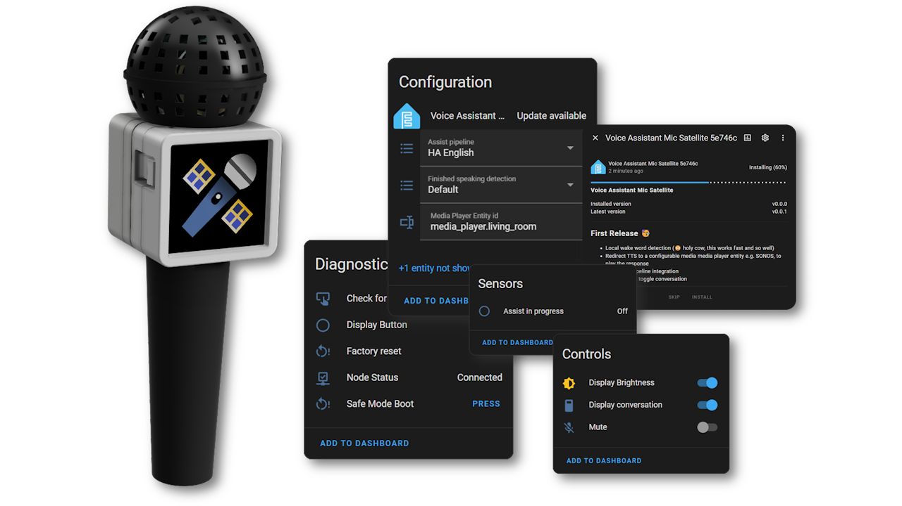
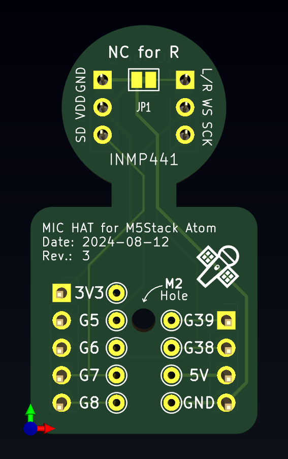
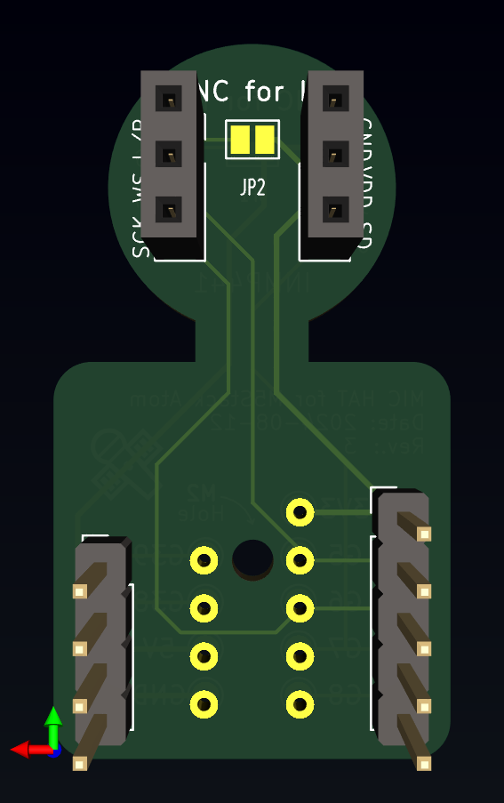
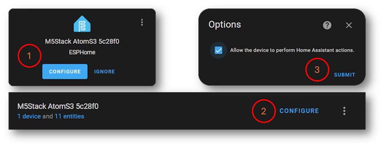
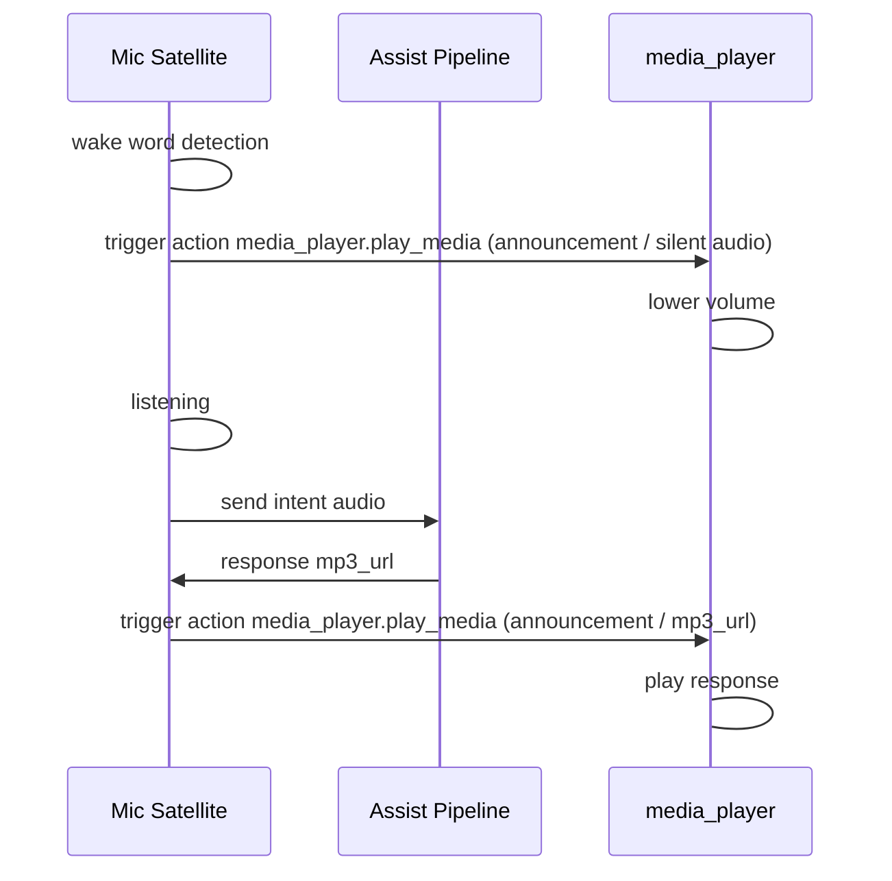
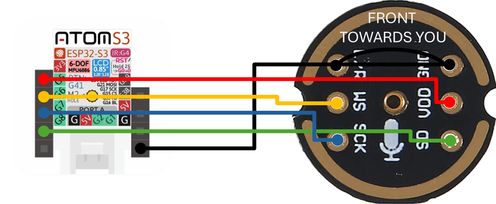
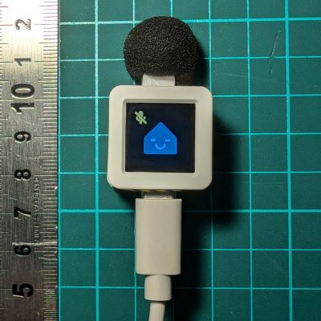
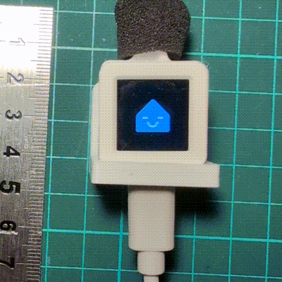

# HA Assist Mic Satellite


<p align="center">
  
</p>

***<p align="center" style="text-align: center;">«The HA Assist Mic Satellite is a compact, ESPHome-based microphone solution designed to integrate with your existing sound setup..»</p>***

## Features

*2024-08-08: This is in very early development. The firmware is working, but the documentation is still in progress. The PCB and case are still in development.*

A ~~tiny~~ Atom version of the [ESP32-S3-BOX](https://esphome.io/projects/index.html)

- Local **wake word detection** (😲 holy cow, this works fast and so well)
- Redirect TTS to a configurable media **media player entity** e.g. SONOS, to play the response
- HA **Assist Pipeline integration**
- Toggle **mute**, toggle **conversation text** and control display **brightness**
- **Show current state** (listening, idle, request, response) on the display. It is fairly readable, though it requires good eyesight 👀.
- **Timers** support (plural), realistically up to 4 timers
- Easy firmware flashing via the [web installer](https://www.ittips.ch/ha-assist-mic-satellite/)

### Roadmap

If anyone is interested in contributing, here are some ideas:

- [ ] Option to change the wake word [#7](https://github.com/MrWyss/ha-assist-mic-satellite/issues/7)
- [ ] Online OTA update for the firmware [#8](https://github.com/MrWyss/ha-assist-mic-satellite/issues/8)
- [ ] Redesign Animation and Text (optimizing for the small screens) [#9](https://github.com/MrWyss/ha-assist-mic-satellite/issues/9)
- [ ] Better alarm **sound files** [#10](https://github.com/MrWyss/ha-assist-mic-satellite/issues/10)

## TL;DR

Gather the following items: [M5Stack AtomS3](#bom), [pcb](#pcb), [pin headers and pin sockets](#bom) and an [INMP441](#bom) breakout board.
3D print the [case](#case), [assemble](#assembly) it, [flash the firmware](#firmware), [configure](#home-assistant) the device in Home Assistant.

## Try it out / Tricks

- **Wake Word**: "Okay Nabu"
- Create a timer, *Create a 3 minute timer for Bananas*, *Cancel Banana timer*
- The display itself is also a button, so you can **double press to mute** the device, it stops listening for the wake word.
- If you have Music Assistant you can change the **announcement volumes**. Goto the Music Assistant Addon -> Settings -> Players -> Your Speaker -> Configure -> Announcements configuration

## Hardware

### BOM

- [M5Stack AtomS3](https://docs.m5stack.com/en/core/AtomS3) ~15$
- [PCB](#pcb) ~5$ + Shipping
- [Case](#case) ~0.5$ Filament
- **INMP441** Breakout Board (usually comes with pin sockets) ~2$
  - 2x Pin socket 1x03 2.54mm (J3, J4)
- 1x Pin header 1x05 2.54mm (J1)
- 1x Pin header 1x04 2.54mm (J2)
- M2 x 5mm screw nylon or with metal with nylon washer (optional)

### PCB

The pcb was designed in KiCAD. [KiCAD Canvas Online View](https://kicanvas.org/?github=https%3A%2F%2Fgithub.com%2FMrWyss%2Fha-assist-mic-satellite%2Ftree%2Fmain%2Fpcb%2FMic%2520HAT%2520for%2520M5Stack%2520Atom) | [KiCad Project](pcb/Mic%20HAT%20for%20M5Stack%20Atom) | [PCB Step File](<pcb/Mic HAT for M5Stack Atom/Mic HAT for M5Stack Atom.step>)

🔜 Order from [PCBWay](https://www.pcbway.com/project/shareproject/HA_Assist_Mic_Satellite_f5cc4682.html) (affiliated link)

| PCB Front | PCB Back |
|:-------------------------:|:-------------------------:|
| | |

### Case

The case was designed in Fusion 360 and exported as 3mf files and step files. [Step files](case/step) | [3mf files](case/3mf)
It shouldn't need any supports for 3d printing, but I recommend printing it with your high detail settings. It is rather small.

### Assembly

Pretty straight forward. Solder the header sockets and pins to the pcb and to the INMP441.

>❗Check the direction of the header sockets and pins. Especially on the INMP441, the side with mic icon should face the same direction as the screen.

Put it in the case, screw it together and attach the HAT to the AtomS3.

<p align="center">
  
</p>

## Software

- **Home Assistant** (ESPHome optinal, if you want to adopt the device)
- **Music Assistant** (optional)
- A **media player entity** (e.g. media_player.office)

### Firmware

Install Firmware: [Web Installer](https://www.ittips.ch/ha-assist-mic-satellite/) | [ESPHome yaml](code/esphome/va-mic-sat-atoms3.yaml)

This has been frankensteined together from various sources. I will try to give [credit](#credits) where [credit](#credits) is due.

### Home Assistant

The device should get auto discovered.

We need to tick **Allow the device to perform Home Assistant actions**. Since the firmware will call the `media_player.play_media` service, we need to allow this.


While you here, click on **device** and change paste your media player entity id where the announcement should be played.

### Sounds

There are **two** sound files required. One for when the device is listening, this is the silent wav file, the second is for the alarm ringtone.

Currently the firmware is configured that the media player streams the files directly from github, in other words it (media_player) requires an internet connection. If you want to change this, adopt the device in ESPHome and change the following lines to something like this:

```yaml
substitutions:
  # ....
  timer_sound_file: media-source://media_source/local/my-alarm.mp3
  silence_sound_file: media-source://media_source/local/my-silence.mp3
```

To copy the sound files to for instance the home assistant, you can use the vscode addon or samba share. See more [Home Assistant Docs](https://www.home-assistant.io/integrations/media_source/)

## How it works

### Simplified Process



### Wiring / Schematics

[KiCAD Schematic](<pcb/Mic HAT for M5Stack Atom/Mic HAT for M5Stack Atom.kicad_sch>) | [KiCAD Canvas Online View](https://kicanvas.org/?github=https%3A%2F%2Fgithub.com%2FMrWyss%2Fha-assist-mic-satellite%2Ftree%2Fmain%2Fpcb%2FMic%2520HAT%2520for%2520M5Stack%2520Atom)

All the the pcb hat does is connecting the INMP441 pins to the AtomS3 pins.



|AtomS3 Pin|INMP441 Pin|
|:----------:|:-----------:|
|3V3| VDD|
|GND | GND + L/R|
|G5 (GPIO5) | WS|
|G6 (GPIO6) | SCK|
|G7 (GPIO7) | SD|

Additionally, it exposes the the remaining pins of the AtomS3 and adds two solder bridges (JP1 and JP2). G8, G38, G39 are available to use for other purposes. So is the grove connector (G1, G2). Power (+3V3 and +5V) and ground are also available.

The solder bridges are used to change the audio channel, left or right. There are two configurations:

- Left channel : JP1 bridged and JP2 not connected (default)
- Right channel : JP1 not bridged and JP2 bridged

>❗To change the configuration, both solder bridges need to be modified. Connect one and disconnect the other. I would otherwise connect 3V3 to GND.

## Picture Gallery (🚧 Work in Progress 🚧)

### First prototype

|Muted            |  Intent in Action|
|:-------------------------:|:-------------------------:|
| | |

## Background

I am not an electrical engineer nor a software developer. This project is for fun and to learn new things, such as PCB design with KiCad, CAD, and ready-made ESPHome projects.

I am aware that Nabu Casa is working on a [Voice Kit](https://github.com/esphome/voice-kit); in fact, many things are directly taken from their project. I am excited to see what the final product will look like and might even buy it myself.

My motivation was to have a small device that integrates with my existing sound setup (SONOS, in my case) rather than having a separate speaker.

## License

This project is licensed under the MIT License - see the [LICENSE](LICENSE) file for details.
I wasn't sure if I should use the same license as the ESPHome project, but I think it is fine.

## Contributing

**Please do**, create issues, pull requests or dm me here. I am happy to help and learn from you.

## Credits

- [HA Voice Kit](https://github.com/esphome/voice-kit)
- [ESPHome Voice Assistant Github Repo](https://github.com/esphome/firmware/tree/main/voice-assistant/)
- [SmarthomeCircle](https://smarthomecircle.com/How-I-created-my-voice-assistant-with-on-device-wake-word-using-home-assistant)
- [Community](https://community.home-assistant.io/t/esphome-voice-assistant-speech-output-to-home-assistant-media-player/588337/18)
