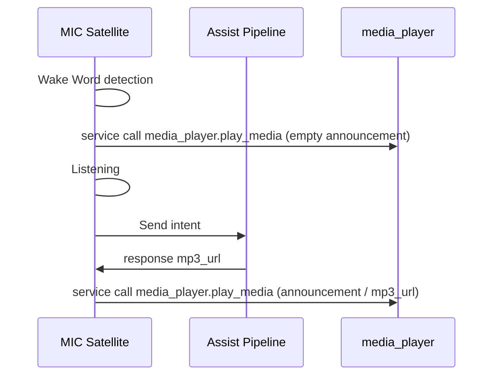

# HA Assist Mic Satellite


<p align="center">
  
</p>

***<p style="text-align: center;">«The HA Assist Mic Satellite is a compact, ESPHome-based microphone only solution.»</p>***

## Features

*2024-08-08: This is in very early development. The firmware is working, but the documentation is still in progress. The PCB and case are still in development.*

A ~~tiny~~ Atom version of the [ESP32-S3-BOX](https://esphome.io/projects/index.html)

- Local **wake word detection** (😲 holy cow, this works fast and so well)
- Redirect TTS to a configurable media **media player entity** e.g. SONOS, to play the response
- HA **Assist Pipeline integration**
- Turn **on** and **off** listening mode (**wake word detection**)
- **Show current state** (listening, idle, request, response) on the display. It is fairly readable, though it requires good eyesight 👀.

### Future ideas

- [x] **Ready made project** / **Made for ESPHome** if that is requested
- [ ] option to change the wake word
- [ ] Online OTA update for the firmware
- [ ] Redesign Animation (for small screens)
- [ ] 🚧 **Timers** (this is still work in progress)
- [ ] 3D printable **case** and **mounting solution** for the AtomS3 and the microphone
- [ ] Royalty free **sound files** the alarm

## TL;DR

Gather the following items: **M5Stack AtomS3**, [PCB](https://www.pcbway.com/project/shareproject/HA_Assist_Mic_Satellite_f5cc4682.html), header sockets and pins, and an INMP441 breakout board.
3D print the case, solder the pbc, [flash the firmware](https://www.ittips.ch/ha-assist-mic-satellite/), configure the device in Home Assistant (**Allow the device to perform Home Assistant actions** and configure your **media_player entitiy**), and you're all set.

## Try it out / Tricks

- **Wake Word**: "Okay Nabu"
- The display itself is also a button, so you can **double press to mute** the device, it stops listening for the wake word.
- If you have Music Assistant you can change the **announcement volumes**. Goto the Music Assistant Addon -> Settings -> Players -> Your Speaker -> Configure -> Announcements configuration

## Hardware

### BOM

- [M5Stack AtomS3](https://docs.m5stack.com/en/core/AtomS3) ~15$
- [PCB](#pcb) ~5$ + Shipping
- [Case](#case) ~0.5$ Filament
- **INMP441** Breakout Board (usually comes with PinSockets) ~2$
  - 2x PinSocket 1x03 2.54mm (J3, J4)
- 1x PinHeader 1x05 2.54mm (J1)
- 1x PinHeader 1x04 2.54mm (J2)
- M2 x 5mm Screw nylon or with metal with nylon washer (optional)

### PCB

The pcb was designed in KiCAD. [KiCAD Canvas Online View](https://kicanvas.org/?github=https%3A%2F%2Fgithub.com%2FMrWyss%2Fha-assist-mic-satellite%2Ftree%2Fmain%2Fpcb%2FMic%2520HAT%2520for%2520M5Stack%2520Atom) | [KiCad Project](pcb/Mic%20HAT%20for%20M5Stack%20Atom) | [PCB Step File](<pcb/Mic HAT for M5Stack Atom/Mic HAT for M5Stack Atom.step>)


🔜 Order from [PCBWay](https://www.pcbway.com/project/shareproject/HA_Assist_Mic_Satellite_f5cc4682.html) (affiliated link)

### Case

The case was designed in Fusion 360 and exported as 3mf files and step files. [Step files](case/step) | [3mf files](case/3mf)
It shouldn't need any supports for 3d printing, but I recommend printing it with your high detail settings. It is rather small.

```stl
solid ASCII
  facet normal 1.000000e+00 -0.000000e+00 0.000000e+00
    outer loop
      vertex   -5.100000e+00 -3.590000e+00 1.200000e+01
      vertex   -5.100000e+00 -3.590000e+00 1.150000e+01
      vertex   -5.100000e+00 -9.000000e-02 1.200000e+01
    endloop
  endfacet
  facet normal 1.000000e+00 0.000000e+00 0.000000e+00
    outer loop
      vertex   -5.100000e+00 -9.000000e-02 1.200000e+01
      vertex   -5.100000e+00 -3.590000e+00 1.150000e+01
      vertex   -5.100000e+00 -3.590000e+00 1.100000e+01
    endloop
  endfacet
  facet normal 1.000000e+00 0.000000e+00 0.000000e+00
    outer loop
      vertex   -5.100000e+00 -9.000000e-02 1.200000e+01
      vertex   -5.100000e+00 -3.590000e+00 1.100000e+01
      vertex   -5.100000e+00 -9.000000e-02 5.000000e+00
    endloop
  endfacet
  facet normal 1.000000e+00 0.000000e+00 0.000000e+00
    outer loop
      vertex   -5.100000e+00 -9.000000e-02 5.000000e+00
      vertex   -5.100000e+00 -3.590000e+00 1.100000e+01
      vertex   -5.100000e+00 -3.590000e+00 5.000000e+00
    endloop
  endfacet
  facet normal 0.000000e+00 1.000000e+00 -0.000000e+00
    outer loop
      vertex   5.100000e+00 -3.590000e+00 1.100000e+01
      vertex   -5.100000e+00 -3.590000e+00 1.100000e+01
      vertex   5.100000e+00 -3.590000e+00 1.150000e+01
    endloop
  endfacet
  facet normal 0.000000e+00 1.000000e+00 0.000000e+00
    outer loop
      vertex   5.100000e+00 -3.590000e+00 1.150000e+01
      vertex   -5.100000e+00 -3.590000e+00 1.100000e+01
      vertex   -5.100000e+00 -3.590000e+00 1.150000e+01
    endloop
  endfacet
  facet normal -1.000000e+00 0.000000e+00 0.000000e+00
    outer loop
      vertex   5.100000e+00 -3.590000e+00 1.200000e+01
      vertex   5.100000e+00 -9.000000e-02 1.200000e+01
      vertex   5.100000e+00 -3.590000e+00 1.150000e+01
    endloop
  endfacet
  facet normal -1.000000e+00 0.000000e+00 0.000000e+00
    outer loop
      vertex   5.100000e+00 -3.590000e+00 1.150000e+01
      vertex   5.100000e+00 -9.000000e-02 1.200000e+01
      vertex   5.100000e+00 -3.590000e+00 1.100000e+01
    endloop
  endfacet
  facet normal -1.000000e+00 0.000000e+00 0.000000e+00
    outer loop
      vertex   5.100000e+00 -3.590000e+00 1.100000e+01
      vertex   5.100000e+00 -9.000000e-02 1.200000e+01
      vertex   5.100000e+00 -9.000000e-02 5.000000e+00
    endloop
  endfacet
  facet normal -1.000000e+00 0.000000e+00 0.000000e+00
    outer loop
      vertex   5.100000e+00 -3.590000e+00 1.100000e+01
      vertex   5.100000e+00 -9.000000e-02 5.000000e+00
      vertex   5.100000e+00 -3.590000e+00 5.000000e+00
    endloop
  endfacet
  facet normal 0.000000e+00 0.000000e+00 1.000000e+00
    outer loop
      vertex   5.100000e+00 -9.000000e-02 5.000000e+00
      vertex   -5.100000e+00 -9.000000e-02 5.000000e+00
      vertex   5.100000e+00 -3.590000e+00 5.000000e+00
    endloop
  endfacet
  facet normal 0.000000e+00 0.000000e+00 1.000000e+00
    outer loop
      vertex   5.100000e+00 -3.590000e+00 5.000000e+00
      vertex   -5.100000e+00 -9.000000e-02 5.000000e+00
      vertex   -5.100000e+00 -3.590000e+00 5.000000e+00
    endloop
  endfacet
  facet normal 0.000000e+00 -1.000000e+00 -0.000000e+00
    outer loop
      vertex   6.000000e+00 -3.590000e+00 9.350000e+00
      vertex   5.100000e+00 -3.590000e+00 5.000000e+00
      vertex   6.000000e+00 -3.590000e+00 -4.050000e+00
    endloop
  endfacet
  facet normal 0.000000e+00 -1.000000e+00 0.000000e+00
    outer loop
      vertex   6.000000e+00 -3.590000e+00 -4.050000e+00
      vertex   5.100000e+00 -3.590000e+00 5.000000e+00
      vertex   1.138800e+00 -3.590000e+00 -2.589998e-01
    endloop
  endfacet
  facet normal 0.000000e+00 -1.000000e+00 0.000000e+00
    outer loop
      vertex   6.000000e+00 -3.590000e+00 -4.050000e+00
      vertex   1.138800e+00 -3.590000e+00 -2.589998e-01
      vertex   1.084962e+00 -3.590000e+00 -5.989185e-01
    endloop
  endfacet
  facet normal 0.000000e+00 -1.000000e+00 0.000000e+00
    outer loop
      vertex   9.240000e+00 -3.590000e+00 9.350000e+00
      vertex   9.500000e+00 -3.590000e+00 1.100000e+01
      vertex   6.000000e+00 -3.590000e+00 9.350000e+00
    endloop
  endfacet
  facet normal 0.000000e+00 -1.000000e+00 0.000000e+00
    outer loop
      vertex   6.000000e+00 -3.590000e+00 9.350000e+00
      vertex   9.500000e+00 -3.590000e+00 1.100000e+01
      vertex   5.100000e+00 -3.590000e+00 1.100000e+01
    endloop
  endfacet
  facet normal -0.000000e+00 -1.000000e+00 0.000000e+00
    outer loop
      vertex   6.000000e+00 -3.590000e+00 9.350000e+00
      vertex   5.100000e+00 -3.590000e+00 1.100000e+01
      vertex   5.100000e+00 -3.590000e+00 5.000000e+00
    endloop
  endfacet
  facet normal 0.000000e+00 -1.000000e+00 0.000000e+00
    outer loop
      vertex   9.240000e+00 -3.590000e+00 -4.050000e+00
      vertex   1.100000e+01 -3.590000e+00 9.500000e+00
      vertex   9.240000e+00 -3.590000e+00 9.350000e+00
    endloop
  endfacet
  facet normal 0.000000e+00 -1.000000e+00 0.000000e+00
    outer loop
      vertex   9.240000e+00 -3.590000e+00 9.350000e+00
      vertex   1.100000e+01 -3.590000e+00 9.500000e+00
      vertex   1.094889e+01 -3.590000e+00 9.888229e+00
    endloop
  endfacet
  facet normal 0.000000e+00 -1.000000e+00 0.000000e+00
    outer loop
      vertex   9.240000e+00 -3.590000e+00 9.350000e+00
      vertex   1.094889e+01 -3.590000e+00 9.888229e+00
      vertex   1.079904e+01 -3.590000e+00 1.025000e+01
    endloop
  endfacet
  facet normal 0.000000e+00 -1.000000e+00 -0.000000e+00
    outer loop
      vertex   1.100000e+01 -3.590000e+00 9.500000e+00
      vertex   9.240000e+00 -3.590000e+00 -4.050000e+00
      vertex   1.100000e+01 -3.590000e+00 -9.500000e+00
    endloop
  endfacet
  facet normal 0.000000e+00 -1.000000e+00 0.000000e+00
    outer loop
      vertex   1.100000e+01 -3.590000e+00 -9.500000e+00
      vertex   9.240000e+00 -3.590000e+00 -4.050000e+00
      vertex   6.000000e+00 -3.590000e+00 -4.050000e+00
    endloop
  endfacet
  facet normal -0.000000e+00 -1.000000e+00 0.000000e+00
    outer loop
      vertex   1.100000e+01 -3.590000e+00 -9.500000e+00
      vertex   6.000000e+00 -3.590000e+00 -4.050000e+00
      vertex   9.500000e+00 -3.590000e+00 -1.100000e+01
    endloop
  endfacet
  facet normal 0.000000e+00 -1.000000e+00 0.000000e+00
    outer loop
      vertex   9.500000e+00 -3.590000e+00 -1.100000e+01
      vertex   6.000000e+00 -3.590000e+00 -4.050000e+00
      vertex   3.800000e+00 -3.590000e+00 -1.100000e+01
    endloop
  endfacet
  facet normal 0.000000e+00 -1.000000e+00 0.000000e+00
    outer loop
      vertex   3.800000e+00 -3.590000e+00 -1.100000e+01
      vertex   6.000000e+00 -3.590000e+00 -4.050000e+00
      vertex   3.787188e-01 -3.590000e+00 -1.305162e+00
    endloop
  endfacet
  facet normal 0.000000e+00 -1.000000e+00 0.000000e+00
    outer loop
      vertex   3.800000e+00 -3.590000e+00 -1.100000e+01
      vertex   3.787188e-01 -3.590000e+00 -1.305162e+00
      vertex   3.880009e-02 -3.590000e+00 -1.359000e+00
    endloop
  endfacet
  facet normal 0.000000e+00 -1.000000e+00 0.000000e+00
    outer loop
      vertex   -6.000000e+00 -3.590000e+00 9.350000e+00
      vertex   -6.000000e+00 -3.590000e+00 5.000000e+00
      vertex   -5.100000e+00 -3.590000e+00 5.000000e+00
    endloop
  endfacet
  facet normal -0.000000e+00 -1.000000e+00 0.000000e+00
    outer loop
      vertex   -5.100000e+00 -3.590000e+00 5.000000e+00
      vertex   -6.000000e+00 -3.590000e+00 5.000000e+00
      vertex   -6.000000e+00 -3.590000e+00 -1.510000e+00
    endloop
  endfacet
  facet normal 0.000000e+00 -1.000000e+00 -0.000000e+00
    outer loop
      vertex   -5.100000e+00 -3.590000e+00 5.000000e+00
      vertex   -6.000000e+00 -3.590000e+00 -1.510000e+00
      vertex   -1.007362e+00 -3.590000e+00 8.091887e-02
    endloop
  endfacet
  facet normal 0.000000e+00 -1.000000e+00 0.000000e+00
    outer loop
      vertex   -1.007362e+00 -3.590000e+00 8.091887e-02
      vertex   -6.000000e+00 -3.590000e+00 -1.510000e+00
      vertex   -1.061200e+00 -3.590000e+00 -2.589998e-01
    endloop
  endfacet
  facet normal 0.000000e+00 -1.000000e+00 -0.000000e+00
    outer loop
      vertex   -1.061200e+00 -3.590000e+00 -2.589998e-01
      vertex   -6.000000e+00 -3.590000e+00 -1.510000e+00
      vertex   -1.007362e+00 -3.590000e+00 -5.989185e-01
    endloop
  endfacet
  facet normal 0.000000e+00 -1.000000e+00 -0.000000e+00
    outer loop
      vertex   -1.007362e+00 -3.590000e+00 -5.989185e-01
      vertex   -6.000000e+00 -3.590000e+00 -1.510000e+00
      vertex   -8.511186e-01 -3.590000e+00 -9.055636e-01
    endloop
  endfacet
  facet normal 0.000000e+00 -1.000000e+00 -0.000000e+00
    outer loop
      vertex   -8.511186e-01 -3.590000e+00 -9.055636e-01
      vertex   -6.000000e+00 -3.590000e+00 -1.510000e+00
      vertex   -6.077637e-01 -3.590000e+00 -1.148919e+00
    endloop
  endfacet
  facet normal 0.000000e+00 -1.000000e+00 0.000000e+00
    outer loop
      vertex   -6.077637e-01 -3.590000e+00 -1.148919e+00
      vertex   -6.000000e+00 -3.590000e+00 -1.510000e+00
      vertex   -3.800000e+00 -3.590000e+00 -1.100000e+01
    endloop
  endfacet
  facet normal 0.000000e+00 -1.000000e+00 -0.000000e+00
    outer loop
      vertex   -6.077637e-01 -3.590000e+00 -1.148919e+00
      vertex   -3.800000e+00 -3.590000e+00 -1.100000e+01
      vertex   -3.011186e-01 -3.590000e+00 -1.305162e+00
    endloop
  endfacet
  facet normal 0.000000e+00 -1.000000e+00 -0.000000e+00
    outer loop
      vertex   -3.011186e-01 -3.590000e+00 -1.305162e+00
      vertex   -3.800000e+00 -3.590000e+00 -1.100000e+01
      vertex   3.880009e-02 -3.590000e+00 -1.359000e+00
    endloop
  endfacet
  facet normal 0.000000e+00 -1.000000e+00 -0.000000e+00
    outer loop
      vertex   3.880009e-02 -3.590000e+00 -1.359000e+00
      vertex   -3.800000e+00 -3.590000e+00 -1.100000e+01
      vertex   3.800000e+00 -3.590000e+00 -1.100000e+01
    endloop
  endfacet
  facet normal 0.000000e+00 -1.000000e+00 -0.000000e+00
    outer loop
      vertex   -9.240000e+00 -3.590000e+00 -1.510000e+00
      vertex   -1.100000e+01 -3.590000e+00 -9.500000e+00
      vertex   -6.000000e+00 -3.590000e+00 -1.510000e+00
    endloop
  endfacet
  facet normal 0.000000e+00 -1.000000e+00 0.000000e+00
    outer loop
      vertex   -6.000000e+00 -3.590000e+00 -1.510000e+00
      vertex   -1.100000e+01 -3.590000e+00 -9.500000e+00
      vertex   -9.500000e+00 -3.590000e+00 -1.100000e+01
    endloop
  endfacet
  facet normal 0.000000e+00 -1.000000e+00 -0.000000e+00
    outer loop
      vertex   -6.000000e+00 -3.590000e+00 -1.510000e+00
      vertex   -9.500000e+00 -3.590000e+00 -1.100000e+01
      vertex   -3.800000e+00 -3.590000e+00 -1.100000e+01
    endloop
  endfacet
  facet normal 0.000000e+00 -1.000000e+00 0.000000e+00
    outer loop
      vertex   -1.100000e+01 -3.590000e+00 -9.500000e+00
      vertex   -9.240000e+00 -3.590000e+00 -1.510000e+00
      vertex   -1.100000e+01 -3.590000e+00 9.500000e+00
    endloop
  endfacet
  facet normal 0.000000e+00 -1.000000e+00 0.000000e+00
    outer loop
      vertex   -1.100000e+01 -3.590000e+00 9.500000e+00
      vertex   -9.240000e+00 -3.590000e+00 -1.510000e+00
      vertex   -9.240000e+00 -3.590000e+00 9.350000e+00
    endloop
  endfacet
  facet normal 0.000000e+00 -1.000000e+00 0.000000e+00
    outer loop
      vertex   -1.100000e+01 -3.590000e+00 9.500000e+00
      vertex   -9.240000e+00 -3.590000e+00 9.350000e+00
      vertex   -1.094889e+01 -3.590000e+00 9.888229e+00
    endloop
  endfacet
  facet normal 0.000000e+00 -1.000000e+00 0.000000e+00
    outer loop
      vertex   -1.094889e+01 -3.590000e+00 9.888229e+00
      vertex   -9.240000e+00 -3.590000e+00 9.350000e+00
      vertex   -1.079904e+01 -3.590000e+00 1.025000e+01
    endloop
  endfacet
  facet normal 0.000000e+00 -1.000000e+00 0.000000e+00
    outer loop
      vertex   -1.079904e+01 -3.590000e+00 1.025000e+01
      vertex   -9.240000e+00 -3.590000e+00 9.350000e+00
      vertex   -1.056066e+01 -3.590000e+00 1.056066e+01
    endloop
  endfacet
  facet normal 0.000000e+00 -1.000000e+00 0.000000e+00
    outer loop
      vertex   -1.056066e+01 -3.590000e+00 1.056066e+01
      vertex   -9.240000e+00 -3.590000e+00 9.350000e+00
      vertex   -1.025000e+01 -3.590000e+00 1.079904e+01
    endloop
  endfacet
  facet normal 0.000000e+00 -1.000000e+00 0.000000e+00
    outer loop
      vertex   -1.025000e+01 -3.590000e+00 1.079904e+01
      vertex   -9.240000e+00 -3.590000e+00 9.350000e+00
      vertex   -9.888229e+00 -3.590000e+00 1.094889e+01
    endloop
  endfacet
  facet normal 0.000000e+00 -1.000000e+00 0.000000e+00
    outer loop
      vertex   -9.888229e+00 -3.590000e+00 1.094889e+01
      vertex   -9.240000e+00 -3.590000e+00 9.350000e+00
      vertex   -9.500000e+00 -3.590000e+00 1.100000e+01
    endloop
  endfacet
  facet normal 0.000000e+00 -1.000000e+00 0.000000e+00
    outer loop
      vertex   -9.500000e+00 -3.590000e+00 1.100000e+01
      vertex   -9.240000e+00 -3.590000e+00 9.350000e+00
      vertex   -6.000000e+00 -3.590000e+00 9.350000e+00
    endloop
  endfacet
  facet normal 0.000000e+00 -1.000000e+00 0.000000e+00
    outer loop
      vertex   -9.500000e+00 -3.590000e+00 1.100000e+01
      vertex   -6.000000e+00 -3.590000e+00 9.350000e+00
      vertex   -5.100000e+00 -3.590000e+00 1.100000e+01
    endloop
  endfacet
  facet normal 0.000000e+00 -1.000000e+00 -0.000000e+00
    outer loop
      vertex   -5.100000e+00 -3.590000e+00 1.100000e+01
      vertex   -6.000000e+00 -3.590000e+00 9.350000e+00
      vertex   -5.100000e+00 -3.590000e+00 5.000000e+00
    endloop
  endfacet
  facet normal 0.000000e+00 -1.000000e+00 0.000000e+00
    outer loop
      vertex   -1.007362e+00 -3.590000e+00 8.091887e-02
      vertex   -8.511186e-01 -3.590000e+00 3.875640e-01
      vertex   -5.100000e+00 -3.590000e+00 5.000000e+00
    endloop
  endfacet
  facet normal 0.000000e+00 -1.000000e+00 0.000000e+00
    outer loop
      vertex   -5.100000e+00 -3.590000e+00 5.000000e+00
      vertex   -8.511186e-01 -3.590000e+00 3.875640e-01
      vertex   -6.077637e-01 -3.590000e+00 6.309189e-01
    endloop
  endfacet
  facet normal 0.000000e+00 -1.000000e+00 0.000000e+00
    outer loop
      vertex   -5.100000e+00 -3.590000e+00 5.000000e+00
      vertex   -6.077637e-01 -3.590000e+00 6.309189e-01
      vertex   -3.011186e-01 -3.590000e+00 7.871623e-01
    endloop
  endfacet
  facet normal 0.000000e+00 -1.000000e+00 0.000000e+00
    outer loop
      vertex   -3.011186e-01 -3.590000e+00 7.871623e-01
      vertex   3.880009e-02 -3.590000e+00 8.410002e-01
      vertex   -5.100000e+00 -3.590000e+00 5.000000e+00
    endloop
  endfacet
  facet normal 0.000000e+00 -1.000000e+00 0.000000e+00
    outer loop
      vertex   -5.100000e+00 -3.590000e+00 5.000000e+00
      vertex   3.880009e-02 -3.590000e+00 8.410002e-01
      vertex   5.100000e+00 -3.590000e+00 5.000000e+00
    endloop
  endfacet
  facet normal 0.000000e+00 -1.000000e+00 0.000000e+00
    outer loop
      vertex   5.100000e+00 -3.590000e+00 5.000000e+00
      vertex   3.880009e-02 -3.590000e+00 8.410002e-01
      vertex   3.787188e-01 -3.590000e+00 7.871623e-01
    endloop
  endfacet
  facet normal 0.000000e+00 -1.000000e+00 0.000000e+00
    outer loop
      vertex   5.100000e+00 -3.590000e+00 5.000000e+00
      vertex   3.787188e-01 -3.590000e+00 7.871623e-01
      vertex   6.853639e-01 -3.590000e+00 6.309189e-01
    endloop
  endfacet
  facet normal 0.000000e+00 -1.000000e+00 0.000000e+00
    outer loop
      vertex   6.853639e-01 -3.590000e+00 6.309189e-01
      vertex   9.287188e-01 -3.590000e+00 3.875640e-01
      vertex   5.100000e+00 -3.590000e+00 5.000000e+00
    endloop
  endfacet
  facet normal 0.000000e+00 -1.000000e+00 0.000000e+00
    outer loop
      vertex   5.100000e+00 -3.590000e+00 5.000000e+00
      vertex   9.287188e-01 -3.590000e+00 3.875640e-01
      vertex   1.084962e+00 -3.590000e+00 8.091887e-02
    endloop
  endfacet
  facet normal 0.000000e+00 -1.000000e+00 0.000000e+00
    outer loop
      vertex   5.100000e+00 -3.590000e+00 5.000000e+00
      vertex   1.084962e+00 -3.590000e+00 8.091887e-02
      vertex   1.138800e+00 -3.590000e+00 -2.589998e-01
    endloop
  endfacet
  facet normal 0.000000e+00 -1.000000e+00 -0.000000e+00
    outer loop
      vertex   1.084962e+00 -3.590000e+00 -5.989185e-01
      vertex   9.287188e-01 -3.590000e+00 -9.055636e-01
      vertex   6.000000e+00 -3.590000e+00 -4.050000e+00
    endloop
  endfacet
  facet normal 0.000000e+00 -1.000000e+00 0.000000e+00
    outer loop
      vertex   6.000000e+00 -3.590000e+00 -4.050000e+00
      vertex   9.287188e-01 -3.590000e+00 -9.055636e-01
      vertex   6.853639e-01 -3.590000e+00 -1.148919e+00
    endloop
  endfacet
  facet normal 0.000000e+00 -1.000000e+00 0.000000e+00
    outer loop
      vertex   6.000000e+00 -3.590000e+00 -4.050000e+00
      vertex   6.853639e-01 -3.590000e+00 -1.148919e+00
      vertex   3.787188e-01 -3.590000e+00 -1.305162e+00
    endloop
  endfacet
  facet normal 0.000000e+00 -1.000000e+00 0.000000e+00
    outer loop
      vertex   -1.094889e+01 -3.590000e+00 -9.888229e+00
      vertex   -1.079904e+01 -3.590000e+00 -1.025000e+01
      vertex   -1.100000e+01 -3.590000e+00 -9.500000e+00
    endloop
  endfacet
  facet normal 0.000000e+00 -1.000000e+00 0.000000e+00
    outer loop
      vertex   -1.100000e+01 -3.590000e+00 -9.500000e+00
      vertex   -1.079904e+01 -3.590000e+00 -1.025000e+01
      vertex   -1.056066e+01 -3.590000e+00 -1.056066e+01
    endloop
  endfacet
  facet normal 0.000000e+00 -1.000000e+00 0.000000e+00
    outer loop
      vertex   -1.100000e+01 -3.590000e+00 -9.500000e+00
      vertex   -1.056066e+01 -3.590000e+00 -1.056066e+01
      vertex   -1.025000e+01 -3.590000e+00 -1.079904e+01
    endloop
  endfacet
  facet normal 0.000000e+00 -1.000000e+00 0.000000e+00
    outer loop
      vertex   -1.025000e+01 -3.590000e+00 -1.079904e+01
      vertex   -9.888229e+00 -3.590000e+00 -1.094889e+01
      vertex   -1.100000e+01 -3.590000e+00 -9.500000e+00
    endloop
  endfacet
  facet normal 0.000000e+00 -1.000000e+00 0.000000e+00
    outer loop
      vertex   -1.100000e+01 -3.590000e+00 -9.500000e+00
      vertex   -9.888229e+00 -3.590000e+00 -1.094889e+01
      vertex   -9.500000e+00 -3.590000e+00 -1.100000e+01
    endloop
  endfacet
  facet normal -0.000000e+00 -1.000000e+00 -0.000000e+00
    outer loop
      vertex   3.800000e+00 -3.590000e+00 -1.100000e+01
      vertex   -3.800000e+00 -3.590000e+00 -1.100000e+01
      vertex   3.800000e+00 -3.590000e+00 -1.150000e+01
    endloop
  endfacet
  facet normal 0.000000e+00 -1.000000e+00 0.000000e+00
    outer loop
      vertex   3.800000e+00 -3.590000e+00 -1.150000e+01
      vertex   -3.800000e+00 -3.590000e+00 -1.100000e+01
      vertex   -3.800000e+00 -3.590000e+00 -1.150000e+01
    endloop
  endfacet
  facet normal -0.000000e+00 -1.000000e+00 -0.000000e+00
    outer loop
      vertex   3.800000e+00 -3.590000e+00 -1.150000e+01
      vertex   -3.800000e+00 -3.590000e+00 -1.150000e+01
      vertex   9.500000e+00 -3.590000e+00 -1.200000e+01
    endloop
  endfacet
  facet normal 0.000000e+00 -1.000000e+00 0.000000e+00
    outer loop
      vertex   9.500000e+00 -3.590000e+00 -1.200000e+01
      vertex   -3.800000e+00 -3.590000e+00 -1.150000e+01
      vertex   -9.500000e+00 -3.590000e+00 -1.200000e+01
    endloop
  endfacet
  facet normal 0.000000e+00 -1.000000e+00 0.000000e+00
    outer loop
      vertex   -9.500000e+00 -3.590000e+00 -1.200000e+01
      vertex   -3.800000e+00 -3.590000e+00 -1.150000e+01
      vertex   -9.500000e+00 -3.590000e+00 -1.150000e+01
    endloop
  endfacet
  facet normal 0.000000e+00 -1.000000e+00 0.000000e+00
    outer loop
      vertex   -9.500000e+00 -3.590000e+00 -1.200000e+01
      vertex   -9.500000e+00 -3.590000e+00 -1.150000e+01
      vertex   -9.987726e+00 -3.590000e+00 -1.195196e+01
    endloop
  endfacet
  facet normal 0.000000e+00 -1.000000e+00 0.000000e+00
    outer loop
      vertex   -9.987726e+00 -3.590000e+00 -1.195196e+01
      vertex   -9.500000e+00 -3.590000e+00 -1.150000e+01
      vertex   -9.945042e+00 -3.590000e+00 -1.144986e+01
    endloop
  endfacet
  facet normal 0.000000e+00 -1.000000e+00 0.000000e+00
    outer loop
      vertex   -9.987726e+00 -3.590000e+00 -1.195196e+01
      vertex   -9.945042e+00 -3.590000e+00 -1.144986e+01
      vertex   -1.045671e+01 -3.590000e+00 -1.180970e+01
    endloop
  endfacet
  facet normal 0.000000e+00 -1.000000e+00 0.000000e+00
    outer loop
      vertex   -1.045671e+01 -3.590000e+00 -1.180970e+01
      vertex   -9.945042e+00 -3.590000e+00 -1.144986e+01
      vertex   -1.036777e+01 -3.590000e+00 -1.130194e+01
    endloop
  endfacet
  facet normal 0.000000e+00 -1.000000e+00 0.000000e+00
    outer loop
      vertex   -1.045671e+01 -3.590000e+00 -1.180970e+01
      vertex   -1.036777e+01 -3.590000e+00 -1.130194e+01
      vertex   -1.088893e+01 -3.590000e+00 -1.157867e+01
    endloop
  endfacet
  facet normal 0.000000e+00 -1.000000e+00 0.000000e+00
    outer loop
      vertex   -1.088893e+01 -3.590000e+00 -1.157867e+01
      vertex   -1.036777e+01 -3.590000e+00 -1.130194e+01
      vertex   -1.074698e+01 -3.590000e+00 -1.106366e+01
    endloop
  endfacet
  facet normal 0.000000e+00 -1.000000e+00 0.000000e+00
    outer loop
      vertex   -1.088893e+01 -3.590000e+00 -1.157867e+01
      vertex   -1.074698e+01 -3.590000e+00 -1.106366e+01
      vertex   -1.126777e+01 -3.590000e+00 -1.126777e+01
    endloop
  endfacet
  facet normal 0.000000e+00 -1.000000e+00 0.000000e+00
    outer loop
      vertex   -1.126777e+01 -3.590000e+00 -1.126777e+01
      vertex   -1.074698e+01 -3.590000e+00 -1.106366e+01
      vertex   -1.106366e+01 -3.590000e+00 -1.074698e+01
    endloop
  endfacet
  facet normal 0.000000e+00 -1.000000e+00 0.000000e+00
    outer loop
      vertex   -1.126777e+01 -3.590000e+00 -1.126777e+01
      vertex   -1.106366e+01 -3.590000e+00 -1.074698e+01
      vertex   -1.157867e+01 -3.590000e+00 -1.088893e+01
    endloop
  endfacet
  facet normal 0.000000e+00 -1.000000e+00 0.000000e+00
    outer loop
      vertex   -1.157867e+01 -3.590000e+00 -1.088893e+01
      vertex   -1.106366e+01 -3.590000e+00 -1.074698e+01
      vertex   -1.130194e+01 -3.590000e+00 -1.036777e+01
    endloop
  endfacet
  facet normal 0.000000e+00 -1.000000e+00 0.000000e+00
    outer loop
      vertex   -1.157867e+01 -3.590000e+00 -1.088893e+01
      vertex   -1.130194e+01 -3.590000e+00 -1.036777e+01
      vertex   -1.180970e+01 -3.590000e+00 -1.045671e+01
    endloop
  endfacet
  facet normal 0.000000e+00 -1.000000e+00 0.000000e+00
    outer loop
      vertex   -1.180970e+01 -3.590000e+00 -1.045671e+01
      vertex   -1.130194e+01 -3.590000e+00 -1.036777e+01
      vertex   -1.144986e+01 -3.590000e+00 -9.945042e+00
    endloop
  endfacet
  facet normal 0.000000e+00 -1.000000e+00 0.000000e+00
    outer loop
      vertex   -1.180970e+01 -3.590000e+00 -1.045671e+01
      vertex   -1.144986e+01 -3.590000e+00 -9.945042e+00
      vertex   -1.195196e+01 -3.590000e+00 -9.987726e+00
    endloop
  endfacet
  facet normal 0.000000e+00 -1.000000e+00 0.000000e+00
    outer loop
      vertex   -1.195196e+01 -3.590000e+00 -9.987726e+00
      vertex   -1.144986e+01 -3.590000e+00 -9.945042e+00
      vertex   -1.150000e+01 -3.590000e+00 -9.500000e+00
    endloop
  endfacet
  facet normal 0.000000e+00 -1.000000e+00 0.000000e+00
    outer loop
      vertex   -1.195196e+01 -3.590000e+00 -9.987726e+00
      vertex   -1.150000e+01 -3.590000e+00 -9.500000e+00
      vertex   -1.200000e+01 -3.590000e+00 -9.500000e+00
    endloop
  endfacet
  facet normal 0.000000e+00 -1.000000e+00 0.000000e+00
    outer loop
      vertex   -1.200000e+01 -3.590000e+00 -9.500000e+00
      vertex   -1.150000e+01 -3.590000e+00 -9.500000e+00
      vertex   -1.200000e+01 -3.590000e+00 9.500000e+00
    endloop
  endfacet
  facet normal 0.000000e+00 -1.000000e+00 0.000000e+00
    outer loop
      vertex   -1.200000e+01 -3.590000e+00 9.500000e+00
      vertex   -1.150000e+01 -3.590000e+00 -9.500000e+00
      vertex   -1.150000e+01 -3.590000e+00 9.500000e+00
    endloop
  endfacet
  facet normal 0.000000e+00 -1.000000e+00 0.000000e+00
    outer loop
      vertex   -1.200000e+01 -3.590000e+00 9.500000e+00
      vertex   -1.150000e+01 -3.590000e+00 9.500000e+00
      vertex   -1.195196e+01 -3.590000e+00 9.987726e+00
    endloop
  endfacet
  facet normal 0.000000e+00 -1.000000e+00 0.000000e+00
    outer loop
      vertex   -1.195196e+01 -3.590000e+00 9.987726e+00
      vertex   -1.150000e+01 -3.590000e+00 9.500000e+00
      vertex   -1.144986e+01 -3.590000e+00 9.945042e+00
    endloop
  endfacet
  facet normal 0.000000e+00 -1.000000e+00 0.000000e+00
    outer loop
      vertex   -1.195196e+01 -3.590000e+00 9.987726e+00
      vertex   -1.144986e+01 -3.590000e+00 9.945042e+00
      vertex   -1.180970e+01 -3.590000e+00 1.045671e+01
    endloop
  endfacet
  facet normal 0.000000e+00 -1.000000e+00 0.000000e+00
    outer loop
      vertex   -1.180970e+01 -3.590000e+00 1.045671e+01
      vertex   -1.144986e+01 -3.590000e+00 9.945042e+00
      vertex   -1.130194e+01 -3.590000e+00 1.036777e+01
    endloop
  endfacet
  facet normal 0.000000e+00 -1.000000e+00 0.000000e+00
    outer loop
      vertex   -1.180970e+01 -3.590000e+00 1.045671e+01
      vertex   -1.130194e+01 -3.590000e+00 1.036777e+01
      vertex   -1.157867e+01 -3.590000e+00 1.088893e+01
    endloop
  endfacet
  facet normal 0.000000e+00 -1.000000e+00 0.000000e+00
    outer loop
      vertex   -1.157867e+01 -3.590000e+00 1.088893e+01
      vertex   -1.130194e+01 -3.590000e+00 1.036777e+01
      vertex   -1.106366e+01 -3.590000e+00 1.074698e+01
    endloop
  endfacet
  facet normal 0.000000e+00 -1.000000e+00 0.000000e+00
    outer loop
      vertex   -1.157867e+01 -3.590000e+00 1.088893e+01
      vertex   -1.106366e+01 -3.590000e+00 1.074698e+01
      vertex   -1.126777e+01 -3.590000e+00 1.126777e+01
    endloop
  endfacet
  facet normal 0.000000e+00 -1.000000e+00 0.000000e+00
    outer loop
      vertex   -1.126777e+01 -3.590000e+00 1.126777e+01
      vertex   -1.106366e+01 -3.590000e+00 1.074698e+01
      vertex   -1.074698e+01 -3.590000e+00 1.106366e+01
    endloop
  endfacet
  facet normal 0.000000e+00 -1.000000e+00 0.000000e+00
    outer loop
      vertex   -1.126777e+01 -3.590000e+00 1.126777e+01
      vertex   -1.074698e+01 -3.590000e+00 1.106366e+01
      vertex   -1.088893e+01 -3.590000e+00 1.157867e+01
    endloop
  endfacet
  facet normal 0.000000e+00 -1.000000e+00 0.000000e+00
    outer loop
      vertex   -1.088893e+01 -3.590000e+00 1.157867e+01
      vertex   -1.074698e+01 -3.590000e+00 1.106366e+01
      vertex   -1.036777e+01 -3.590000e+00 1.130194e+01
    endloop
  endfacet
  facet normal 0.000000e+00 -1.000000e+00 0.000000e+00
    outer loop
      vertex   -1.088893e+01 -3.590000e+00 1.157867e+01
      vertex   -1.036777e+01 -3.590000e+00 1.130194e+01
      vertex   -1.045671e+01 -3.590000e+00 1.180970e+01
    endloop
  endfacet
  facet normal 0.000000e+00 -1.000000e+00 0.000000e+00
    outer loop
      vertex   -1.045671e+01 -3.590000e+00 1.180970e+01
      vertex   -1.036777e+01 -3.590000e+00 1.130194e+01
      vertex   -9.945042e+00 -3.590000e+00 1.144986e+01
    endloop
  endfacet
  facet normal 0.000000e+00 -1.000000e+00 0.000000e+00
    outer loop
      vertex   -1.045671e+01 -3.590000e+00 1.180970e+01
      vertex   -9.945042e+00 -3.590000e+00 1.144986e+01
      vertex   -9.987726e+00 -3.590000e+00 1.195196e+01
    endloop
  endfacet
  facet normal 0.000000e+00 -1.000000e+00 0.000000e+00
    outer loop
      vertex   -9.987726e+00 -3.590000e+00 1.195196e+01
      vertex   -9.945042e+00 -3.590000e+00 1.144986e+01
      vertex   -9.500000e+00 -3.590000e+00 1.150000e+01
    endloop
  endfacet
  facet normal 0.000000e+00 -1.000000e+00 0.000000e+00
    outer loop
      vertex   -9.987726e+00 -3.590000e+00 1.195196e+01
      vertex   -9.500000e+00 -3.590000e+00 1.150000e+01
      vertex   -9.500000e+00 -3.590000e+00 1.200000e+01
    endloop
  endfacet
  facet normal 0.000000e+00 -1.000000e+00 0.000000e+00
    outer loop
      vertex   -9.500000e+00 -3.590000e+00 1.200000e+01
      vertex   -9.500000e+00 -3.590000e+00 1.150000e+01
      vertex   -5.100000e+00 -3.590000e+00 1.150000e+01
    endloop
  endfacet
  facet normal 0.000000e+00 -1.000000e+00 0.000000e+00
    outer loop
      vertex   -9.500000e+00 -3.590000e+00 1.200000e+01
      vertex   -5.100000e+00 -3.590000e+00 1.150000e+01
      vertex   -5.100000e+00 -3.590000e+00 1.200000e+01
    endloop
  endfacet
  facet normal 0.000000e+00 -1.000000e+00 0.000000e+00
    outer loop
      vertex   3.800000e+00 -3.590000e+00 -1.150000e+01
      vertex   9.500000e+00 -3.590000e+00 -1.200000e+01
      vertex   9.500000e+00 -3.590000e+00 -1.150000e+01
    endloop
  endfacet
  facet normal 0.000000e+00 -1.000000e+00 0.000000e+00
    outer loop
      vertex   9.500000e+00 -3.590000e+00 -1.150000e+01
      vertex   9.500000e+00 -3.590000e+00 -1.200000e+01
      vertex   9.987726e+00 -3.590000e+00 -1.195196e+01
    endloop
  endfacet
  facet normal 0.000000e+00 -1.000000e+00 0.000000e+00
    outer loop
      vertex   9.500000e+00 -3.590000e+00 -1.150000e+01
      vertex   9.987726e+00 -3.590000e+00 -1.195196e+01
      vertex   9.945042e+00 -3.590000e+00 -1.144986e+01
    endloop
  endfacet
  facet normal 0.000000e+00 -1.000000e+00 0.000000e+00
    outer loop
      vertex   9.945042e+00 -3.590000e+00 -1.144986e+01
      vertex   9.987726e+00 -3.590000e+00 -1.195196e+01
      vertex   1.045671e+01 -3.590000e+00 -1.180970e+01
    endloop
  endfacet
  facet normal 0.000000e+00 -1.000000e+00 0.000000e+00
    outer loop
      vertex   9.945042e+00 -3.590000e+00 -1.144986e+01
      vertex   1.045671e+01 -3.590000e+00 -1.180970e+01
      vertex   1.036777e+01 -3.590000e+00 -1.130194e+01
    endloop
  endfacet
  facet normal 0.000000e+00 -1.000000e+00 0.000000e+00
    outer loop
      vertex   1.036777e+01 -3.590000e+00 -1.130194e+01
      vertex   1.045671e+01 -3.590000e+00 -1.180970e+01
      vertex   1.088893e+01 -3.590000e+00 -1.157867e+01
    endloop
  endfacet
  facet normal 0.000000e+00 -1.000000e+00 0.000000e+00
    outer loop
      vertex   1.036777e+01 -3.590000e+00 -1.130194e+01
      vertex   1.088893e+01 -3.590000e+00 -1.157867e+01
      vertex   1.074698e+01 -3.590000e+00 -1.106366e+01
    endloop
  endfacet
  facet normal 0.000000e+00 -1.000000e+00 0.000000e+00
    outer loop
      vertex   1.074698e+01 -3.590000e+00 -1.106366e+01
      vertex   1.088893e+01 -3.590000e+00 -1.157867e+01
      vertex   1.126777e+01 -3.590000e+00 -1.126777e+01
    endloop
  endfacet
  facet normal 0.000000e+00 -1.000000e+00 0.000000e+00
    outer loop
      vertex   1.074698e+01 -3.590000e+00 -1.106366e+01
      vertex   1.126777e+01 -3.590000e+00 -1.126777e+01
      vertex   1.106366e+01 -3.590000e+00 -1.074698e+01
    endloop
  endfacet
  facet normal 0.000000e+00 -1.000000e+00 0.000000e+00
    outer loop
      vertex   1.106366e+01 -3.590000e+00 -1.074698e+01
      vertex   1.126777e+01 -3.590000e+00 -1.126777e+01
      vertex   1.157867e+01 -3.590000e+00 -1.088893e+01
    endloop
  endfacet
  facet normal 0.000000e+00 -1.000000e+00 0.000000e+00
    outer loop
      vertex   1.106366e+01 -3.590000e+00 -1.074698e+01
      vertex   1.157867e+01 -3.590000e+00 -1.088893e+01
      vertex   1.130194e+01 -3.590000e+00 -1.036777e+01
    endloop
  endfacet
  facet normal 0.000000e+00 -1.000000e+00 0.000000e+00
    outer loop
      vertex   1.130194e+01 -3.590000e+00 -1.036777e+01
      vertex   1.157867e+01 -3.590000e+00 -1.088893e+01
      vertex   1.180970e+01 -3.590000e+00 -1.045671e+01
    endloop
  endfacet
  facet normal 0.000000e+00 -1.000000e+00 0.000000e+00
    outer loop
      vertex   1.130194e+01 -3.590000e+00 -1.036777e+01
      vertex   1.180970e+01 -3.590000e+00 -1.045671e+01
      vertex   1.144986e+01 -3.590000e+00 -9.945042e+00
    endloop
  endfacet
  facet normal 0.000000e+00 -1.000000e+00 0.000000e+00
    outer loop
      vertex   1.144986e+01 -3.590000e+00 -9.945042e+00
      vertex   1.180970e+01 -3.590000e+00 -1.045671e+01
      vertex   1.195196e+01 -3.590000e+00 -9.987726e+00
    endloop
  endfacet
  facet normal 0.000000e+00 -1.000000e+00 0.000000e+00
    outer loop
      vertex   1.144986e+01 -3.590000e+00 -9.945042e+00
      vertex   1.195196e+01 -3.590000e+00 -9.987726e+00
      vertex   1.150000e+01 -3.590000e+00 -9.500000e+00
    endloop
  endfacet
  facet normal 0.000000e+00 -1.000000e+00 0.000000e+00
    outer loop
      vertex   1.150000e+01 -3.590000e+00 -9.500000e+00
      vertex   1.195196e+01 -3.590000e+00 -9.987726e+00
      vertex   1.200000e+01 -3.590000e+00 -9.500000e+00
    endloop
  endfacet
  facet normal 0.000000e+00 -1.000000e+00 0.000000e+00
    outer loop
      vertex   1.150000e+01 -3.590000e+00 -9.500000e+00
      vertex   1.200000e+01 -3.590000e+00 -9.500000e+00
      vertex   1.150000e+01 -3.590000e+00 9.500000e+00
    endloop
  endfacet
  facet normal 0.000000e+00 -1.000000e+00 0.000000e+00
    outer loop
      vertex   1.150000e+01 -3.590000e+00 9.500000e+00
      vertex   1.200000e+01 -3.590000e+00 -9.500000e+00
      vertex   1.200000e+01 -3.590000e+00 9.500000e+00
    endloop
  endfacet
  facet normal 0.000000e+00 -1.000000e+00 0.000000e+00
    outer loop
      vertex   1.150000e+01 -3.590000e+00 9.500000e+00
      vertex   1.200000e+01 -3.590000e+00 9.500000e+00
      vertex   1.195196e+01 -3.590000e+00 9.987726e+00
    endloop
  endfacet
  facet normal 0.000000e+00 -1.000000e+00 0.000000e+00
    outer loop
      vertex   1.150000e+01 -3.590000e+00 9.500000e+00
      vertex   1.195196e+01 -3.590000e+00 9.987726e+00
      vertex   1.144986e+01 -3.590000e+00 9.945042e+00
    endloop
  endfacet
  facet normal 0.000000e+00 -1.000000e+00 0.000000e+00
    outer loop
      vertex   1.144986e+01 -3.590000e+00 9.945042e+00
      vertex   1.195196e+01 -3.590000e+00 9.987726e+00
      vertex   1.180970e+01 -3.590000e+00 1.045671e+01
    endloop
  endfacet
  facet normal 0.000000e+00 -1.000000e+00 0.000000e+00
    outer loop
      vertex   1.144986e+01 -3.590000e+00 9.945042e+00
      vertex   1.180970e+01 -3.590000e+00 1.045671e+01
      vertex   1.130194e+01 -3.590000e+00 1.036777e+01
    endloop
  endfacet
  facet normal 0.000000e+00 -1.000000e+00 0.000000e+00
    outer loop
      vertex   1.130194e+01 -3.590000e+00 1.036777e+01
      vertex   1.180970e+01 -3.590000e+00 1.045671e+01
      vertex   1.157867e+01 -3.590000e+00 1.088893e+01
    endloop
  endfacet
  facet normal 0.000000e+00 -1.000000e+00 0.000000e+00
    outer loop
      vertex   1.130194e+01 -3.590000e+00 1.036777e+01
      vertex   1.157867e+01 -3.590000e+00 1.088893e+01
      vertex   1.106366e+01 -3.590000e+00 1.074698e+01
    endloop
  endfacet
  facet normal 0.000000e+00 -1.000000e+00 0.000000e+00
    outer loop
      vertex   1.106366e+01 -3.590000e+00 1.074698e+01
      vertex   1.157867e+01 -3.590000e+00 1.088893e+01
      vertex   1.126777e+01 -3.590000e+00 1.126777e+01
    endloop
  endfacet
  facet normal 0.000000e+00 -1.000000e+00 0.000000e+00
    outer loop
      vertex   1.106366e+01 -3.590000e+00 1.074698e+01
      vertex   1.126777e+01 -3.590000e+00 1.126777e+01
      vertex   1.074698e+01 -3.590000e+00 1.106366e+01
    endloop
  endfacet
  facet normal 0.000000e+00 -1.000000e+00 0.000000e+00
    outer loop
      vertex   1.074698e+01 -3.590000e+00 1.106366e+01
      vertex   1.126777e+01 -3.590000e+00 1.126777e+01
      vertex   1.088893e+01 -3.590000e+00 1.157867e+01
    endloop
  endfacet
  facet normal 0.000000e+00 -1.000000e+00 0.000000e+00
    outer loop
      vertex   1.074698e+01 -3.590000e+00 1.106366e+01
      vertex   1.088893e+01 -3.590000e+00 1.157867e+01
      vertex   1.036777e+01 -3.590000e+00 1.130194e+01
    endloop
  endfacet
  facet normal 0.000000e+00 -1.000000e+00 0.000000e+00
    outer loop
      vertex   1.036777e+01 -3.590000e+00 1.130194e+01
      vertex   1.088893e+01 -3.590000e+00 1.157867e+01
      vertex   1.045671e+01 -3.590000e+00 1.180970e+01
    endloop
  endfacet
  facet normal 0.000000e+00 -1.000000e+00 0.000000e+00
    outer loop
      vertex   1.036777e+01 -3.590000e+00 1.130194e+01
      vertex   1.045671e+01 -3.590000e+00 1.180970e+01
      vertex   9.945042e+00 -3.590000e+00 1.144986e+01
    endloop
  endfacet
  facet normal 0.000000e+00 -1.000000e+00 0.000000e+00
    outer loop
      vertex   9.945042e+00 -3.590000e+00 1.144986e+01
      vertex   1.045671e+01 -3.590000e+00 1.180970e+01
      vertex   9.987726e+00 -3.590000e+00 1.195196e+01
    endloop
  endfacet
  facet normal 0.000000e+00 -1.000000e+00 0.000000e+00
    outer loop
      vertex   9.945042e+00 -3.590000e+00 1.144986e+01
      vertex   9.987726e+00 -3.590000e+00 1.195196e+01
      vertex   9.500000e+00 -3.590000e+00 1.150000e+01
    endloop
  endfacet
  facet normal 0.000000e+00 -1.000000e+00 0.000000e+00
    outer loop
      vertex   9.500000e+00 -3.590000e+00 1.150000e+01
      vertex   9.987726e+00 -3.590000e+00 1.195196e+01
      vertex   9.500000e+00 -3.590000e+00 1.200000e+01
    endloop
  endfacet
  facet normal 0.000000e+00 -1.000000e+00 0.000000e+00
    outer loop
      vertex   9.500000e+00 -3.590000e+00 1.150000e+01
      vertex   9.500000e+00 -3.590000e+00 1.200000e+01
      vertex   5.100000e+00 -3.590000e+00 1.150000e+01
    endloop
  endfacet
  facet normal 0.000000e+00 -1.000000e+00 0.000000e+00
    outer loop
      vertex   5.100000e+00 -3.590000e+00 1.150000e+01
      vertex   9.500000e+00 -3.590000e+00 1.200000e+01
      vertex   5.100000e+00 -3.590000e+00 1.200000e+01
    endloop
  endfacet
  facet normal 0.000000e+00 -1.000000e+00 0.000000e+00
    outer loop
      vertex   9.500000e+00 -3.590000e+00 -1.100000e+01
      vertex   9.888229e+00 -3.590000e+00 -1.094889e+01
      vertex   1.100000e+01 -3.590000e+00 -9.500000e+00
    endloop
  endfacet
  facet normal 0.000000e+00 -1.000000e+00 0.000000e+00
    outer loop
      vertex   1.100000e+01 -3.590000e+00 -9.500000e+00
      vertex   9.888229e+00 -3.590000e+00 -1.094889e+01
      vertex   1.025000e+01 -3.590000e+00 -1.079904e+01
    endloop
  endfacet
  facet normal 0.000000e+00 -1.000000e+00 0.000000e+00
    outer loop
      vertex   1.100000e+01 -3.590000e+00 -9.500000e+00
      vertex   1.025000e+01 -3.590000e+00 -1.079904e+01
      vertex   1.056066e+01 -3.590000e+00 -1.056066e+01
    endloop
  endfacet
  facet normal 0.000000e+00 -1.000000e+00 0.000000e+00
    outer loop
      vertex   1.056066e+01 -3.590000e+00 -1.056066e+01
      vertex   1.079904e+01 -3.590000e+00 -1.025000e+01
      vertex   1.100000e+01 -3.590000e+00 -9.500000e+00
    endloop
  endfacet
  facet normal 0.000000e+00 -1.000000e+00 0.000000e+00
    outer loop
      vertex   1.100000e+01 -3.590000e+00 -9.500000e+00
      vertex   1.079904e+01 -3.590000e+00 -1.025000e+01
      vertex   1.094889e+01 -3.590000e+00 -9.888229e+00
    endloop
  endfacet
  facet normal -0.000000e+00 -1.000000e+00 0.000000e+00
    outer loop
      vertex   1.079904e+01 -3.590000e+00 1.025000e+01
      vertex   1.056066e+01 -3.590000e+00 1.056066e+01
      vertex   9.240000e+00 -3.590000e+00 9.350000e+00
    endloop
  endfacet
  facet normal 0.000000e+00 -1.000000e+00 0.000000e+00
    outer loop
      vertex   9.240000e+00 -3.590000e+00 9.350000e+00
      vertex   1.056066e+01 -3.590000e+00 1.056066e+01
      vertex   1.025000e+01 -3.590000e+00 1.079904e+01
    endloop
  endfacet
  facet normal 0.000000e+00 -1.000000e+00 0.000000e+00
    outer loop
      vertex   9.240000e+00 -3.590000e+00 9.350000e+00
      vertex   1.025000e+01 -3.590000e+00 1.079904e+01
      vertex   9.888229e+00 -3.590000e+00 1.094889e+01
    endloop
  endfacet
  facet normal -0.000000e+00 -1.000000e+00 0.000000e+00
    outer loop
      vertex   9.888229e+00 -3.590000e+00 1.094889e+01
      vertex   9.500000e+00 -3.590000e+00 1.100000e+01
      vertex   9.240000e+00 -3.590000e+00 9.350000e+00
    endloop
  endfacet
  facet normal 0.000000e+00 0.000000e+00 1.000000e+00
    outer loop
      vertex   5.100000e+00 -3.590000e+00 1.200000e+01
      vertex   9.500000e+00 -3.590000e+00 1.200000e+01
      vertex   5.100000e+00 -9.000000e-02 1.200000e+01
    endloop
  endfacet
  facet normal -0.000000e+00 0.000000e+00 1.000000e+00
    outer loop
      vertex   5.100000e+00 -9.000000e-02 1.200000e+01
      vertex   9.500000e+00 -3.590000e+00 1.200000e+01
      vertex   9.500000e+00 -9.000000e-02 1.200000e+01
    endloop
  endfacet
  facet normal 0.000000e+00 0.000000e+00 1.000000e+00
    outer loop
      vertex   -5.100000e+00 -9.000000e-02 1.200000e+01
      vertex   -9.500000e+00 -9.000000e-02 1.200000e+01
      vertex   -5.100000e+00 -3.590000e+00 1.200000e+01
    endloop
  endfacet
  facet normal 0.000000e+00 0.000000e+00 1.000000e+00
    outer loop
      vertex   -5.100000e+00 -3.590000e+00 1.200000e+01
      vertex   -9.500000e+00 -9.000000e-02 1.200000e+01
      vertex   -9.500000e+00 -3.590000e+00 1.200000e+01
    endloop
  endfacet
  facet normal -0.000000e+00 1.000000e+00 0.000000e+00
    outer loop
      vertex   -9.500000e+00 -9.000000e-02 1.200000e+01
      vertex   -5.100000e+00 -9.000000e-02 1.200000e+01
      vertex   -6.000000e+00 -9.000000e-02 9.350000e+00
    endloop
  endfacet
  facet normal -0.000000e+00 1.000000e+00 0.000000e+00
    outer loop
      vertex   -6.000000e+00 -9.000000e-02 9.350000e+00
      vertex   -5.100000e+00 -9.000000e-02 1.200000e+01
      vertex   -5.100000e+00 -9.000000e-02 5.000000e+00
    endloop
  endfacet
  facet normal 0.000000e+00 1.000000e+00 0.000000e+00
    outer loop
      vertex   -6.000000e+00 -9.000000e-02 9.350000e+00
      vertex   -5.100000e+00 -9.000000e-02 5.000000e+00
      vertex   -6.000000e+00 -9.000000e-02 5.000000e+00
    endloop
  endfacet
  facet normal 0.000000e+00 1.000000e+00 0.000000e+00
    outer loop
      vertex   -6.000000e+00 -9.000000e-02 5.000000e+00
      vertex   -5.100000e+00 -9.000000e-02 5.000000e+00
      vertex   -6.000000e+00 -9.000000e-02 -1.510000e+00
    endloop
  endfacet
  facet normal 0.000000e+00 1.000000e+00 0.000000e+00
    outer loop
      vertex   -6.000000e+00 -9.000000e-02 -1.510000e+00
      vertex   -5.100000e+00 -9.000000e-02 5.000000e+00
      vertex   -1.007362e+00 -9.000000e-02 8.091887e-02
    endloop
  endfacet
  facet normal 0.000000e+00 1.000000e+00 0.000000e+00
    outer loop
      vertex   -6.000000e+00 -9.000000e-02 -1.510000e+00
      vertex   -1.007362e+00 -9.000000e-02 8.091887e-02
      vertex   -1.061200e+00 -9.000000e-02 -2.589998e-01
    endloop
  endfacet
  facet normal 0.000000e+00 1.000000e+00 0.000000e+00
    outer loop
      vertex   5.100000e+00 -9.000000e-02 5.000000e+00
      vertex   3.880009e-02 -9.000000e-02 8.410002e-01
      vertex   -5.100000e+00 -9.000000e-02 5.000000e+00
    endloop
  endfacet
  facet normal 0.000000e+00 1.000000e+00 0.000000e+00
    outer loop
      vertex   -5.100000e+00 -9.000000e-02 5.000000e+00
      vertex   3.880009e-02 -9.000000e-02 8.410002e-01
      vertex   -3.011186e-01 -9.000000e-02 7.871623e-01
    endloop
  endfacet
  facet normal 0.000000e+00 1.000000e+00 0.000000e+00
    outer loop
      vertex   -5.100000e+00 -9.000000e-02 5.000000e+00
      vertex   -3.011186e-01 -9.000000e-02 7.871623e-01
      vertex   -6.077637e-01 -9.000000e-02 6.309189e-01
    endloop
  endfacet
  facet normal 0.000000e+00 1.000000e+00 0.000000e+00
    outer loop
      vertex   5.100000e+00 -9.000000e-02 1.200000e+01
      vertex   6.000000e+00 -9.000000e-02 9.350000e+00
      vertex   5.100000e+00 -9.000000e-02 5.000000e+00
    endloop
  endfacet
  facet normal -0.000000e+00 1.000000e+00 0.000000e+00
    outer loop
      vertex   5.100000e+00 -9.000000e-02 5.000000e+00
      vertex   6.000000e+00 -9.000000e-02 9.350000e+00
      vertex   6.000000e+00 -9.000000e-02 -4.050000e+00
    endloop
  endfacet
  facet normal 0.000000e+00 1.000000e+00 0.000000e+00
    outer loop
      vertex   5.100000e+00 -9.000000e-02 5.000000e+00
      vertex   6.000000e+00 -9.000000e-02 -4.050000e+00
      vertex   1.138800e+00 -9.000000e-02 -2.589998e-01
    endloop
  endfacet
  facet normal 0.000000e+00 1.000000e+00 0.000000e+00
    outer loop
      vertex   1.138800e+00 -9.000000e-02 -2.589998e-01
      vertex   6.000000e+00 -9.000000e-02 -4.050000e+00
      vertex   1.084962e+00 -9.000000e-02 -5.989185e-01
    endloop
  endfacet
  facet normal 0.000000e+00 1.000000e+00 0.000000e+00
    outer loop
      vertex   1.084962e+00 -9.000000e-02 -5.989185e-01
      vertex   6.000000e+00 -9.000000e-02 -4.050000e+00
      vertex   9.287188e-01 -9.000000e-02 -9.055636e-01
    endloop
  endfacet
  facet normal 0.000000e+00 1.000000e+00 0.000000e+00
    outer loop
      vertex   9.287188e-01 -9.000000e-02 -9.055636e-01
      vertex   6.000000e+00 -9.000000e-02 -4.050000e+00
      vertex   6.853639e-01 -9.000000e-02 -1.148919e+00
    endloop
  endfacet
  facet normal 0.000000e+00 1.000000e+00 0.000000e+00
    outer loop
      vertex   6.853639e-01 -9.000000e-02 -1.148919e+00
      vertex   6.000000e+00 -9.000000e-02 -4.050000e+00
      vertex   3.787188e-01 -9.000000e-02 -1.305162e+00
    endloop
  endfacet
  facet normal 0.000000e+00 1.000000e+00 0.000000e+00
    outer loop
      vertex   3.787188e-01 -9.000000e-02 -1.305162e+00
      vertex   6.000000e+00 -9.000000e-02 -4.050000e+00
      vertex   3.880009e-02 -9.000000e-02 -1.359000e+00
    endloop
  endfacet
  facet normal 0.000000e+00 1.000000e+00 0.000000e+00
    outer loop
      vertex   3.880009e-02 -9.000000e-02 -1.359000e+00
      vertex   6.000000e+00 -9.000000e-02 -4.050000e+00
      vertex   -9.500000e+00 -9.000000e-02 -1.200000e+01
    endloop
  endfacet
  facet normal 0.000000e+00 1.000000e+00 0.000000e+00
    outer loop
      vertex   3.880009e-02 -9.000000e-02 -1.359000e+00
      vertex   -9.500000e+00 -9.000000e-02 -1.200000e+01
      vertex   -3.011186e-01 -9.000000e-02 -1.305162e+00
    endloop
  endfacet
  facet normal 0.000000e+00 1.000000e+00 0.000000e+00
    outer loop
      vertex   -3.011186e-01 -9.000000e-02 -1.305162e+00
      vertex   -9.500000e+00 -9.000000e-02 -1.200000e+01
      vertex   -6.000000e+00 -9.000000e-02 -1.510000e+00
    endloop
  endfacet
  facet normal 0.000000e+00 1.000000e+00 0.000000e+00
    outer loop
      vertex   -3.011186e-01 -9.000000e-02 -1.305162e+00
      vertex   -6.000000e+00 -9.000000e-02 -1.510000e+00
      vertex   -6.077637e-01 -9.000000e-02 -1.148919e+00
    endloop
  endfacet
  facet normal 0.000000e+00 1.000000e+00 0.000000e+00
    outer loop
      vertex   -6.077637e-01 -9.000000e-02 -1.148919e+00
      vertex   -6.000000e+00 -9.000000e-02 -1.510000e+00
      vertex   -8.511186e-01 -9.000000e-02 -9.055636e-01
    endloop
  endfacet
  facet normal 0.000000e+00 1.000000e+00 0.000000e+00
    outer loop
      vertex   -8.511186e-01 -9.000000e-02 -9.055636e-01
      vertex   -6.000000e+00 -9.000000e-02 -1.510000e+00
      vertex   -1.007362e+00 -9.000000e-02 -5.989185e-01
    endloop
  endfacet
  facet normal 0.000000e+00 1.000000e+00 0.000000e+00
    outer loop
      vertex   -1.007362e+00 -9.000000e-02 -5.989185e-01
      vertex   -6.000000e+00 -9.000000e-02 -1.510000e+00
      vertex   -1.061200e+00 -9.000000e-02 -2.589998e-01
    endloop
  endfacet
  facet normal -0.000000e+00 1.000000e+00 0.000000e+00
    outer loop
      vertex   5.100000e+00 -9.000000e-02 1.200000e+01
      vertex   9.500000e+00 -9.000000e-02 1.200000e+01
      vertex   6.000000e+00 -9.000000e-02 9.350000e+00
    endloop
  endfacet
  facet normal 0.000000e+00 1.000000e+00 0.000000e+00
    outer loop
      vertex   6.000000e+00 -9.000000e-02 9.350000e+00
      vertex   9.500000e+00 -9.000000e-02 1.200000e+01
      vertex   9.240000e+00 -9.000000e-02 9.350000e+00
    endloop
  endfacet
  facet normal 0.000000e+00 1.000000e+00 0.000000e+00
    outer loop
      vertex   9.240000e+00 -9.000000e-02 9.350000e+00
      vertex   9.500000e+00 -9.000000e-02 1.200000e+01
      vertex   9.987726e+00 -9.000000e-02 1.195196e+01
    endloop
  endfacet
  facet normal 0.000000e+00 1.000000e+00 0.000000e+00
    outer loop
      vertex   9.240000e+00 -9.000000e-02 9.350000e+00
      vertex   9.987726e+00 -9.000000e-02 1.195196e+01
      vertex   1.045671e+01 -9.000000e-02 1.180970e+01
    endloop
  endfacet
  facet normal 0.000000e+00 1.000000e+00 0.000000e+00
    outer loop
      vertex   1.045671e+01 -9.000000e-02 1.180970e+01
      vertex   1.088893e+01 -9.000000e-02 1.157867e+01
      vertex   9.240000e+00 -9.000000e-02 9.350000e+00
    endloop
  endfacet
  facet normal 0.000000e+00 1.000000e+00 0.000000e+00
    outer loop
      vertex   9.240000e+00 -9.000000e-02 9.350000e+00
      vertex   1.088893e+01 -9.000000e-02 1.157867e+01
      vertex   1.126777e+01 -9.000000e-02 1.126777e+01
    endloop
  endfacet
  facet normal 0.000000e+00 1.000000e+00 0.000000e+00
    outer loop
      vertex   9.240000e+00 -9.000000e-02 9.350000e+00
      vertex   1.126777e+01 -9.000000e-02 1.126777e+01
      vertex   1.157867e+01 -9.000000e-02 1.088893e+01
    endloop
  endfacet
  facet normal 0.000000e+00 1.000000e+00 0.000000e+00
    outer loop
      vertex   1.157867e+01 -9.000000e-02 1.088893e+01
      vertex   1.180970e+01 -9.000000e-02 1.045671e+01
      vertex   9.240000e+00 -9.000000e-02 9.350000e+00
    endloop
  endfacet
  facet normal 0.000000e+00 1.000000e+00 0.000000e+00
    outer loop
      vertex   9.240000e+00 -9.000000e-02 9.350000e+00
      vertex   1.180970e+01 -9.000000e-02 1.045671e+01
      vertex   1.195196e+01 -9.000000e-02 9.987726e+00
    endloop
  endfacet
  facet normal 0.000000e+00 1.000000e+00 0.000000e+00
    outer loop
      vertex   9.240000e+00 -9.000000e-02 9.350000e+00
      vertex   1.195196e+01 -9.000000e-02 9.987726e+00
      vertex   1.200000e+01 -9.000000e-02 9.500000e+00
    endloop
  endfacet
  facet normal -0.000000e+00 1.000000e+00 0.000000e+00
    outer loop
      vertex   9.240000e+00 -9.000000e-02 9.350000e+00
      vertex   1.200000e+01 -9.000000e-02 9.500000e+00
      vertex   9.240000e+00 -9.000000e-02 -4.050000e+00
    endloop
  endfacet
  facet normal -0.000000e+00 1.000000e+00 0.000000e+00
    outer loop
      vertex   9.240000e+00 -9.000000e-02 -4.050000e+00
      vertex   1.200000e+01 -9.000000e-02 9.500000e+00
      vertex   1.200000e+01 -9.000000e-02 -9.500000e+00
    endloop
  endfacet
  facet normal 0.000000e+00 1.000000e+00 0.000000e+00
    outer loop
      vertex   9.240000e+00 -9.000000e-02 -4.050000e+00
      vertex   1.200000e+01 -9.000000e-02 -9.500000e+00
      vertex   9.500000e+00 -9.000000e-02 -1.200000e+01
    endloop
  endfacet
  facet normal 0.000000e+00 1.000000e+00 0.000000e+00
    outer loop
      vertex   9.500000e+00 -9.000000e-02 -1.200000e+01
      vertex   1.200000e+01 -9.000000e-02 -9.500000e+00
      vertex   9.987726e+00 -9.000000e-02 -1.195196e+01
    endloop
  endfacet
  facet normal 0.000000e+00 1.000000e+00 0.000000e+00
    outer loop
      vertex   9.987726e+00 -9.000000e-02 -1.195196e+01
      vertex   1.200000e+01 -9.000000e-02 -9.500000e+00
      vertex   1.045671e+01 -9.000000e-02 -1.180970e+01
    endloop
  endfacet
  facet normal 0.000000e+00 1.000000e+00 0.000000e+00
    outer loop
      vertex   1.045671e+01 -9.000000e-02 -1.180970e+01
      vertex   1.200000e+01 -9.000000e-02 -9.500000e+00
      vertex   1.088893e+01 -9.000000e-02 -1.157867e+01
    endloop
  endfacet
  facet normal 0.000000e+00 1.000000e+00 0.000000e+00
    outer loop
      vertex   1.088893e+01 -9.000000e-02 -1.157867e+01
      vertex   1.200000e+01 -9.000000e-02 -9.500000e+00
      vertex   1.126777e+01 -9.000000e-02 -1.126777e+01
    endloop
  endfacet
  facet normal 0.000000e+00 1.000000e+00 0.000000e+00
    outer loop
      vertex   1.126777e+01 -9.000000e-02 -1.126777e+01
      vertex   1.200000e+01 -9.000000e-02 -9.500000e+00
      vertex   1.157867e+01 -9.000000e-02 -1.088893e+01
    endloop
  endfacet
  facet normal 0.000000e+00 1.000000e+00 0.000000e+00
    outer loop
      vertex   1.157867e+01 -9.000000e-02 -1.088893e+01
      vertex   1.200000e+01 -9.000000e-02 -9.500000e+00
      vertex   1.180970e+01 -9.000000e-02 -1.045671e+01
    endloop
  endfacet
  facet normal 0.000000e+00 1.000000e+00 0.000000e+00
    outer loop
      vertex   1.180970e+01 -9.000000e-02 -1.045671e+01
      vertex   1.200000e+01 -9.000000e-02 -9.500000e+00
      vertex   1.195196e+01 -9.000000e-02 -9.987726e+00
    endloop
  endfacet
  facet normal 0.000000e+00 1.000000e+00 0.000000e+00
    outer loop
      vertex   9.240000e+00 -9.000000e-02 -4.050000e+00
      vertex   9.500000e+00 -9.000000e-02 -1.200000e+01
      vertex   6.000000e+00 -9.000000e-02 -4.050000e+00
    endloop
  endfacet
  facet normal 0.000000e+00 1.000000e+00 0.000000e+00
    outer loop
      vertex   6.000000e+00 -9.000000e-02 -4.050000e+00
      vertex   9.500000e+00 -9.000000e-02 -1.200000e+01
      vertex   -9.500000e+00 -9.000000e-02 -1.200000e+01
    endloop
  endfacet
  facet normal 0.000000e+00 1.000000e+00 0.000000e+00
    outer loop
      vertex   -6.000000e+00 -9.000000e-02 -1.510000e+00
      vertex   -9.500000e+00 -9.000000e-02 -1.200000e+01
      vertex   -1.200000e+01 -9.000000e-02 -9.500000e+00
    endloop
  endfacet
  facet normal 0.000000e+00 1.000000e+00 0.000000e+00
    outer loop
      vertex   -1.200000e+01 -9.000000e-02 -9.500000e+00
      vertex   -9.500000e+00 -9.000000e-02 -1.200000e+01
      vertex   -9.987726e+00 -9.000000e-02 -1.195196e+01
    endloop
  endfacet
  facet normal 0.000000e+00 1.000000e+00 0.000000e+00
    outer loop
      vertex   -1.200000e+01 -9.000000e-02 -9.500000e+00
      vertex   -9.987726e+00 -9.000000e-02 -1.195196e+01
      vertex   -1.045671e+01 -9.000000e-02 -1.180970e+01
    endloop
  endfacet
  facet normal 0.000000e+00 1.000000e+00 0.000000e+00
    outer loop
      vertex   -1.045671e+01 -9.000000e-02 -1.180970e+01
      vertex   -1.088893e+01 -9.000000e-02 -1.157867e+01
      vertex   -1.200000e+01 -9.000000e-02 -9.500000e+00
    endloop
  endfacet
  facet normal 0.000000e+00 1.000000e+00 0.000000e+00
    outer loop
      vertex   -1.200000e+01 -9.000000e-02 -9.500000e+00
      vertex   -1.088893e+01 -9.000000e-02 -1.157867e+01
      vertex   -1.126777e+01 -9.000000e-02 -1.126777e+01
    endloop
  endfacet
  facet normal 0.000000e+00 1.000000e+00 0.000000e+00
    outer loop
      vertex   -1.200000e+01 -9.000000e-02 -9.500000e+00
      vertex   -1.126777e+01 -9.000000e-02 -1.126777e+01
      vertex   -1.157867e+01 -9.000000e-02 -1.088893e+01
    endloop
  endfacet
  facet normal 0.000000e+00 1.000000e+00 0.000000e+00
    outer loop
      vertex   -1.157867e+01 -9.000000e-02 -1.088893e+01
      vertex   -1.180970e+01 -9.000000e-02 -1.045671e+01
      vertex   -1.200000e+01 -9.000000e-02 -9.500000e+00
    endloop
  endfacet
  facet normal 0.000000e+00 1.000000e+00 0.000000e+00
    outer loop
      vertex   -1.200000e+01 -9.000000e-02 -9.500000e+00
      vertex   -1.180970e+01 -9.000000e-02 -1.045671e+01
      vertex   -1.195196e+01 -9.000000e-02 -9.987726e+00
    endloop
  endfacet
  facet normal 0.000000e+00 1.000000e+00 0.000000e+00
    outer loop
      vertex   -6.000000e+00 -9.000000e-02 -1.510000e+00
      vertex   -1.200000e+01 -9.000000e-02 -9.500000e+00
      vertex   -9.240000e+00 -9.000000e-02 -1.510000e+00
    endloop
  endfacet
  facet normal 0.000000e+00 1.000000e+00 0.000000e+00
    outer loop
      vertex   -9.240000e+00 -9.000000e-02 -1.510000e+00
      vertex   -1.200000e+01 -9.000000e-02 -9.500000e+00
      vertex   -1.200000e+01 -9.000000e-02 9.500000e+00
    endloop
  endfacet
  facet normal 0.000000e+00 1.000000e+00 -0.000000e+00
    outer loop
      vertex   -9.240000e+00 -9.000000e-02 -1.510000e+00
      vertex   -1.200000e+01 -9.000000e-02 9.500000e+00
      vertex   -9.240000e+00 -9.000000e-02 9.350000e+00
    endloop
  endfacet
  facet normal 0.000000e+00 1.000000e+00 0.000000e+00
    outer loop
      vertex   -9.240000e+00 -9.000000e-02 9.350000e+00
      vertex   -1.200000e+01 -9.000000e-02 9.500000e+00
      vertex   -1.195196e+01 -9.000000e-02 9.987726e+00
    endloop
  endfacet
  facet normal 0.000000e+00 1.000000e+00 0.000000e+00
    outer loop
      vertex   -9.240000e+00 -9.000000e-02 9.350000e+00
      vertex   -1.195196e+01 -9.000000e-02 9.987726e+00
      vertex   -1.180970e+01 -9.000000e-02 1.045671e+01
    endloop
  endfacet
  facet normal -0.000000e+00 1.000000e+00 0.000000e+00
    outer loop
      vertex   -1.180970e+01 -9.000000e-02 1.045671e+01
      vertex   -1.157867e+01 -9.000000e-02 1.088893e+01
      vertex   -9.240000e+00 -9.000000e-02 9.350000e+00
    endloop
  endfacet
  facet normal 0.000000e+00 1.000000e+00 0.000000e+00
    outer loop
      vertex   -9.240000e+00 -9.000000e-02 9.350000e+00
      vertex   -1.157867e+01 -9.000000e-02 1.088893e+01
      vertex   -1.126777e+01 -9.000000e-02 1.126777e+01
    endloop
  endfacet
  facet normal 0.000000e+00 1.000000e+00 0.000000e+00
    outer loop
      vertex   -9.240000e+00 -9.000000e-02 9.350000e+00
      vertex   -1.126777e+01 -9.000000e-02 1.126777e+01
      vertex   -1.088893e+01 -9.000000e-02 1.157867e+01
    endloop
  endfacet
  facet normal -0.000000e+00 1.000000e+00 0.000000e+00
    outer loop
      vertex   -1.088893e+01 -9.000000e-02 1.157867e+01
      vertex   -1.045671e+01 -9.000000e-02 1.180970e+01
      vertex   -9.240000e+00 -9.000000e-02 9.350000e+00
    endloop
  endfacet
  facet normal 0.000000e+00 1.000000e+00 0.000000e+00
    outer loop
      vertex   -9.240000e+00 -9.000000e-02 9.350000e+00
      vertex   -1.045671e+01 -9.000000e-02 1.180970e+01
      vertex   -9.987726e+00 -9.000000e-02 1.195196e+01
    endloop
  endfacet
  facet normal 0.000000e+00 1.000000e+00 0.000000e+00
    outer loop
      vertex   -9.240000e+00 -9.000000e-02 9.350000e+00
      vertex   -9.987726e+00 -9.000000e-02 1.195196e+01
      vertex   -9.500000e+00 -9.000000e-02 1.200000e+01
    endloop
  endfacet
  facet normal 0.000000e+00 1.000000e+00 -0.000000e+00
    outer loop
      vertex   -9.240000e+00 -9.000000e-02 9.350000e+00
      vertex   -9.500000e+00 -9.000000e-02 1.200000e+01
      vertex   -6.000000e+00 -9.000000e-02 9.350000e+00
    endloop
  endfacet
  facet normal 0.000000e+00 1.000000e+00 -0.000000e+00
    outer loop
      vertex   1.138800e+00 -9.000000e-02 -2.589998e-01
      vertex   1.084962e+00 -9.000000e-02 8.091887e-02
      vertex   5.100000e+00 -9.000000e-02 5.000000e+00
    endloop
  endfacet
  facet normal 0.000000e+00 1.000000e+00 0.000000e+00
    outer loop
      vertex   5.100000e+00 -9.000000e-02 5.000000e+00
      vertex   1.084962e+00 -9.000000e-02 8.091887e-02
      vertex   9.287188e-01 -9.000000e-02 3.875640e-01
    endloop
  endfacet
  facet normal 0.000000e+00 1.000000e+00 0.000000e+00
    outer loop
      vertex   5.100000e+00 -9.000000e-02 5.000000e+00
      vertex   9.287188e-01 -9.000000e-02 3.875640e-01
      vertex   6.853639e-01 -9.000000e-02 6.309189e-01
    endloop
  endfacet
  facet normal 0.000000e+00 1.000000e+00 -0.000000e+00
    outer loop
      vertex   6.853639e-01 -9.000000e-02 6.309189e-01
      vertex   3.787188e-01 -9.000000e-02 7.871623e-01
      vertex   5.100000e+00 -9.000000e-02 5.000000e+00
    endloop
  endfacet
  facet normal 0.000000e+00 1.000000e+00 0.000000e+00
    outer loop
      vertex   5.100000e+00 -9.000000e-02 5.000000e+00
      vertex   3.787188e-01 -9.000000e-02 7.871623e-01
      vertex   3.880009e-02 -9.000000e-02 8.410002e-01
    endloop
  endfacet
  facet normal 0.000000e+00 1.000000e+00 0.000000e+00
    outer loop
      vertex   -6.077637e-01 -9.000000e-02 6.309189e-01
      vertex   -8.511186e-01 -9.000000e-02 3.875640e-01
      vertex   -5.100000e+00 -9.000000e-02 5.000000e+00
    endloop
  endfacet
  facet normal 0.000000e+00 1.000000e+00 0.000000e+00
    outer loop
      vertex   -5.100000e+00 -9.000000e-02 5.000000e+00
      vertex   -8.511186e-01 -9.000000e-02 3.875640e-01
      vertex   -1.007362e+00 -9.000000e-02 8.091887e-02
    endloop
  endfacet
  facet normal 9.937122e-01 -0.000000e+00 1.119645e-01
    outer loop
      vertex   1.150000e+01 -9.200000e+00 9.500000e+00
      vertex   1.150000e+01 -3.590000e+00 9.500000e+00
      vertex   1.144986e+01 -9.200000e+00 9.945042e+00
    endloop
  endfacet
  facet normal 9.937122e-01 -0.000000e+00 1.119645e-01
    outer loop
      vertex   1.144986e+01 -9.200000e+00 9.945042e+00
      vertex   1.150000e+01 -3.590000e+00 9.500000e+00
      vertex   1.144986e+01 -3.590000e+00 9.945042e+00
    endloop
  endfacet
  facet normal 9.438833e-01 -0.000000e+00 3.302791e-01
    outer loop
      vertex   1.144986e+01 -9.200000e+00 9.945042e+00
      vertex   1.144986e+01 -3.590000e+00 9.945042e+00
      vertex   1.130194e+01 -9.200000e+00 1.036777e+01
    endloop
  endfacet
  facet normal 9.438833e-01 -0.000000e+00 3.302791e-01
    outer loop
      vertex   1.130194e+01 -9.200000e+00 1.036777e+01
      vertex   1.144986e+01 -3.590000e+00 9.945042e+00
      vertex   1.130194e+01 -3.590000e+00 1.036777e+01
    endloop
  endfacet
  facet normal 8.467242e-01 -0.000000e+00 5.320321e-01
    outer loop
      vertex   1.130194e+01 -9.200000e+00 1.036777e+01
      vertex   1.130194e+01 -3.590000e+00 1.036777e+01
      vertex   1.106366e+01 -9.200000e+00 1.074698e+01
    endloop
  endfacet
  facet normal 8.467242e-01 -0.000000e+00 5.320321e-01
    outer loop
      vertex   1.106366e+01 -9.200000e+00 1.074698e+01
      vertex   1.130194e+01 -3.590000e+00 1.036777e+01
      vertex   1.106366e+01 -3.590000e+00 1.074698e+01
    endloop
  endfacet
  facet normal 7.071068e-01 -0.000000e+00 7.071068e-01
    outer loop
      vertex   1.106366e+01 -9.200000e+00 1.074698e+01
      vertex   1.106366e+01 -3.590000e+00 1.074698e+01
      vertex   1.074698e+01 -9.200000e+00 1.106366e+01
    endloop
  endfacet
  facet normal 7.071068e-01 -0.000000e+00 7.071068e-01
    outer loop
      vertex   1.074698e+01 -9.200000e+00 1.106366e+01
      vertex   1.106366e+01 -3.590000e+00 1.074698e+01
      vertex   1.074698e+01 -3.590000e+00 1.106366e+01
    endloop
  endfacet
  facet normal 5.320321e-01 -0.000000e+00 8.467242e-01
    outer loop
      vertex   1.074698e+01 -9.200000e+00 1.106366e+01
      vertex   1.074698e+01 -3.590000e+00 1.106366e+01
      vertex   1.036777e+01 -9.200000e+00 1.130194e+01
    endloop
  endfacet
  facet normal 5.320321e-01 -0.000000e+00 8.467242e-01
    outer loop
      vertex   1.036777e+01 -9.200000e+00 1.130194e+01
      vertex   1.074698e+01 -3.590000e+00 1.106366e+01
      vertex   1.036777e+01 -3.590000e+00 1.130194e+01
    endloop
  endfacet
  facet normal 3.302791e-01 -0.000000e+00 9.438833e-01
    outer loop
      vertex   1.036777e+01 -9.200000e+00 1.130194e+01
      vertex   1.036777e+01 -3.590000e+00 1.130194e+01
      vertex   9.945042e+00 -9.200000e+00 1.144986e+01
    endloop
  endfacet
  facet normal 3.302791e-01 -0.000000e+00 9.438833e-01
    outer loop
      vertex   9.945042e+00 -9.200000e+00 1.144986e+01
      vertex   1.036777e+01 -3.590000e+00 1.130194e+01
      vertex   9.945042e+00 -3.590000e+00 1.144986e+01
    endloop
  endfacet
  facet normal 1.119645e-01 -0.000000e+00 9.937122e-01
    outer loop
      vertex   9.945042e+00 -9.200000e+00 1.144986e+01
      vertex   9.945042e+00 -3.590000e+00 1.144986e+01
      vertex   9.500000e+00 -9.200000e+00 1.150000e+01
    endloop
  endfacet
  facet normal 1.119645e-01 -0.000000e+00 9.937122e-01
    outer loop
      vertex   9.500000e+00 -9.200000e+00 1.150000e+01
      vertex   9.945042e+00 -3.590000e+00 1.144986e+01
      vertex   9.500000e+00 -3.590000e+00 1.150000e+01
    endloop
  endfacet
  facet normal -0.000000e+00 0.000000e+00 1.000000e+00
    outer loop
      vertex   -9.500000e+00 -3.590000e+00 1.150000e+01
      vertex   -9.500000e+00 -9.200000e+00 1.150000e+01
      vertex   -5.100000e+00 -3.590000e+00 1.150000e+01
    endloop
  endfacet
  facet normal 0.000000e+00 0.000000e+00 1.000000e+00
    outer loop
      vertex   -5.100000e+00 -3.590000e+00 1.150000e+01
      vertex   -9.500000e+00 -9.200000e+00 1.150000e+01
      vertex   9.500000e+00 -9.200000e+00 1.150000e+01
    endloop
  endfacet
  facet normal -0.000000e+00 0.000000e+00 1.000000e+00
    outer loop
      vertex   -5.100000e+00 -3.590000e+00 1.150000e+01
      vertex   9.500000e+00 -9.200000e+00 1.150000e+01
      vertex   5.100000e+00 -3.590000e+00 1.150000e+01
    endloop
  endfacet
  facet normal -0.000000e+00 0.000000e+00 1.000000e+00
    outer loop
      vertex   5.100000e+00 -3.590000e+00 1.150000e+01
      vertex   9.500000e+00 -9.200000e+00 1.150000e+01
      vertex   9.500000e+00 -3.590000e+00 1.150000e+01
    endloop
  endfacet
  facet normal -1.119645e-01 0.000000e+00 9.937122e-01
    outer loop
      vertex   -9.500000e+00 -9.200000e+00 1.150000e+01
      vertex   -9.500000e+00 -3.590000e+00 1.150000e+01
      vertex   -9.945042e+00 -9.200000e+00 1.144986e+01
    endloop
  endfacet
  facet normal -1.119645e-01 0.000000e+00 9.937122e-01
    outer loop
      vertex   -9.945042e+00 -9.200000e+00 1.144986e+01
      vertex   -9.500000e+00 -3.590000e+00 1.150000e+01
      vertex   -9.945042e+00 -3.590000e+00 1.144986e+01
    endloop
  endfacet
  facet normal -3.302791e-01 0.000000e+00 9.438833e-01
    outer loop
      vertex   -9.945042e+00 -9.200000e+00 1.144986e+01
      vertex   -9.945042e+00 -3.590000e+00 1.144986e+01
      vertex   -1.036777e+01 -9.200000e+00 1.130194e+01
    endloop
  endfacet
  facet normal -3.302791e-01 0.000000e+00 9.438833e-01
    outer loop
      vertex   -1.036777e+01 -9.200000e+00 1.130194e+01
      vertex   -9.945042e+00 -3.590000e+00 1.144986e+01
      vertex   -1.036777e+01 -3.590000e+00 1.130194e+01
    endloop
  endfacet
  facet normal -5.320321e-01 0.000000e+00 8.467242e-01
    outer loop
      vertex   -1.036777e+01 -9.200000e+00 1.130194e+01
      vertex   -1.036777e+01 -3.590000e+00 1.130194e+01
      vertex   -1.074698e+01 -9.200000e+00 1.106366e+01
    endloop
  endfacet
  facet normal -5.320321e-01 0.000000e+00 8.467242e-01
    outer loop
      vertex   -1.074698e+01 -9.200000e+00 1.106366e+01
      vertex   -1.036777e+01 -3.590000e+00 1.130194e+01
      vertex   -1.074698e+01 -3.590000e+00 1.106366e+01
    endloop
  endfacet
  facet normal -7.071068e-01 0.000000e+00 7.071068e-01
    outer loop
      vertex   -1.074698e+01 -9.200000e+00 1.106366e+01
      vertex   -1.074698e+01 -3.590000e+00 1.106366e+01
      vertex   -1.106366e+01 -9.200000e+00 1.074698e+01
    endloop
  endfacet
  facet normal -7.071068e-01 0.000000e+00 7.071068e-01
    outer loop
      vertex   -1.106366e+01 -9.200000e+00 1.074698e+01
      vertex   -1.074698e+01 -3.590000e+00 1.106366e+01
      vertex   -1.106366e+01 -3.590000e+00 1.074698e+01
    endloop
  endfacet
  facet normal -8.467242e-01 0.000000e+00 5.320321e-01
    outer loop
      vertex   -1.106366e+01 -9.200000e+00 1.074698e+01
      vertex   -1.106366e+01 -3.590000e+00 1.074698e+01
      vertex   -1.130194e+01 -9.200000e+00 1.036777e+01
    endloop
  endfacet
  facet normal -8.467242e-01 0.000000e+00 5.320321e-01
    outer loop
      vertex   -1.130194e+01 -9.200000e+00 1.036777e+01
      vertex   -1.106366e+01 -3.590000e+00 1.074698e+01
      vertex   -1.130194e+01 -3.590000e+00 1.036777e+01
    endloop
  endfacet
  facet normal -9.438833e-01 0.000000e+00 3.302791e-01
    outer loop
      vertex   -1.130194e+01 -9.200000e+00 1.036777e+01
      vertex   -1.130194e+01 -3.590000e+00 1.036777e+01
      vertex   -1.144986e+01 -9.200000e+00 9.945042e+00
    endloop
  endfacet
  facet normal -9.438833e-01 0.000000e+00 3.302791e-01
    outer loop
      vertex   -1.144986e+01 -9.200000e+00 9.945042e+00
      vertex   -1.130194e+01 -3.590000e+00 1.036777e+01
      vertex   -1.144986e+01 -3.590000e+00 9.945042e+00
    endloop
  endfacet
  facet normal -9.937122e-01 0.000000e+00 1.119645e-01
    outer loop
      vertex   -1.144986e+01 -9.200000e+00 9.945042e+00
      vertex   -1.144986e+01 -3.590000e+00 9.945042e+00
      vertex   -1.150000e+01 -9.200000e+00 9.500000e+00
    endloop
  endfacet
  facet normal -9.937122e-01 -6.293003e-16 1.119645e-01
    outer loop
      vertex   -1.150000e+01 -9.200000e+00 9.500000e+00
      vertex   -1.144986e+01 -3.590000e+00 9.945042e+00
      vertex   -1.150000e+01 -3.590000e+00 9.500000e+00
    endloop
  endfacet
  facet normal -1.000000e+00 -6.332823e-16 -0.000000e+00
    outer loop
      vertex   -1.150000e+01 -3.590000e+00 9.500000e+00
      vertex   -1.150000e+01 -3.590000e+00 -9.500000e+00
      vertex   -1.150000e+01 -9.200000e+00 9.500000e+00
    endloop
  endfacet
  facet normal -1.000000e+00 -6.332823e-16 -0.000000e+00
    outer loop
      vertex   -1.150000e+01 -9.200000e+00 9.500000e+00
      vertex   -1.150000e+01 -3.590000e+00 -9.500000e+00
      vertex   -1.150000e+01 -9.200000e+00 -9.500000e+00
    endloop
  endfacet
  facet normal -9.937122e-01 -6.293003e-16 -1.119645e-01
    outer loop
      vertex   -1.150000e+01 -9.200000e+00 -9.500000e+00
      vertex   -1.150000e+01 -3.590000e+00 -9.500000e+00
      vertex   -1.144986e+01 -9.200000e+00 -9.945042e+00
    endloop
  endfacet
  facet normal -9.937122e-01 0.000000e+00 -1.119645e-01
    outer loop
      vertex   -1.144986e+01 -9.200000e+00 -9.945042e+00
      vertex   -1.150000e+01 -3.590000e+00 -9.500000e+00
      vertex   -1.144986e+01 -3.590000e+00 -9.945042e+00
    endloop
  endfacet
  facet normal -9.438833e-01 0.000000e+00 -3.302791e-01
    outer loop
      vertex   -1.144986e+01 -9.200000e+00 -9.945042e+00
      vertex   -1.144986e+01 -3.590000e+00 -9.945042e+00
      vertex   -1.130194e+01 -9.200000e+00 -1.036777e+01
    endloop
  endfacet
  facet normal -9.438833e-01 0.000000e+00 -3.302791e-01
    outer loop
      vertex   -1.130194e+01 -9.200000e+00 -1.036777e+01
      vertex   -1.144986e+01 -3.590000e+00 -9.945042e+00
      vertex   -1.130194e+01 -3.590000e+00 -1.036777e+01
    endloop
  endfacet
  facet normal -8.467242e-01 0.000000e+00 -5.320321e-01
    outer loop
      vertex   -1.130194e+01 -9.200000e+00 -1.036777e+01
      vertex   -1.130194e+01 -3.590000e+00 -1.036777e+01
      vertex   -1.106366e+01 -9.200000e+00 -1.074698e+01
    endloop
  endfacet
  facet normal -8.467242e-01 0.000000e+00 -5.320321e-01
    outer loop
      vertex   -1.106366e+01 -9.200000e+00 -1.074698e+01
      vertex   -1.130194e+01 -3.590000e+00 -1.036777e+01
      vertex   -1.106366e+01 -3.590000e+00 -1.074698e+01
    endloop
  endfacet
  facet normal -7.071068e-01 0.000000e+00 -7.071068e-01
    outer loop
      vertex   -1.106366e+01 -9.200000e+00 -1.074698e+01
      vertex   -1.106366e+01 -3.590000e+00 -1.074698e+01
      vertex   -1.074698e+01 -9.200000e+00 -1.106366e+01
    endloop
  endfacet
  facet normal -7.071068e-01 0.000000e+00 -7.071068e-01
    outer loop
      vertex   -1.074698e+01 -9.200000e+00 -1.106366e+01
      vertex   -1.106366e+01 -3.590000e+00 -1.074698e+01
      vertex   -1.074698e+01 -3.590000e+00 -1.106366e+01
    endloop
  endfacet
  facet normal -5.320321e-01 0.000000e+00 -8.467242e-01
    outer loop
      vertex   -1.074698e+01 -9.200000e+00 -1.106366e+01
      vertex   -1.074698e+01 -3.590000e+00 -1.106366e+01
      vertex   -1.036777e+01 -9.200000e+00 -1.130194e+01
    endloop
  endfacet
  facet normal -5.320321e-01 0.000000e+00 -8.467242e-01
    outer loop
      vertex   -1.036777e+01 -9.200000e+00 -1.130194e+01
      vertex   -1.074698e+01 -3.590000e+00 -1.106366e+01
      vertex   -1.036777e+01 -3.590000e+00 -1.130194e+01
    endloop
  endfacet
  facet normal -3.302791e-01 0.000000e+00 -9.438833e-01
    outer loop
      vertex   -1.036777e+01 -9.200000e+00 -1.130194e+01
      vertex   -1.036777e+01 -3.590000e+00 -1.130194e+01
      vertex   -9.945042e+00 -9.200000e+00 -1.144986e+01
    endloop
  endfacet
  facet normal -3.302791e-01 0.000000e+00 -9.438833e-01
    outer loop
      vertex   -9.945042e+00 -9.200000e+00 -1.144986e+01
      vertex   -1.036777e+01 -3.590000e+00 -1.130194e+01
      vertex   -9.945042e+00 -3.590000e+00 -1.144986e+01
    endloop
  endfacet
  facet normal -1.119645e-01 0.000000e+00 -9.937122e-01
    outer loop
      vertex   -9.945042e+00 -9.200000e+00 -1.144986e+01
      vertex   -9.945042e+00 -3.590000e+00 -1.144986e+01
      vertex   -9.500000e+00 -9.200000e+00 -1.150000e+01
    endloop
  endfacet
  facet normal -1.119645e-01 0.000000e+00 -9.937122e-01
    outer loop
      vertex   -9.500000e+00 -9.200000e+00 -1.150000e+01
      vertex   -9.945042e+00 -3.590000e+00 -1.144986e+01
      vertex   -9.500000e+00 -3.590000e+00 -1.150000e+01
    endloop
  endfacet
  facet normal 0.000000e+00 0.000000e+00 -1.000000e+00
    outer loop
      vertex   -9.500000e+00 -3.590000e+00 -1.150000e+01
      vertex   -3.800000e+00 -3.590000e+00 -1.150000e+01
      vertex   -9.500000e+00 -9.200000e+00 -1.150000e+01
    endloop
  endfacet
  facet normal 0.000000e+00 0.000000e+00 -1.000000e+00
    outer loop
      vertex   -9.500000e+00 -9.200000e+00 -1.150000e+01
      vertex   -3.800000e+00 -3.590000e+00 -1.150000e+01
      vertex   -3.800000e+00 -9.200000e+00 -1.150000e+01
    endloop
  endfacet
  facet normal 1.000000e+00 -1.583206e-16 0.000000e+00
    outer loop
      vertex   -3.800000e+00 -3.590000e+00 -1.150000e+01
      vertex   -3.800000e+00 -3.590000e+00 -1.100000e+01
      vertex   -3.800000e+00 -9.200000e+00 -1.150000e+01
    endloop
  endfacet
  facet normal 1.000000e+00 -1.583206e-16 0.000000e+00
    outer loop
      vertex   -3.800000e+00 -9.200000e+00 -1.150000e+01
      vertex   -3.800000e+00 -3.590000e+00 -1.100000e+01
      vertex   -3.800000e+00 -9.200000e+00 -1.100000e+01
    endloop
  endfacet
  facet normal 0.000000e+00 0.000000e+00 1.000000e+00
    outer loop
      vertex   -3.800000e+00 -3.590000e+00 -1.100000e+01
      vertex   -9.500000e+00 -3.590000e+00 -1.100000e+01
      vertex   -3.800000e+00 -9.200000e+00 -1.100000e+01
    endloop
  endfacet
  facet normal 0.000000e+00 0.000000e+00 1.000000e+00
    outer loop
      vertex   -3.800000e+00 -9.200000e+00 -1.100000e+01
      vertex   -9.500000e+00 -3.590000e+00 -1.100000e+01
      vertex   -9.500000e+00 -9.200000e+00 -1.100000e+01
    endloop
  endfacet
  facet normal 1.305262e-01 -0.000000e+00 9.914449e-01
    outer loop
      vertex   -9.500000e+00 -9.200000e+00 -1.100000e+01
      vertex   -9.500000e+00 -3.590000e+00 -1.100000e+01
      vertex   -9.888229e+00 -9.200000e+00 -1.094889e+01
    endloop
  endfacet
  facet normal 1.305262e-01 -4.132996e-17 9.914449e-01
    outer loop
      vertex   -9.888229e+00 -9.200000e+00 -1.094889e+01
      vertex   -9.500000e+00 -3.590000e+00 -1.100000e+01
      vertex   -9.888229e+00 -3.590000e+00 -1.094889e+01
    endloop
  endfacet
  facet normal 3.826834e-01 -1.211733e-16 9.238795e-01
    outer loop
      vertex   -9.888229e+00 -9.200000e+00 -1.094889e+01
      vertex   -9.888229e+00 -3.590000e+00 -1.094889e+01
      vertex   -1.025000e+01 -9.200000e+00 -1.079904e+01
    endloop
  endfacet
  facet normal 3.826834e-01 5.019163e-17 9.238795e-01
    outer loop
      vertex   -1.025000e+01 -9.200000e+00 -1.079904e+01
      vertex   -9.888229e+00 -3.590000e+00 -1.094889e+01
      vertex   -1.025000e+01 -3.590000e+00 -1.079904e+01
    endloop
  endfacet
  facet normal 6.087614e-01 -1.343095e-16 7.933533e-01
    outer loop
      vertex   -1.025000e+01 -9.200000e+00 -1.079904e+01
      vertex   -1.025000e+01 -3.590000e+00 -1.079904e+01
      vertex   -1.056066e+01 -9.200000e+00 -1.056066e+01
    endloop
  endfacet
  facet normal 6.087614e-01 -0.000000e+00 7.933533e-01
    outer loop
      vertex   -1.056066e+01 -9.200000e+00 -1.056066e+01
      vertex   -1.025000e+01 -3.590000e+00 -1.079904e+01
      vertex   -1.056066e+01 -3.590000e+00 -1.056066e+01
    endloop
  endfacet
  facet normal 7.933533e-01 -0.000000e+00 6.087614e-01
    outer loop
      vertex   -1.056066e+01 -9.200000e+00 -1.056066e+01
      vertex   -1.056066e+01 -3.590000e+00 -1.056066e+01
      vertex   -1.079904e+01 -9.200000e+00 -1.025000e+01
    endloop
  endfacet
  facet normal 7.933533e-01 -0.000000e+00 6.087614e-01
    outer loop
      vertex   -1.079904e+01 -9.200000e+00 -1.025000e+01
      vertex   -1.056066e+01 -3.590000e+00 -1.056066e+01
      vertex   -1.079904e+01 -3.590000e+00 -1.025000e+01
    endloop
  endfacet
  facet normal 9.238795e-01 -0.000000e+00 3.826834e-01
    outer loop
      vertex   -1.079904e+01 -9.200000e+00 -1.025000e+01
      vertex   -1.079904e+01 -3.590000e+00 -1.025000e+01
      vertex   -1.094889e+01 -9.200000e+00 -9.888229e+00
    endloop
  endfacet
  facet normal 9.238795e-01 -0.000000e+00 3.826834e-01
    outer loop
      vertex   -1.094889e+01 -9.200000e+00 -9.888229e+00
      vertex   -1.079904e+01 -3.590000e+00 -1.025000e+01
      vertex   -1.094889e+01 -3.590000e+00 -9.888229e+00
    endloop
  endfacet
  facet normal 9.914449e-01 -0.000000e+00 1.305262e-01
    outer loop
      vertex   -1.094889e+01 -9.200000e+00 -9.888229e+00
      vertex   -1.094889e+01 -3.590000e+00 -9.888229e+00
      vertex   -1.100000e+01 -9.200000e+00 -9.500000e+00
    endloop
  endfacet
  facet normal 9.914449e-01 -0.000000e+00 1.305262e-01
    outer loop
      vertex   -1.100000e+01 -9.200000e+00 -9.500000e+00
      vertex   -1.094889e+01 -3.590000e+00 -9.888229e+00
      vertex   -1.100000e+01 -3.590000e+00 -9.500000e+00
    endloop
  endfacet
  facet normal 1.000000e+00 0.000000e+00 -0.000000e+00
    outer loop
      vertex   -1.100000e+01 -3.590000e+00 -9.500000e+00
      vertex   -1.100000e+01 -3.590000e+00 9.500000e+00
      vertex   -1.100000e+01 -9.200000e+00 -9.500000e+00
    endloop
  endfacet
  facet normal 1.000000e+00 0.000000e+00 0.000000e+00
    outer loop
      vertex   -1.100000e+01 -9.200000e+00 -9.500000e+00
      vertex   -1.100000e+01 -3.590000e+00 9.500000e+00
      vertex   -1.100000e+01 -9.200000e+00 9.500000e+00
    endloop
  endfacet
  facet normal 9.914449e-01 0.000000e+00 -1.305262e-01
    outer loop
      vertex   -1.100000e+01 -9.200000e+00 9.500000e+00
      vertex   -1.100000e+01 -3.590000e+00 9.500000e+00
      vertex   -1.094889e+01 -9.200000e+00 9.888229e+00
    endloop
  endfacet
  facet normal 9.914449e-01 -4.132996e-17 -1.305262e-01
    outer loop
      vertex   -1.094889e+01 -9.200000e+00 9.888229e+00
      vertex   -1.100000e+01 -3.590000e+00 9.500000e+00
      vertex   -1.094889e+01 -3.590000e+00 9.888229e+00
    endloop
  endfacet
  facet normal 9.238795e-01 -1.211733e-16 -3.826834e-01
    outer loop
      vertex   -1.094889e+01 -9.200000e+00 9.888229e+00
      vertex   -1.094889e+01 -3.590000e+00 9.888229e+00
      vertex   -1.079904e+01 -9.200000e+00 1.025000e+01
    endloop
  endfacet
  facet normal 9.238795e-01 5.019163e-17 -3.826834e-01
    outer loop
      vertex   -1.079904e+01 -9.200000e+00 1.025000e+01
      vertex   -1.094889e+01 -3.590000e+00 9.888229e+00
      vertex   -1.079904e+01 -3.590000e+00 1.025000e+01
    endloop
  endfacet
  facet normal 7.933533e-01 -1.343095e-16 -6.087614e-01
    outer loop
      vertex   -1.079904e+01 -9.200000e+00 1.025000e+01
      vertex   -1.079904e+01 -3.590000e+00 1.025000e+01
      vertex   -1.056066e+01 -9.200000e+00 1.056066e+01
    endloop
  endfacet
  facet normal 7.933533e-01 0.000000e+00 -6.087614e-01
    outer loop
      vertex   -1.056066e+01 -9.200000e+00 1.056066e+01
      vertex   -1.079904e+01 -3.590000e+00 1.025000e+01
      vertex   -1.056066e+01 -3.590000e+00 1.056066e+01
    endloop
  endfacet
  facet normal 6.087614e-01 0.000000e+00 -7.933533e-01
    outer loop
      vertex   -1.056066e+01 -9.200000e+00 1.056066e+01
      vertex   -1.056066e+01 -3.590000e+00 1.056066e+01
      vertex   -1.025000e+01 -9.200000e+00 1.079904e+01
    endloop
  endfacet
  facet normal 6.087614e-01 0.000000e+00 -7.933533e-01
    outer loop
      vertex   -1.025000e+01 -9.200000e+00 1.079904e+01
      vertex   -1.056066e+01 -3.590000e+00 1.056066e+01
      vertex   -1.025000e+01 -3.590000e+00 1.079904e+01
    endloop
  endfacet
  facet normal 3.826834e-01 0.000000e+00 -9.238795e-01
    outer loop
      vertex   -1.025000e+01 -9.200000e+00 1.079904e+01
      vertex   -1.025000e+01 -3.590000e+00 1.079904e+01
      vertex   -9.888229e+00 -9.200000e+00 1.094889e+01
    endloop
  endfacet
  facet normal 3.826834e-01 0.000000e+00 -9.238795e-01
    outer loop
      vertex   -9.888229e+00 -9.200000e+00 1.094889e+01
      vertex   -1.025000e+01 -3.590000e+00 1.079904e+01
      vertex   -9.888229e+00 -3.590000e+00 1.094889e+01
    endloop
  endfacet
  facet normal 1.305262e-01 0.000000e+00 -9.914449e-01
    outer loop
      vertex   -9.888229e+00 -9.200000e+00 1.094889e+01
      vertex   -9.888229e+00 -3.590000e+00 1.094889e+01
      vertex   -9.500000e+00 -9.200000e+00 1.100000e+01
    endloop
  endfacet
  facet normal 1.305262e-01 6.278645e-16 -9.914449e-01
    outer loop
      vertex   -9.500000e+00 -9.200000e+00 1.100000e+01
      vertex   -9.888229e+00 -3.590000e+00 1.094889e+01
      vertex   -9.500000e+00 -3.590000e+00 1.100000e+01
    endloop
  endfacet
  facet normal 0.000000e+00 6.332823e-16 -1.000000e+00
    outer loop
      vertex   9.500000e+00 -3.590000e+00 1.100000e+01
      vertex   9.500000e+00 -9.200000e+00 1.100000e+01
      vertex   5.100000e+00 -3.590000e+00 1.100000e+01
    endloop
  endfacet
  facet normal 0.000000e+00 6.332823e-16 -1.000000e+00
    outer loop
      vertex   5.100000e+00 -3.590000e+00 1.100000e+01
      vertex   9.500000e+00 -9.200000e+00 1.100000e+01
      vertex   -9.500000e+00 -9.200000e+00 1.100000e+01
    endloop
  endfacet
  facet normal 0.000000e+00 6.332823e-16 -1.000000e+00
    outer loop
      vertex   5.100000e+00 -3.590000e+00 1.100000e+01
      vertex   -9.500000e+00 -9.200000e+00 1.100000e+01
      vertex   -5.100000e+00 -3.590000e+00 1.100000e+01
    endloop
  endfacet
  facet normal 0.000000e+00 6.332823e-16 -1.000000e+00
    outer loop
      vertex   -5.100000e+00 -3.590000e+00 1.100000e+01
      vertex   -9.500000e+00 -9.200000e+00 1.100000e+01
      vertex   -9.500000e+00 -3.590000e+00 1.100000e+01
    endloop
  endfacet
  facet normal -1.305262e-01 6.278645e-16 -9.914449e-01
    outer loop
      vertex   9.500000e+00 -9.200000e+00 1.100000e+01
      vertex   9.500000e+00 -3.590000e+00 1.100000e+01
      vertex   9.888229e+00 -9.200000e+00 1.094889e+01
    endloop
  endfacet
  facet normal -1.305262e-01 -4.132996e-17 -9.914449e-01
    outer loop
      vertex   9.888229e+00 -9.200000e+00 1.094889e+01
      vertex   9.500000e+00 -3.590000e+00 1.100000e+01
      vertex   9.888229e+00 -3.590000e+00 1.094889e+01
    endloop
  endfacet
  facet normal -3.826834e-01 -1.211733e-16 -9.238795e-01
    outer loop
      vertex   9.888229e+00 -9.200000e+00 1.094889e+01
      vertex   9.888229e+00 -3.590000e+00 1.094889e+01
      vertex   1.025000e+01 -9.200000e+00 1.079904e+01
    endloop
  endfacet
  facet normal -3.826834e-01 5.019163e-17 -9.238795e-01
    outer loop
      vertex   1.025000e+01 -9.200000e+00 1.079904e+01
      vertex   9.888229e+00 -3.590000e+00 1.094889e+01
      vertex   1.025000e+01 -3.590000e+00 1.079904e+01
    endloop
  endfacet
  facet normal -6.087614e-01 -1.343095e-16 -7.933533e-01
    outer loop
      vertex   1.025000e+01 -9.200000e+00 1.079904e+01
      vertex   1.025000e+01 -3.590000e+00 1.079904e+01
      vertex   1.056066e+01 -9.200000e+00 1.056066e+01
    endloop
  endfacet
  facet normal -6.087614e-01 0.000000e+00 -7.933533e-01
    outer loop
      vertex   1.056066e+01 -9.200000e+00 1.056066e+01
      vertex   1.025000e+01 -3.590000e+00 1.079904e+01
      vertex   1.056066e+01 -3.590000e+00 1.056066e+01
    endloop
  endfacet
  facet normal -7.933533e-01 0.000000e+00 -6.087614e-01
    outer loop
      vertex   1.056066e+01 -9.200000e+00 1.056066e+01
      vertex   1.056066e+01 -3.590000e+00 1.056066e+01
      vertex   1.079904e+01 -9.200000e+00 1.025000e+01
    endloop
  endfacet
  facet normal -7.933533e-01 0.000000e+00 -6.087614e-01
    outer loop
      vertex   1.079904e+01 -9.200000e+00 1.025000e+01
      vertex   1.056066e+01 -3.590000e+00 1.056066e+01
      vertex   1.079904e+01 -3.590000e+00 1.025000e+01
    endloop
  endfacet
  facet normal -9.238795e-01 0.000000e+00 -3.826834e-01
    outer loop
      vertex   1.079904e+01 -9.200000e+00 1.025000e+01
      vertex   1.079904e+01 -3.590000e+00 1.025000e+01
      vertex   1.094889e+01 -9.200000e+00 9.888229e+00
    endloop
  endfacet
  facet normal -9.238795e-01 0.000000e+00 -3.826834e-01
    outer loop
      vertex   1.094889e+01 -9.200000e+00 9.888229e+00
      vertex   1.079904e+01 -3.590000e+00 1.025000e+01
      vertex   1.094889e+01 -3.590000e+00 9.888229e+00
    endloop
  endfacet
  facet normal -9.914449e-01 0.000000e+00 -1.305262e-01
    outer loop
      vertex   1.094889e+01 -9.200000e+00 9.888229e+00
      vertex   1.094889e+01 -3.590000e+00 9.888229e+00
      vertex   1.100000e+01 -9.200000e+00 9.500000e+00
    endloop
  endfacet
  facet normal -9.914449e-01 0.000000e+00 -1.305262e-01
    outer loop
      vertex   1.100000e+01 -9.200000e+00 9.500000e+00
      vertex   1.094889e+01 -3.590000e+00 9.888229e+00
      vertex   1.100000e+01 -3.590000e+00 9.500000e+00
    endloop
  endfacet
  facet normal -1.000000e+00 -0.000000e+00 -0.000000e+00
    outer loop
      vertex   1.100000e+01 -3.590000e+00 9.500000e+00
      vertex   1.100000e+01 -3.590000e+00 -9.500000e+00
      vertex   1.100000e+01 -9.200000e+00 9.500000e+00
    endloop
  endfacet
  facet normal -1.000000e+00 0.000000e+00 0.000000e+00
    outer loop
      vertex   1.100000e+01 -9.200000e+00 9.500000e+00
      vertex   1.100000e+01 -3.590000e+00 -9.500000e+00
      vertex   1.100000e+01 -9.200000e+00 -9.500000e+00
    endloop
  endfacet
  facet normal -9.914449e-01 0.000000e+00 1.305262e-01
    outer loop
      vertex   1.100000e+01 -9.200000e+00 -9.500000e+00
      vertex   1.100000e+01 -3.590000e+00 -9.500000e+00
      vertex   1.094889e+01 -9.200000e+00 -9.888229e+00
    endloop
  endfacet
  facet normal -9.914449e-01 -4.132996e-17 1.305262e-01
    outer loop
      vertex   1.094889e+01 -9.200000e+00 -9.888229e+00
      vertex   1.100000e+01 -3.590000e+00 -9.500000e+00
      vertex   1.094889e+01 -3.590000e+00 -9.888229e+00
    endloop
  endfacet
  facet normal -9.238795e-01 -1.211733e-16 3.826834e-01
    outer loop
      vertex   1.094889e+01 -9.200000e+00 -9.888229e+00
      vertex   1.094889e+01 -3.590000e+00 -9.888229e+00
      vertex   1.079904e+01 -9.200000e+00 -1.025000e+01
    endloop
  endfacet
  facet normal -9.238795e-01 5.019163e-17 3.826834e-01
    outer loop
      vertex   1.079904e+01 -9.200000e+00 -1.025000e+01
      vertex   1.094889e+01 -3.590000e+00 -9.888229e+00
      vertex   1.079904e+01 -3.590000e+00 -1.025000e+01
    endloop
  endfacet
  facet normal -7.933533e-01 -1.343095e-16 6.087614e-01
    outer loop
      vertex   1.079904e+01 -9.200000e+00 -1.025000e+01
      vertex   1.079904e+01 -3.590000e+00 -1.025000e+01
      vertex   1.056066e+01 -9.200000e+00 -1.056066e+01
    endloop
  endfacet
  facet normal -7.933533e-01 0.000000e+00 6.087614e-01
    outer loop
      vertex   1.056066e+01 -9.200000e+00 -1.056066e+01
      vertex   1.079904e+01 -3.590000e+00 -1.025000e+01
      vertex   1.056066e+01 -3.590000e+00 -1.056066e+01
    endloop
  endfacet
  facet normal -6.087614e-01 0.000000e+00 7.933533e-01
    outer loop
      vertex   1.056066e+01 -9.200000e+00 -1.056066e+01
      vertex   1.056066e+01 -3.590000e+00 -1.056066e+01
      vertex   1.025000e+01 -9.200000e+00 -1.079904e+01
    endloop
  endfacet
  facet normal -6.087614e-01 0.000000e+00 7.933533e-01
    outer loop
      vertex   1.025000e+01 -9.200000e+00 -1.079904e+01
      vertex   1.056066e+01 -3.590000e+00 -1.056066e+01
      vertex   1.025000e+01 -3.590000e+00 -1.079904e+01
    endloop
  endfacet
  facet normal -3.826834e-01 0.000000e+00 9.238795e-01
    outer loop
      vertex   1.025000e+01 -9.200000e+00 -1.079904e+01
      vertex   1.025000e+01 -3.590000e+00 -1.079904e+01
      vertex   9.888229e+00 -9.200000e+00 -1.094889e+01
    endloop
  endfacet
  facet normal -3.826834e-01 0.000000e+00 9.238795e-01
    outer loop
      vertex   9.888229e+00 -9.200000e+00 -1.094889e+01
      vertex   1.025000e+01 -3.590000e+00 -1.079904e+01
      vertex   9.888229e+00 -3.590000e+00 -1.094889e+01
    endloop
  endfacet
  facet normal -1.305262e-01 0.000000e+00 9.914449e-01
    outer loop
      vertex   9.888229e+00 -9.200000e+00 -1.094889e+01
      vertex   9.888229e+00 -3.590000e+00 -1.094889e+01
      vertex   9.500000e+00 -9.200000e+00 -1.100000e+01
    endloop
  endfacet
  facet normal -1.305262e-01 0.000000e+00 9.914449e-01
    outer loop
      vertex   9.500000e+00 -9.200000e+00 -1.100000e+01
      vertex   9.888229e+00 -3.590000e+00 -1.094889e+01
      vertex   9.500000e+00 -3.590000e+00 -1.100000e+01
    endloop
  endfacet
  facet normal 0.000000e+00 0.000000e+00 1.000000e+00
    outer loop
      vertex   9.500000e+00 -3.590000e+00 -1.100000e+01
      vertex   3.800000e+00 -3.590000e+00 -1.100000e+01
      vertex   9.500000e+00 -9.200000e+00 -1.100000e+01
    endloop
  endfacet
  facet normal 0.000000e+00 0.000000e+00 1.000000e+00
    outer loop
      vertex   9.500000e+00 -9.200000e+00 -1.100000e+01
      vertex   3.800000e+00 -3.590000e+00 -1.100000e+01
      vertex   3.800000e+00 -9.200000e+00 -1.100000e+01
    endloop
  endfacet
  facet normal -1.000000e+00 7.916029e-17 0.000000e+00
    outer loop
      vertex   3.800000e+00 -3.590000e+00 -1.100000e+01
      vertex   3.800000e+00 -3.590000e+00 -1.150000e+01
      vertex   3.800000e+00 -9.200000e+00 -1.100000e+01
    endloop
  endfacet
  facet normal -1.000000e+00 7.916029e-17 0.000000e+00
    outer loop
      vertex   3.800000e+00 -9.200000e+00 -1.100000e+01
      vertex   3.800000e+00 -3.590000e+00 -1.150000e+01
      vertex   3.800000e+00 -9.200000e+00 -1.150000e+01
    endloop
  endfacet
  facet normal 0.000000e+00 -0.000000e+00 -1.000000e+00
    outer loop
      vertex   3.800000e+00 -3.590000e+00 -1.150000e+01
      vertex   9.500000e+00 -3.590000e+00 -1.150000e+01
      vertex   3.800000e+00 -9.200000e+00 -1.150000e+01
    endloop
  endfacet
  facet normal 0.000000e+00 0.000000e+00 -1.000000e+00
    outer loop
      vertex   3.800000e+00 -9.200000e+00 -1.150000e+01
      vertex   9.500000e+00 -3.590000e+00 -1.150000e+01
      vertex   9.500000e+00 -9.200000e+00 -1.150000e+01
    endloop
  endfacet
  facet normal 1.119645e-01 0.000000e+00 -9.937122e-01
    outer loop
      vertex   9.500000e+00 -9.200000e+00 -1.150000e+01
      vertex   9.500000e+00 -3.590000e+00 -1.150000e+01
      vertex   9.945042e+00 -9.200000e+00 -1.144986e+01
    endloop
  endfacet
  facet normal 1.119645e-01 0.000000e+00 -9.937122e-01
    outer loop
      vertex   9.945042e+00 -9.200000e+00 -1.144986e+01
      vertex   9.500000e+00 -3.590000e+00 -1.150000e+01
      vertex   9.945042e+00 -3.590000e+00 -1.144986e+01
    endloop
  endfacet
  facet normal 3.302791e-01 0.000000e+00 -9.438833e-01
    outer loop
      vertex   9.945042e+00 -9.200000e+00 -1.144986e+01
      vertex   9.945042e+00 -3.590000e+00 -1.144986e+01
      vertex   1.036777e+01 -9.200000e+00 -1.130194e+01
    endloop
  endfacet
  facet normal 3.302791e-01 0.000000e+00 -9.438833e-01
    outer loop
      vertex   1.036777e+01 -9.200000e+00 -1.130194e+01
      vertex   9.945042e+00 -3.590000e+00 -1.144986e+01
      vertex   1.036777e+01 -3.590000e+00 -1.130194e+01
    endloop
  endfacet
  facet normal 5.320321e-01 0.000000e+00 -8.467242e-01
    outer loop
      vertex   1.036777e+01 -9.200000e+00 -1.130194e+01
      vertex   1.036777e+01 -3.590000e+00 -1.130194e+01
      vertex   1.074698e+01 -9.200000e+00 -1.106366e+01
    endloop
  endfacet
  facet normal 5.320321e-01 0.000000e+00 -8.467242e-01
    outer loop
      vertex   1.074698e+01 -9.200000e+00 -1.106366e+01
      vertex   1.036777e+01 -3.590000e+00 -1.130194e+01
      vertex   1.074698e+01 -3.590000e+00 -1.106366e+01
    endloop
  endfacet
  facet normal 7.071068e-01 0.000000e+00 -7.071068e-01
    outer loop
      vertex   1.074698e+01 -9.200000e+00 -1.106366e+01
      vertex   1.074698e+01 -3.590000e+00 -1.106366e+01
      vertex   1.106366e+01 -9.200000e+00 -1.074698e+01
    endloop
  endfacet
  facet normal 7.071068e-01 0.000000e+00 -7.071068e-01
    outer loop
      vertex   1.106366e+01 -9.200000e+00 -1.074698e+01
      vertex   1.074698e+01 -3.590000e+00 -1.106366e+01
      vertex   1.106366e+01 -3.590000e+00 -1.074698e+01
    endloop
  endfacet
  facet normal 8.467242e-01 0.000000e+00 -5.320321e-01
    outer loop
      vertex   1.106366e+01 -9.200000e+00 -1.074698e+01
      vertex   1.106366e+01 -3.590000e+00 -1.074698e+01
      vertex   1.130194e+01 -9.200000e+00 -1.036777e+01
    endloop
  endfacet
  facet normal 8.467242e-01 0.000000e+00 -5.320321e-01
    outer loop
      vertex   1.130194e+01 -9.200000e+00 -1.036777e+01
      vertex   1.106366e+01 -3.590000e+00 -1.074698e+01
      vertex   1.130194e+01 -3.590000e+00 -1.036777e+01
    endloop
  endfacet
  facet normal 9.438833e-01 0.000000e+00 -3.302791e-01
    outer loop
      vertex   1.130194e+01 -9.200000e+00 -1.036777e+01
      vertex   1.130194e+01 -3.590000e+00 -1.036777e+01
      vertex   1.144986e+01 -9.200000e+00 -9.945042e+00
    endloop
  endfacet
  facet normal 9.438833e-01 0.000000e+00 -3.302791e-01
    outer loop
      vertex   1.144986e+01 -9.200000e+00 -9.945042e+00
      vertex   1.130194e+01 -3.590000e+00 -1.036777e+01
      vertex   1.144986e+01 -3.590000e+00 -9.945042e+00
    endloop
  endfacet
  facet normal 9.937122e-01 0.000000e+00 -1.119645e-01
    outer loop
      vertex   1.144986e+01 -9.200000e+00 -9.945042e+00
      vertex   1.144986e+01 -3.590000e+00 -9.945042e+00
      vertex   1.150000e+01 -9.200000e+00 -9.500000e+00
    endloop
  endfacet
  facet normal 9.937122e-01 0.000000e+00 -1.119645e-01
    outer loop
      vertex   1.150000e+01 -9.200000e+00 -9.500000e+00
      vertex   1.144986e+01 -3.590000e+00 -9.945042e+00
      vertex   1.150000e+01 -3.590000e+00 -9.500000e+00
    endloop
  endfacet
  facet normal 1.000000e+00 0.000000e+00 -0.000000e+00
    outer loop
      vertex   1.150000e+01 -3.590000e+00 -9.500000e+00
      vertex   1.150000e+01 -3.590000e+00 9.500000e+00
      vertex   1.150000e+01 -9.200000e+00 -9.500000e+00
    endloop
  endfacet
  facet normal 1.000000e+00 0.000000e+00 0.000000e+00
    outer loop
      vertex   1.150000e+01 -9.200000e+00 -9.500000e+00
      vertex   1.150000e+01 -3.590000e+00 9.500000e+00
      vertex   1.150000e+01 -9.200000e+00 9.500000e+00
    endloop
  endfacet
  facet normal 0.000000e+00 -1.000000e+00 0.000000e+00
    outer loop
      vertex   3.800000e+00 -9.200000e+00 -1.150000e+01
      vertex   9.500000e+00 -9.200000e+00 -1.150000e+01
      vertex   9.500000e+00 -9.200000e+00 -1.100000e+01
    endloop
  endfacet
  facet normal 0.000000e+00 -1.000000e+00 0.000000e+00
    outer loop
      vertex   9.500000e+00 -9.200000e+00 -1.100000e+01
      vertex   9.500000e+00 -9.200000e+00 -1.150000e+01
      vertex   9.945042e+00 -9.200000e+00 -1.144986e+01
    endloop
  endfacet
  facet normal 0.000000e+00 -1.000000e+00 0.000000e+00
    outer loop
      vertex   9.500000e+00 -9.200000e+00 -1.100000e+01
      vertex   9.945042e+00 -9.200000e+00 -1.144986e+01
      vertex   9.888229e+00 -9.200000e+00 -1.094889e+01
    endloop
  endfacet
  facet normal 0.000000e+00 -1.000000e+00 0.000000e+00
    outer loop
      vertex   9.888229e+00 -9.200000e+00 -1.094889e+01
      vertex   9.945042e+00 -9.200000e+00 -1.144986e+01
      vertex   1.036777e+01 -9.200000e+00 -1.130194e+01
    endloop
  endfacet
  facet normal 0.000000e+00 -1.000000e+00 0.000000e+00
    outer loop
      vertex   9.888229e+00 -9.200000e+00 -1.094889e+01
      vertex   1.036777e+01 -9.200000e+00 -1.130194e+01
      vertex   1.025000e+01 -9.200000e+00 -1.079904e+01
    endloop
  endfacet
  facet normal 0.000000e+00 -1.000000e+00 0.000000e+00
    outer loop
      vertex   1.025000e+01 -9.200000e+00 -1.079904e+01
      vertex   1.036777e+01 -9.200000e+00 -1.130194e+01
      vertex   1.074698e+01 -9.200000e+00 -1.106366e+01
    endloop
  endfacet
  facet normal 0.000000e+00 -1.000000e+00 0.000000e+00
    outer loop
      vertex   1.025000e+01 -9.200000e+00 -1.079904e+01
      vertex   1.074698e+01 -9.200000e+00 -1.106366e+01
      vertex   1.056066e+01 -9.200000e+00 -1.056066e+01
    endloop
  endfacet
  facet normal 0.000000e+00 -1.000000e+00 0.000000e+00
    outer loop
      vertex   1.056066e+01 -9.200000e+00 -1.056066e+01
      vertex   1.074698e+01 -9.200000e+00 -1.106366e+01
      vertex   1.106366e+01 -9.200000e+00 -1.074698e+01
    endloop
  endfacet
  facet normal 0.000000e+00 -1.000000e+00 0.000000e+00
    outer loop
      vertex   1.056066e+01 -9.200000e+00 -1.056066e+01
      vertex   1.106366e+01 -9.200000e+00 -1.074698e+01
      vertex   1.079904e+01 -9.200000e+00 -1.025000e+01
    endloop
  endfacet
  facet normal 0.000000e+00 -1.000000e+00 0.000000e+00
    outer loop
      vertex   1.079904e+01 -9.200000e+00 -1.025000e+01
      vertex   1.106366e+01 -9.200000e+00 -1.074698e+01
      vertex   1.130194e+01 -9.200000e+00 -1.036777e+01
    endloop
  endfacet
  facet normal 0.000000e+00 -1.000000e+00 0.000000e+00
    outer loop
      vertex   1.079904e+01 -9.200000e+00 -1.025000e+01
      vertex   1.130194e+01 -9.200000e+00 -1.036777e+01
      vertex   1.094889e+01 -9.200000e+00 -9.888229e+00
    endloop
  endfacet
  facet normal 0.000000e+00 -1.000000e+00 0.000000e+00
    outer loop
      vertex   1.094889e+01 -9.200000e+00 -9.888229e+00
      vertex   1.130194e+01 -9.200000e+00 -1.036777e+01
      vertex   1.144986e+01 -9.200000e+00 -9.945042e+00
    endloop
  endfacet
  facet normal 0.000000e+00 -1.000000e+00 0.000000e+00
    outer loop
      vertex   1.094889e+01 -9.200000e+00 -9.888229e+00
      vertex   1.144986e+01 -9.200000e+00 -9.945042e+00
      vertex   1.100000e+01 -9.200000e+00 -9.500000e+00
    endloop
  endfacet
  facet normal 0.000000e+00 -1.000000e+00 0.000000e+00
    outer loop
      vertex   1.100000e+01 -9.200000e+00 -9.500000e+00
      vertex   1.144986e+01 -9.200000e+00 -9.945042e+00
      vertex   1.150000e+01 -9.200000e+00 -9.500000e+00
    endloop
  endfacet
  facet normal 0.000000e+00 -1.000000e+00 0.000000e+00
    outer loop
      vertex   1.100000e+01 -9.200000e+00 -9.500000e+00
      vertex   1.150000e+01 -9.200000e+00 -9.500000e+00
      vertex   1.100000e+01 -9.200000e+00 9.500000e+00
    endloop
  endfacet
  facet normal 0.000000e+00 -1.000000e+00 0.000000e+00
    outer loop
      vertex   1.100000e+01 -9.200000e+00 9.500000e+00
      vertex   1.150000e+01 -9.200000e+00 -9.500000e+00
      vertex   1.150000e+01 -9.200000e+00 9.500000e+00
    endloop
  endfacet
  facet normal 0.000000e+00 -1.000000e+00 0.000000e+00
    outer loop
      vertex   1.100000e+01 -9.200000e+00 9.500000e+00
      vertex   1.150000e+01 -9.200000e+00 9.500000e+00
      vertex   1.144986e+01 -9.200000e+00 9.945042e+00
    endloop
  endfacet
  facet normal 0.000000e+00 -1.000000e+00 0.000000e+00
    outer loop
      vertex   1.100000e+01 -9.200000e+00 9.500000e+00
      vertex   1.144986e+01 -9.200000e+00 9.945042e+00
      vertex   1.094889e+01 -9.200000e+00 9.888229e+00
    endloop
  endfacet
  facet normal 0.000000e+00 -1.000000e+00 0.000000e+00
    outer loop
      vertex   1.094889e+01 -9.200000e+00 9.888229e+00
      vertex   1.144986e+01 -9.200000e+00 9.945042e+00
      vertex   1.130194e+01 -9.200000e+00 1.036777e+01
    endloop
  endfacet
  facet normal 0.000000e+00 -1.000000e+00 0.000000e+00
    outer loop
      vertex   1.094889e+01 -9.200000e+00 9.888229e+00
      vertex   1.130194e+01 -9.200000e+00 1.036777e+01
      vertex   1.079904e+01 -9.200000e+00 1.025000e+01
    endloop
  endfacet
  facet normal 0.000000e+00 -1.000000e+00 0.000000e+00
    outer loop
      vertex   1.079904e+01 -9.200000e+00 1.025000e+01
      vertex   1.130194e+01 -9.200000e+00 1.036777e+01
      vertex   1.106366e+01 -9.200000e+00 1.074698e+01
    endloop
  endfacet
  facet normal 0.000000e+00 -1.000000e+00 0.000000e+00
    outer loop
      vertex   1.079904e+01 -9.200000e+00 1.025000e+01
      vertex   1.106366e+01 -9.200000e+00 1.074698e+01
      vertex   1.056066e+01 -9.200000e+00 1.056066e+01
    endloop
  endfacet
  facet normal 0.000000e+00 -1.000000e+00 0.000000e+00
    outer loop
      vertex   1.056066e+01 -9.200000e+00 1.056066e+01
      vertex   1.106366e+01 -9.200000e+00 1.074698e+01
      vertex   1.074698e+01 -9.200000e+00 1.106366e+01
    endloop
  endfacet
  facet normal 0.000000e+00 -1.000000e+00 0.000000e+00
    outer loop
      vertex   1.056066e+01 -9.200000e+00 1.056066e+01
      vertex   1.074698e+01 -9.200000e+00 1.106366e+01
      vertex   1.025000e+01 -9.200000e+00 1.079904e+01
    endloop
  endfacet
  facet normal 0.000000e+00 -1.000000e+00 0.000000e+00
    outer loop
      vertex   1.025000e+01 -9.200000e+00 1.079904e+01
      vertex   1.074698e+01 -9.200000e+00 1.106366e+01
      vertex   1.036777e+01 -9.200000e+00 1.130194e+01
    endloop
  endfacet
  facet normal 0.000000e+00 -1.000000e+00 0.000000e+00
    outer loop
      vertex   1.025000e+01 -9.200000e+00 1.079904e+01
      vertex   1.036777e+01 -9.200000e+00 1.130194e+01
      vertex   9.888229e+00 -9.200000e+00 1.094889e+01
    endloop
  endfacet
  facet normal 0.000000e+00 -1.000000e+00 0.000000e+00
    outer loop
      vertex   9.888229e+00 -9.200000e+00 1.094889e+01
      vertex   1.036777e+01 -9.200000e+00 1.130194e+01
      vertex   9.945042e+00 -9.200000e+00 1.144986e+01
    endloop
  endfacet
  facet normal 0.000000e+00 -1.000000e+00 0.000000e+00
    outer loop
      vertex   9.888229e+00 -9.200000e+00 1.094889e+01
      vertex   9.945042e+00 -9.200000e+00 1.144986e+01
      vertex   9.500000e+00 -9.200000e+00 1.100000e+01
    endloop
  endfacet
  facet normal 0.000000e+00 -1.000000e+00 0.000000e+00
    outer loop
      vertex   9.500000e+00 -9.200000e+00 1.100000e+01
      vertex   9.945042e+00 -9.200000e+00 1.144986e+01
      vertex   9.500000e+00 -9.200000e+00 1.150000e+01
    endloop
  endfacet
  facet normal 0.000000e+00 -1.000000e+00 0.000000e+00
    outer loop
      vertex   9.500000e+00 -9.200000e+00 1.100000e+01
      vertex   9.500000e+00 -9.200000e+00 1.150000e+01
      vertex   -9.500000e+00 -9.200000e+00 1.150000e+01
    endloop
  endfacet
  facet normal 0.000000e+00 -1.000000e+00 0.000000e+00
    outer loop
      vertex   9.500000e+00 -9.200000e+00 1.100000e+01
      vertex   -9.500000e+00 -9.200000e+00 1.150000e+01
      vertex   -9.500000e+00 -9.200000e+00 1.100000e+01
    endloop
  endfacet
  facet normal 0.000000e+00 -1.000000e+00 0.000000e+00
    outer loop
      vertex   -9.500000e+00 -9.200000e+00 1.100000e+01
      vertex   -9.500000e+00 -9.200000e+00 1.150000e+01
      vertex   -9.945042e+00 -9.200000e+00 1.144986e+01
    endloop
  endfacet
  facet normal -0.000000e+00 -1.000000e+00 0.000000e+00
    outer loop
      vertex   -9.500000e+00 -9.200000e+00 1.100000e+01
      vertex   -9.945042e+00 -9.200000e+00 1.144986e+01
      vertex   -9.888229e+00 -9.200000e+00 1.094889e+01
    endloop
  endfacet
  facet normal 0.000000e+00 -1.000000e+00 0.000000e+00
    outer loop
      vertex   -9.888229e+00 -9.200000e+00 1.094889e+01
      vertex   -9.945042e+00 -9.200000e+00 1.144986e+01
      vertex   -1.036777e+01 -9.200000e+00 1.130194e+01
    endloop
  endfacet
  facet normal -0.000000e+00 -1.000000e+00 0.000000e+00
    outer loop
      vertex   -9.888229e+00 -9.200000e+00 1.094889e+01
      vertex   -1.036777e+01 -9.200000e+00 1.130194e+01
      vertex   -1.025000e+01 -9.200000e+00 1.079904e+01
    endloop
  endfacet
  facet normal 0.000000e+00 -1.000000e+00 0.000000e+00
    outer loop
      vertex   -1.025000e+01 -9.200000e+00 1.079904e+01
      vertex   -1.036777e+01 -9.200000e+00 1.130194e+01
      vertex   -1.074698e+01 -9.200000e+00 1.106366e+01
    endloop
  endfacet
  facet normal -0.000000e+00 -1.000000e+00 0.000000e+00
    outer loop
      vertex   -1.025000e+01 -9.200000e+00 1.079904e+01
      vertex   -1.074698e+01 -9.200000e+00 1.106366e+01
      vertex   -1.056066e+01 -9.200000e+00 1.056066e+01
    endloop
  endfacet
  facet normal 0.000000e+00 -1.000000e+00 0.000000e+00
    outer loop
      vertex   -1.056066e+01 -9.200000e+00 1.056066e+01
      vertex   -1.074698e+01 -9.200000e+00 1.106366e+01
      vertex   -1.106366e+01 -9.200000e+00 1.074698e+01
    endloop
  endfacet
  facet normal -0.000000e+00 -1.000000e+00 0.000000e+00
    outer loop
      vertex   -1.056066e+01 -9.200000e+00 1.056066e+01
      vertex   -1.106366e+01 -9.200000e+00 1.074698e+01
      vertex   -1.079904e+01 -9.200000e+00 1.025000e+01
    endloop
  endfacet
  facet normal 0.000000e+00 -1.000000e+00 0.000000e+00
    outer loop
      vertex   -1.079904e+01 -9.200000e+00 1.025000e+01
      vertex   -1.106366e+01 -9.200000e+00 1.074698e+01
      vertex   -1.130194e+01 -9.200000e+00 1.036777e+01
    endloop
  endfacet
  facet normal -0.000000e+00 -1.000000e+00 0.000000e+00
    outer loop
      vertex   -1.079904e+01 -9.200000e+00 1.025000e+01
      vertex   -1.130194e+01 -9.200000e+00 1.036777e+01
      vertex   -1.094889e+01 -9.200000e+00 9.888229e+00
    endloop
  endfacet
  facet normal 0.000000e+00 -1.000000e+00 0.000000e+00
    outer loop
      vertex   -1.094889e+01 -9.200000e+00 9.888229e+00
      vertex   -1.130194e+01 -9.200000e+00 1.036777e+01
      vertex   -1.144986e+01 -9.200000e+00 9.945042e+00
    endloop
  endfacet
  facet normal -0.000000e+00 -1.000000e+00 0.000000e+00
    outer loop
      vertex   -1.094889e+01 -9.200000e+00 9.888229e+00
      vertex   -1.144986e+01 -9.200000e+00 9.945042e+00
      vertex   -1.100000e+01 -9.200000e+00 9.500000e+00
    endloop
  endfacet
  facet normal 0.000000e+00 -1.000000e+00 0.000000e+00
    outer loop
      vertex   -1.100000e+01 -9.200000e+00 9.500000e+00
      vertex   -1.144986e+01 -9.200000e+00 9.945042e+00
      vertex   -1.150000e+01 -9.200000e+00 9.500000e+00
    endloop
  endfacet
  facet normal -0.000000e+00 -1.000000e+00 -0.000000e+00
    outer loop
      vertex   -1.100000e+01 -9.200000e+00 9.500000e+00
      vertex   -1.150000e+01 -9.200000e+00 9.500000e+00
      vertex   -1.100000e+01 -9.200000e+00 -9.500000e+00
    endloop
  endfacet
  facet normal 0.000000e+00 -1.000000e+00 0.000000e+00
    outer loop
      vertex   -1.100000e+01 -9.200000e+00 -9.500000e+00
      vertex   -1.150000e+01 -9.200000e+00 9.500000e+00
      vertex   -1.150000e+01 -9.200000e+00 -9.500000e+00
    endloop
  endfacet
  facet normal -0.000000e+00 -1.000000e+00 0.000000e+00
    outer loop
      vertex   -1.100000e+01 -9.200000e+00 -9.500000e+00
      vertex   -1.150000e+01 -9.200000e+00 -9.500000e+00
      vertex   -1.144986e+01 -9.200000e+00 -9.945042e+00
    endloop
  endfacet
  facet normal 0.000000e+00 -1.000000e+00 -0.000000e+00
    outer loop
      vertex   -1.100000e+01 -9.200000e+00 -9.500000e+00
      vertex   -1.144986e+01 -9.200000e+00 -9.945042e+00
      vertex   -1.094889e+01 -9.200000e+00 -9.888229e+00
    endloop
  endfacet
  facet normal 0.000000e+00 -1.000000e+00 0.000000e+00
    outer loop
      vertex   -1.094889e+01 -9.200000e+00 -9.888229e+00
      vertex   -1.144986e+01 -9.200000e+00 -9.945042e+00
      vertex   -1.130194e+01 -9.200000e+00 -1.036777e+01
    endloop
  endfacet
  facet normal 0.000000e+00 -1.000000e+00 -0.000000e+00
    outer loop
      vertex   -1.094889e+01 -9.200000e+00 -9.888229e+00
      vertex   -1.130194e+01 -9.200000e+00 -1.036777e+01
      vertex   -1.079904e+01 -9.200000e+00 -1.025000e+01
    endloop
  endfacet
  facet normal 0.000000e+00 -1.000000e+00 0.000000e+00
    outer loop
      vertex   -1.079904e+01 -9.200000e+00 -1.025000e+01
      vertex   -1.130194e+01 -9.200000e+00 -1.036777e+01
      vertex   -1.106366e+01 -9.200000e+00 -1.074698e+01
    endloop
  endfacet
  facet normal 0.000000e+00 -1.000000e+00 -0.000000e+00
    outer loop
      vertex   -1.079904e+01 -9.200000e+00 -1.025000e+01
      vertex   -1.106366e+01 -9.200000e+00 -1.074698e+01
      vertex   -1.056066e+01 -9.200000e+00 -1.056066e+01
    endloop
  endfacet
  facet normal 0.000000e+00 -1.000000e+00 0.000000e+00
    outer loop
      vertex   -1.056066e+01 -9.200000e+00 -1.056066e+01
      vertex   -1.106366e+01 -9.200000e+00 -1.074698e+01
      vertex   -1.074698e+01 -9.200000e+00 -1.106366e+01
    endloop
  endfacet
  facet normal 0.000000e+00 -1.000000e+00 -0.000000e+00
    outer loop
      vertex   -1.056066e+01 -9.200000e+00 -1.056066e+01
      vertex   -1.074698e+01 -9.200000e+00 -1.106366e+01
      vertex   -1.025000e+01 -9.200000e+00 -1.079904e+01
    endloop
  endfacet
  facet normal 0.000000e+00 -1.000000e+00 0.000000e+00
    outer loop
      vertex   -1.025000e+01 -9.200000e+00 -1.079904e+01
      vertex   -1.074698e+01 -9.200000e+00 -1.106366e+01
      vertex   -1.036777e+01 -9.200000e+00 -1.130194e+01
    endloop
  endfacet
  facet normal 0.000000e+00 -1.000000e+00 -0.000000e+00
    outer loop
      vertex   -1.025000e+01 -9.200000e+00 -1.079904e+01
      vertex   -1.036777e+01 -9.200000e+00 -1.130194e+01
      vertex   -9.888229e+00 -9.200000e+00 -1.094889e+01
    endloop
  endfacet
  facet normal 0.000000e+00 -1.000000e+00 0.000000e+00
    outer loop
      vertex   -9.888229e+00 -9.200000e+00 -1.094889e+01
      vertex   -1.036777e+01 -9.200000e+00 -1.130194e+01
      vertex   -9.945042e+00 -9.200000e+00 -1.144986e+01
    endloop
  endfacet
  facet normal 0.000000e+00 -1.000000e+00 -0.000000e+00
    outer loop
      vertex   -9.888229e+00 -9.200000e+00 -1.094889e+01
      vertex   -9.945042e+00 -9.200000e+00 -1.144986e+01
      vertex   -9.500000e+00 -9.200000e+00 -1.100000e+01
    endloop
  endfacet
  facet normal 0.000000e+00 -1.000000e+00 -0.000000e+00
    outer loop
      vertex   -9.500000e+00 -9.200000e+00 -1.100000e+01
      vertex   -9.945042e+00 -9.200000e+00 -1.144986e+01
      vertex   -9.500000e+00 -9.200000e+00 -1.150000e+01
    endloop
  endfacet
  facet normal 0.000000e+00 -1.000000e+00 0.000000e+00
    outer loop
      vertex   -9.500000e+00 -9.200000e+00 -1.100000e+01
      vertex   -9.500000e+00 -9.200000e+00 -1.150000e+01
      vertex   -3.800000e+00 -9.200000e+00 -1.150000e+01
    endloop
  endfacet
  facet normal 0.000000e+00 -1.000000e+00 0.000000e+00
    outer loop
      vertex   -3.800000e+00 -9.200000e+00 -1.150000e+01
      vertex   -3.800000e+00 -9.200000e+00 -1.100000e+01
      vertex   -9.500000e+00 -9.200000e+00 -1.100000e+01
    endloop
  endfacet
  facet normal -0.000000e+00 -1.000000e+00 0.000000e+00
    outer loop
      vertex   9.500000e+00 -9.200000e+00 -1.100000e+01
      vertex   3.800000e+00 -9.200000e+00 -1.100000e+01
      vertex   3.800000e+00 -9.200000e+00 -1.150000e+01
    endloop
  endfacet
  facet normal 2.741291e-16 0.000000e+00 1.000000e+00
    outer loop
      vertex   9.240000e+00 -9.000000e-02 -4.050000e+00
      vertex   6.000000e+00 -9.000000e-02 -4.050000e+00
      vertex   9.240000e+00 -3.590000e+00 -4.050000e+00
    endloop
  endfacet
  facet normal 2.741291e-16 0.000000e+00 1.000000e+00
    outer loop
      vertex   9.240000e+00 -3.590000e+00 -4.050000e+00
      vertex   6.000000e+00 -9.000000e-02 -4.050000e+00
      vertex   6.000000e+00 -3.590000e+00 -4.050000e+00
    endloop
  endfacet
  facet normal 1.000000e+00 0.000000e+00 -0.000000e+00
    outer loop
      vertex   6.000000e+00 -9.000000e-02 -4.050000e+00
      vertex   6.000000e+00 -9.000000e-02 9.350000e+00
      vertex   6.000000e+00 -3.590000e+00 -4.050000e+00
    endloop
  endfacet
  facet normal 1.000000e+00 0.000000e+00 0.000000e+00
    outer loop
      vertex   6.000000e+00 -3.590000e+00 -4.050000e+00
      vertex   6.000000e+00 -9.000000e-02 9.350000e+00
      vertex   6.000000e+00 -3.590000e+00 9.350000e+00
    endloop
  endfacet
  facet normal 0.000000e+00 0.000000e+00 -1.000000e+00
    outer loop
      vertex   -9.240000e+00 -9.000000e-02 9.350000e+00
      vertex   -6.000000e+00 -9.000000e-02 9.350000e+00
      vertex   -9.240000e+00 -3.590000e+00 9.350000e+00
    endloop
  endfacet
  facet normal 0.000000e+00 0.000000e+00 -1.000000e+00
    outer loop
      vertex   -9.240000e+00 -3.590000e+00 9.350000e+00
      vertex   -6.000000e+00 -9.000000e-02 9.350000e+00
      vertex   -6.000000e+00 -3.590000e+00 9.350000e+00
    endloop
  endfacet
  facet normal -1.000000e+00 -0.000000e+00 -0.000000e+00
    outer loop
      vertex   -6.000000e+00 -9.000000e-02 9.350000e+00
      vertex   -6.000000e+00 -9.000000e-02 5.000000e+00
      vertex   -6.000000e+00 -3.590000e+00 9.350000e+00
    endloop
  endfacet
  facet normal -1.000000e+00 0.000000e+00 0.000000e+00
    outer loop
      vertex   -6.000000e+00 -3.590000e+00 9.350000e+00
      vertex   -6.000000e+00 -9.000000e-02 5.000000e+00
      vertex   -6.000000e+00 -3.590000e+00 5.000000e+00
    endloop
  endfacet
  facet normal -1.000000e+00 -0.000000e+00 -1.367825e-08
    outer loop
      vertex   -6.000000e+00 -9.000000e-02 5.000000e+00
      vertex   -6.000000e+00 -9.000000e-02 -1.510000e+00
      vertex   -6.000000e+00 -3.590000e+00 5.000000e+00
    endloop
  endfacet
  facet normal -1.000000e+00 0.000000e+00 -1.367825e-08
    outer loop
      vertex   -6.000000e+00 -3.590000e+00 5.000000e+00
      vertex   -6.000000e+00 -9.000000e-02 -1.510000e+00
      vertex   -6.000000e+00 -3.590000e+00 -1.510000e+00
    endloop
  endfacet
  facet normal 0.000000e+00 0.000000e+00 -1.000000e+00
    outer loop
      vertex   -9.500000e+00 -9.000000e-02 -1.200000e+01
      vertex   9.500000e+00 -9.000000e-02 -1.200000e+01
      vertex   -9.500000e+00 -3.590000e+00 -1.200000e+01
    endloop
  endfacet
  facet normal 0.000000e+00 0.000000e+00 -1.000000e+00
    outer loop
      vertex   -9.500000e+00 -3.590000e+00 -1.200000e+01
      vertex   9.500000e+00 -9.000000e-02 -1.200000e+01
      vertex   9.500000e+00 -3.590000e+00 -1.200000e+01
    endloop
  endfacet
  facet normal 9.801714e-02 0.000000e+00 -9.951847e-01
    outer loop
      vertex   9.500000e+00 -3.590000e+00 -1.200000e+01
      vertex   9.500000e+00 -9.000000e-02 -1.200000e+01
      vertex   9.987726e+00 -3.590000e+00 -1.195196e+01
    endloop
  endfacet
  facet normal 9.801714e-02 0.000000e+00 -9.951847e-01
    outer loop
      vertex   9.987726e+00 -3.590000e+00 -1.195196e+01
      vertex   9.500000e+00 -9.000000e-02 -1.200000e+01
      vertex   9.987726e+00 -9.000000e-02 -1.195196e+01
    endloop
  endfacet
  facet normal 2.902847e-01 0.000000e+00 -9.569403e-01
    outer loop
      vertex   9.987726e+00 -3.590000e+00 -1.195196e+01
      vertex   9.987726e+00 -9.000000e-02 -1.195196e+01
      vertex   1.045671e+01 -3.590000e+00 -1.180970e+01
    endloop
  endfacet
  facet normal 2.902847e-01 0.000000e+00 -9.569403e-01
    outer loop
      vertex   1.045671e+01 -3.590000e+00 -1.180970e+01
      vertex   9.987726e+00 -9.000000e-02 -1.195196e+01
      vertex   1.045671e+01 -9.000000e-02 -1.180970e+01
    endloop
  endfacet
  facet normal 4.713967e-01 0.000000e+00 -8.819213e-01
    outer loop
      vertex   1.045671e+01 -3.590000e+00 -1.180970e+01
      vertex   1.045671e+01 -9.000000e-02 -1.180970e+01
      vertex   1.088893e+01 -3.590000e+00 -1.157867e+01
    endloop
  endfacet
  facet normal 4.713967e-01 -8.952039e-16 -8.819213e-01
    outer loop
      vertex   1.088893e+01 -3.590000e+00 -1.157867e+01
      vertex   1.045671e+01 -9.000000e-02 -1.180970e+01
      vertex   1.088893e+01 -9.000000e-02 -1.157867e+01
    endloop
  endfacet
  facet normal 6.343933e-01 -7.846528e-16 -7.730105e-01
    outer loop
      vertex   1.088893e+01 -3.590000e+00 -1.157867e+01
      vertex   1.088893e+01 -9.000000e-02 -1.157867e+01
      vertex   1.126777e+01 -3.590000e+00 -1.126777e+01
    endloop
  endfacet
  facet normal 6.343933e-01 -3.923264e-16 -7.730105e-01
    outer loop
      vertex   1.126777e+01 -3.590000e+00 -1.126777e+01
      vertex   1.088893e+01 -9.000000e-02 -1.157867e+01
      vertex   1.126777e+01 -9.000000e-02 -1.126777e+01
    endloop
  endfacet
  facet normal 7.730105e-01 -3.219740e-16 -6.343933e-01
    outer loop
      vertex   1.126777e+01 -3.590000e+00 -1.126777e+01
      vertex   1.126777e+01 -9.000000e-02 -1.126777e+01
      vertex   1.157867e+01 -3.590000e+00 -1.088893e+01
    endloop
  endfacet
  facet normal 7.730105e-01 0.000000e+00 -6.343933e-01
    outer loop
      vertex   1.157867e+01 -3.590000e+00 -1.088893e+01
      vertex   1.126777e+01 -9.000000e-02 -1.126777e+01
      vertex   1.157867e+01 -9.000000e-02 -1.088893e+01
    endloop
  endfacet
  facet normal 8.819213e-01 0.000000e+00 -4.713967e-01
    outer loop
      vertex   1.157867e+01 -3.590000e+00 -1.088893e+01
      vertex   1.157867e+01 -9.000000e-02 -1.088893e+01
      vertex   1.180970e+01 -3.590000e+00 -1.045671e+01
    endloop
  endfacet
  facet normal 8.819213e-01 0.000000e+00 -4.713967e-01
    outer loop
      vertex   1.180970e+01 -3.590000e+00 -1.045671e+01
      vertex   1.157867e+01 -9.000000e-02 -1.088893e+01
      vertex   1.180970e+01 -9.000000e-02 -1.045671e+01
    endloop
  endfacet
  facet normal 9.569403e-01 0.000000e+00 -2.902847e-01
    outer loop
      vertex   1.180970e+01 -3.590000e+00 -1.045671e+01
      vertex   1.180970e+01 -9.000000e-02 -1.045671e+01
      vertex   1.195196e+01 -3.590000e+00 -9.987726e+00
    endloop
  endfacet
  facet normal 9.569403e-01 0.000000e+00 -2.902847e-01
    outer loop
      vertex   1.195196e+01 -3.590000e+00 -9.987726e+00
      vertex   1.180970e+01 -9.000000e-02 -1.045671e+01
      vertex   1.195196e+01 -9.000000e-02 -9.987726e+00
    endloop
  endfacet
  facet normal 9.951847e-01 0.000000e+00 -9.801714e-02
    outer loop
      vertex   1.195196e+01 -3.590000e+00 -9.987726e+00
      vertex   1.195196e+01 -9.000000e-02 -9.987726e+00
      vertex   1.200000e+01 -3.590000e+00 -9.500000e+00
    endloop
  endfacet
  facet normal 9.951847e-01 0.000000e+00 -9.801714e-02
    outer loop
      vertex   1.200000e+01 -3.590000e+00 -9.500000e+00
      vertex   1.195196e+01 -9.000000e-02 -9.987726e+00
      vertex   1.200000e+01 -9.000000e-02 -9.500000e+00
    endloop
  endfacet
  facet normal 1.000000e+00 0.000000e+00 -0.000000e+00
    outer loop
      vertex   1.200000e+01 -9.000000e-02 -9.500000e+00
      vertex   1.200000e+01 -9.000000e-02 9.500000e+00
      vertex   1.200000e+01 -3.590000e+00 -9.500000e+00
    endloop
  endfacet
  facet normal 1.000000e+00 0.000000e+00 0.000000e+00
    outer loop
      vertex   1.200000e+01 -3.590000e+00 -9.500000e+00
      vertex   1.200000e+01 -9.000000e-02 9.500000e+00
      vertex   1.200000e+01 -3.590000e+00 9.500000e+00
    endloop
  endfacet
  facet normal 9.951847e-01 -0.000000e+00 9.801714e-02
    outer loop
      vertex   1.200000e+01 -3.590000e+00 9.500000e+00
      vertex   1.200000e+01 -9.000000e-02 9.500000e+00
      vertex   1.195196e+01 -3.590000e+00 9.987726e+00
    endloop
  endfacet
  facet normal 9.951847e-01 -0.000000e+00 9.801714e-02
    outer loop
      vertex   1.195196e+01 -3.590000e+00 9.987726e+00
      vertex   1.200000e+01 -9.000000e-02 9.500000e+00
      vertex   1.195196e+01 -9.000000e-02 9.987726e+00
    endloop
  endfacet
  facet normal 9.569403e-01 -0.000000e+00 2.902847e-01
    outer loop
      vertex   1.195196e+01 -3.590000e+00 9.987726e+00
      vertex   1.195196e+01 -9.000000e-02 9.987726e+00
      vertex   1.180970e+01 -3.590000e+00 1.045671e+01
    endloop
  endfacet
  facet normal 9.569403e-01 -0.000000e+00 2.902847e-01
    outer loop
      vertex   1.180970e+01 -3.590000e+00 1.045671e+01
      vertex   1.195196e+01 -9.000000e-02 9.987726e+00
      vertex   1.180970e+01 -9.000000e-02 1.045671e+01
    endloop
  endfacet
  facet normal 8.819213e-01 -0.000000e+00 4.713967e-01
    outer loop
      vertex   1.180970e+01 -3.590000e+00 1.045671e+01
      vertex   1.180970e+01 -9.000000e-02 1.045671e+01
      vertex   1.157867e+01 -3.590000e+00 1.088893e+01
    endloop
  endfacet
  facet normal 8.819213e-01 -0.000000e+00 4.713967e-01
    outer loop
      vertex   1.157867e+01 -3.590000e+00 1.088893e+01
      vertex   1.180970e+01 -9.000000e-02 1.045671e+01
      vertex   1.157867e+01 -9.000000e-02 1.088893e+01
    endloop
  endfacet
  facet normal 7.730105e-01 -0.000000e+00 6.343933e-01
    outer loop
      vertex   1.157867e+01 -3.590000e+00 1.088893e+01
      vertex   1.157867e+01 -9.000000e-02 1.088893e+01
      vertex   1.126777e+01 -3.590000e+00 1.126777e+01
    endloop
  endfacet
  facet normal 7.730105e-01 -0.000000e+00 6.343933e-01
    outer loop
      vertex   1.126777e+01 -3.590000e+00 1.126777e+01
      vertex   1.157867e+01 -9.000000e-02 1.088893e+01
      vertex   1.126777e+01 -9.000000e-02 1.126777e+01
    endloop
  endfacet
  facet normal 6.343933e-01 -0.000000e+00 7.730105e-01
    outer loop
      vertex   1.126777e+01 -3.590000e+00 1.126777e+01
      vertex   1.126777e+01 -9.000000e-02 1.126777e+01
      vertex   1.088893e+01 -3.590000e+00 1.157867e+01
    endloop
  endfacet
  facet normal 6.343933e-01 -0.000000e+00 7.730105e-01
    outer loop
      vertex   1.088893e+01 -3.590000e+00 1.157867e+01
      vertex   1.126777e+01 -9.000000e-02 1.126777e+01
      vertex   1.088893e+01 -9.000000e-02 1.157867e+01
    endloop
  endfacet
  facet normal 4.713967e-01 -0.000000e+00 8.819213e-01
    outer loop
      vertex   1.088893e+01 -3.590000e+00 1.157867e+01
      vertex   1.088893e+01 -9.000000e-02 1.157867e+01
      vertex   1.045671e+01 -3.590000e+00 1.180970e+01
    endloop
  endfacet
  facet normal 4.713967e-01 -0.000000e+00 8.819213e-01
    outer loop
      vertex   1.045671e+01 -3.590000e+00 1.180970e+01
      vertex   1.088893e+01 -9.000000e-02 1.157867e+01
      vertex   1.045671e+01 -9.000000e-02 1.180970e+01
    endloop
  endfacet
  facet normal 2.902847e-01 -0.000000e+00 9.569403e-01
    outer loop
      vertex   1.045671e+01 -3.590000e+00 1.180970e+01
      vertex   1.045671e+01 -9.000000e-02 1.180970e+01
      vertex   9.987726e+00 -3.590000e+00 1.195196e+01
    endloop
  endfacet
  facet normal 2.902847e-01 -3.383481e-16 9.569403e-01
    outer loop
      vertex   9.987726e+00 -3.590000e+00 1.195196e+01
      vertex   1.045671e+01 -9.000000e-02 1.180970e+01
      vertex   9.987726e+00 -9.000000e-02 1.195196e+01
    endloop
  endfacet
  facet normal 9.801714e-02 -4.553399e-16 9.951847e-01
    outer loop
      vertex   9.987726e+00 -3.590000e+00 1.195196e+01
      vertex   9.987726e+00 -9.000000e-02 1.195196e+01
      vertex   9.500000e+00 -3.590000e+00 1.200000e+01
    endloop
  endfacet
  facet normal 9.801714e-02 -0.000000e+00 9.951847e-01
    outer loop
      vertex   9.500000e+00 -3.590000e+00 1.200000e+01
      vertex   9.987726e+00 -9.000000e-02 1.195196e+01
      vertex   9.500000e+00 -9.000000e-02 1.200000e+01
    endloop
  endfacet
  facet normal -1.000000e+00 -0.000000e+00 -0.000000e+00
    outer loop
      vertex   9.240000e+00 -9.000000e-02 9.350000e+00
      vertex   9.240000e+00 -9.000000e-02 -4.050000e+00
      vertex   9.240000e+00 -3.590000e+00 9.350000e+00
    endloop
  endfacet
  facet normal -1.000000e+00 0.000000e+00 0.000000e+00
    outer loop
      vertex   9.240000e+00 -3.590000e+00 9.350000e+00
      vertex   9.240000e+00 -9.000000e-02 -4.050000e+00
      vertex   9.240000e+00 -3.590000e+00 -4.050000e+00
    endloop
  endfacet
  facet normal 0.000000e+00 0.000000e+00 -1.000000e+00
    outer loop
      vertex   6.000000e+00 -9.000000e-02 9.350000e+00
      vertex   9.240000e+00 -9.000000e-02 9.350000e+00
      vertex   6.000000e+00 -3.590000e+00 9.350000e+00
    endloop
  endfacet
  facet normal 0.000000e+00 0.000000e+00 -1.000000e+00
    outer loop
      vertex   6.000000e+00 -3.590000e+00 9.350000e+00
      vertex   9.240000e+00 -9.000000e-02 9.350000e+00
      vertex   9.240000e+00 -3.590000e+00 9.350000e+00
    endloop
  endfacet
  facet normal 1.000000e+00 0.000000e+00 -0.000000e+00
    outer loop
      vertex   -9.240000e+00 -9.000000e-02 -1.510000e+00
      vertex   -9.240000e+00 -9.000000e-02 9.350000e+00
      vertex   -9.240000e+00 -3.590000e+00 -1.510000e+00
    endloop
  endfacet
  facet normal 1.000000e+00 0.000000e+00 0.000000e+00
    outer loop
      vertex   -9.240000e+00 -3.590000e+00 -1.510000e+00
      vertex   -9.240000e+00 -9.000000e-02 9.350000e+00
      vertex   -9.240000e+00 -3.590000e+00 9.350000e+00
    endloop
  endfacet
  facet normal 0.000000e+00 0.000000e+00 1.000000e+00
    outer loop
      vertex   -6.000000e+00 -9.000000e-02 -1.510000e+00
      vertex   -9.240000e+00 -9.000000e-02 -1.510000e+00
      vertex   -6.000000e+00 -3.590000e+00 -1.510000e+00
    endloop
  endfacet
  facet normal 0.000000e+00 0.000000e+00 1.000000e+00
    outer loop
      vertex   -6.000000e+00 -3.590000e+00 -1.510000e+00
      vertex   -9.240000e+00 -9.000000e-02 -1.510000e+00
      vertex   -9.240000e+00 -3.590000e+00 -1.510000e+00
    endloop
  endfacet
  facet normal 9.876883e-01 0.000000e+00 -1.564345e-01
    outer loop
      vertex   -1.007362e+00 -9.000000e-02 8.091887e-02
      vertex   -1.007362e+00 -3.590000e+00 8.091887e-02
      vertex   -1.061200e+00 -9.000000e-02 -2.589998e-01
    endloop
  endfacet
  facet normal 9.876883e-01 0.000000e+00 -1.564345e-01
    outer loop
      vertex   -1.061200e+00 -9.000000e-02 -2.589998e-01
      vertex   -1.007362e+00 -3.590000e+00 8.091887e-02
      vertex   -1.061200e+00 -3.590000e+00 -2.589998e-01
    endloop
  endfacet
  facet normal 9.876883e-01 0.000000e+00 1.564345e-01
    outer loop
      vertex   -1.061200e+00 -9.000000e-02 -2.589998e-01
      vertex   -1.061200e+00 -3.590000e+00 -2.589998e-01
      vertex   -1.007362e+00 -9.000000e-02 -5.989185e-01
    endloop
  endfacet
  facet normal 9.876883e-01 0.000000e+00 1.564345e-01
    outer loop
      vertex   -1.007362e+00 -9.000000e-02 -5.989185e-01
      vertex   -1.061200e+00 -3.590000e+00 -2.589998e-01
      vertex   -1.007362e+00 -3.590000e+00 -5.989185e-01
    endloop
  endfacet
  facet normal 8.910065e-01 0.000000e+00 4.539905e-01
    outer loop
      vertex   -1.007362e+00 -9.000000e-02 -5.989185e-01
      vertex   -1.007362e+00 -3.590000e+00 -5.989185e-01
      vertex   -8.511186e-01 -9.000000e-02 -9.055636e-01
    endloop
  endfacet
  facet normal 8.910065e-01 0.000000e+00 4.539905e-01
    outer loop
      vertex   -8.511186e-01 -9.000000e-02 -9.055636e-01
      vertex   -1.007362e+00 -3.590000e+00 -5.989185e-01
      vertex   -8.511186e-01 -3.590000e+00 -9.055636e-01
    endloop
  endfacet
  facet normal 7.071068e-01 0.000000e+00 7.071068e-01
    outer loop
      vertex   -8.511186e-01 -9.000000e-02 -9.055636e-01
      vertex   -8.511186e-01 -3.590000e+00 -9.055636e-01
      vertex   -6.077637e-01 -9.000000e-02 -1.148919e+00
    endloop
  endfacet
  facet normal 7.071068e-01 0.000000e+00 7.071068e-01
    outer loop
      vertex   -6.077637e-01 -9.000000e-02 -1.148919e+00
      vertex   -8.511186e-01 -3.590000e+00 -9.055636e-01
      vertex   -6.077637e-01 -3.590000e+00 -1.148919e+00
    endloop
  endfacet
  facet normal 4.539905e-01 0.000000e+00 8.910065e-01
    outer loop
      vertex   -6.077637e-01 -9.000000e-02 -1.148919e+00
      vertex   -6.077637e-01 -3.590000e+00 -1.148919e+00
      vertex   -3.011186e-01 -9.000000e-02 -1.305162e+00
    endloop
  endfacet
  facet normal 4.539905e-01 0.000000e+00 8.910065e-01
    outer loop
      vertex   -3.011186e-01 -9.000000e-02 -1.305162e+00
      vertex   -6.077637e-01 -3.590000e+00 -1.148919e+00
      vertex   -3.011186e-01 -3.590000e+00 -1.305162e+00
    endloop
  endfacet
  facet normal 1.564345e-01 0.000000e+00 9.876883e-01
    outer loop
      vertex   -3.011186e-01 -9.000000e-02 -1.305162e+00
      vertex   -3.011186e-01 -3.590000e+00 -1.305162e+00
      vertex   3.880009e-02 -9.000000e-02 -1.359000e+00
    endloop
  endfacet
  facet normal 1.564345e-01 0.000000e+00 9.876883e-01
    outer loop
      vertex   3.880009e-02 -9.000000e-02 -1.359000e+00
      vertex   -3.011186e-01 -3.590000e+00 -1.305162e+00
      vertex   3.880009e-02 -3.590000e+00 -1.359000e+00
    endloop
  endfacet
  facet normal -1.564345e-01 0.000000e+00 9.876883e-01
    outer loop
      vertex   3.880009e-02 -9.000000e-02 -1.359000e+00
      vertex   3.880009e-02 -3.590000e+00 -1.359000e+00
      vertex   3.787188e-01 -9.000000e-02 -1.305162e+00
    endloop
  endfacet
  facet normal -1.564345e-01 0.000000e+00 9.876883e-01
    outer loop
      vertex   3.787188e-01 -9.000000e-02 -1.305162e+00
      vertex   3.880009e-02 -3.590000e+00 -1.359000e+00
      vertex   3.787188e-01 -3.590000e+00 -1.305162e+00
    endloop
  endfacet
  facet normal -4.539905e-01 0.000000e+00 8.910065e-01
    outer loop
      vertex   3.787188e-01 -9.000000e-02 -1.305162e+00
      vertex   3.787188e-01 -3.590000e+00 -1.305162e+00
      vertex   6.853639e-01 -9.000000e-02 -1.148919e+00
    endloop
  endfacet
  facet normal -4.539905e-01 0.000000e+00 8.910065e-01
    outer loop
      vertex   6.853639e-01 -9.000000e-02 -1.148919e+00
      vertex   3.787188e-01 -3.590000e+00 -1.305162e+00
      vertex   6.853639e-01 -3.590000e+00 -1.148919e+00
    endloop
  endfacet
  facet normal -7.071068e-01 0.000000e+00 7.071068e-01
    outer loop
      vertex   6.853639e-01 -9.000000e-02 -1.148919e+00
      vertex   6.853639e-01 -3.590000e+00 -1.148919e+00
      vertex   9.287188e-01 -9.000000e-02 -9.055636e-01
    endloop
  endfacet
  facet normal -7.071068e-01 0.000000e+00 7.071068e-01
    outer loop
      vertex   9.287188e-01 -9.000000e-02 -9.055636e-01
      vertex   6.853639e-01 -3.590000e+00 -1.148919e+00
      vertex   9.287188e-01 -3.590000e+00 -9.055636e-01
    endloop
  endfacet
  facet normal -8.910065e-01 0.000000e+00 4.539905e-01
    outer loop
      vertex   9.287188e-01 -9.000000e-02 -9.055636e-01
      vertex   9.287188e-01 -3.590000e+00 -9.055636e-01
      vertex   1.084962e+00 -9.000000e-02 -5.989185e-01
    endloop
  endfacet
  facet normal -8.910065e-01 0.000000e+00 4.539905e-01
    outer loop
      vertex   1.084962e+00 -9.000000e-02 -5.989185e-01
      vertex   9.287188e-01 -3.590000e+00 -9.055636e-01
      vertex   1.084962e+00 -3.590000e+00 -5.989185e-01
    endloop
  endfacet
  facet normal -9.876883e-01 0.000000e+00 1.564345e-01
    outer loop
      vertex   1.084962e+00 -9.000000e-02 -5.989185e-01
      vertex   1.084962e+00 -3.590000e+00 -5.989185e-01
      vertex   1.138800e+00 -9.000000e-02 -2.589998e-01
    endloop
  endfacet
  facet normal -9.876883e-01 0.000000e+00 1.564345e-01
    outer loop
      vertex   1.138800e+00 -9.000000e-02 -2.589998e-01
      vertex   1.084962e+00 -3.590000e+00 -5.989185e-01
      vertex   1.138800e+00 -3.590000e+00 -2.589998e-01
    endloop
  endfacet
  facet normal -9.876883e-01 -0.000000e+00 -1.564345e-01
    outer loop
      vertex   1.138800e+00 -9.000000e-02 -2.589998e-01
      vertex   1.138800e+00 -3.590000e+00 -2.589998e-01
      vertex   1.084962e+00 -9.000000e-02 8.091887e-02
    endloop
  endfacet
  facet normal -9.876883e-01 -0.000000e+00 -1.564345e-01
    outer loop
      vertex   1.084962e+00 -9.000000e-02 8.091887e-02
      vertex   1.138800e+00 -3.590000e+00 -2.589998e-01
      vertex   1.084962e+00 -3.590000e+00 8.091887e-02
    endloop
  endfacet
  facet normal -8.910065e-01 -0.000000e+00 -4.539905e-01
    outer loop
      vertex   1.084962e+00 -9.000000e-02 8.091887e-02
      vertex   1.084962e+00 -3.590000e+00 8.091887e-02
      vertex   9.287188e-01 -9.000000e-02 3.875640e-01
    endloop
  endfacet
  facet normal -8.910065e-01 -0.000000e+00 -4.539905e-01
    outer loop
      vertex   9.287188e-01 -9.000000e-02 3.875640e-01
      vertex   1.084962e+00 -3.590000e+00 8.091887e-02
      vertex   9.287188e-01 -3.590000e+00 3.875640e-01
    endloop
  endfacet
  facet normal -7.071068e-01 -0.000000e+00 -7.071068e-01
    outer loop
      vertex   9.287188e-01 -9.000000e-02 3.875640e-01
      vertex   9.287188e-01 -3.590000e+00 3.875640e-01
      vertex   6.853639e-01 -9.000000e-02 6.309189e-01
    endloop
  endfacet
  facet normal -7.071068e-01 -0.000000e+00 -7.071068e-01
    outer loop
      vertex   6.853639e-01 -9.000000e-02 6.309189e-01
      vertex   9.287188e-01 -3.590000e+00 3.875640e-01
      vertex   6.853639e-01 -3.590000e+00 6.309189e-01
    endloop
  endfacet
  facet normal -4.539905e-01 -0.000000e+00 -8.910065e-01
    outer loop
      vertex   6.853639e-01 -9.000000e-02 6.309189e-01
      vertex   6.853639e-01 -3.590000e+00 6.309189e-01
      vertex   3.787188e-01 -9.000000e-02 7.871623e-01
    endloop
  endfacet
  facet normal -4.539905e-01 -0.000000e+00 -8.910065e-01
    outer loop
      vertex   3.787188e-01 -9.000000e-02 7.871623e-01
      vertex   6.853639e-01 -3.590000e+00 6.309189e-01
      vertex   3.787188e-01 -3.590000e+00 7.871623e-01
    endloop
  endfacet
  facet normal -1.564345e-01 -0.000000e+00 -9.876883e-01
    outer loop
      vertex   3.787188e-01 -9.000000e-02 7.871623e-01
      vertex   3.787188e-01 -3.590000e+00 7.871623e-01
      vertex   3.880009e-02 -9.000000e-02 8.410002e-01
    endloop
  endfacet
  facet normal -1.564345e-01 -0.000000e+00 -9.876883e-01
    outer loop
      vertex   3.880009e-02 -9.000000e-02 8.410002e-01
      vertex   3.787188e-01 -3.590000e+00 7.871623e-01
      vertex   3.880009e-02 -3.590000e+00 8.410002e-01
    endloop
  endfacet
  facet normal 1.564345e-01 0.000000e+00 -9.876883e-01
    outer loop
      vertex   3.880009e-02 -9.000000e-02 8.410002e-01
      vertex   3.880009e-02 -3.590000e+00 8.410002e-01
      vertex   -3.011186e-01 -9.000000e-02 7.871623e-01
    endloop
  endfacet
  facet normal 1.564345e-01 0.000000e+00 -9.876883e-01
    outer loop
      vertex   -3.011186e-01 -9.000000e-02 7.871623e-01
      vertex   3.880009e-02 -3.590000e+00 8.410002e-01
      vertex   -3.011186e-01 -3.590000e+00 7.871623e-01
    endloop
  endfacet
  facet normal 4.539905e-01 0.000000e+00 -8.910065e-01
    outer loop
      vertex   -3.011186e-01 -9.000000e-02 7.871623e-01
      vertex   -3.011186e-01 -3.590000e+00 7.871623e-01
      vertex   -6.077637e-01 -9.000000e-02 6.309189e-01
    endloop
  endfacet
  facet normal 4.539905e-01 0.000000e+00 -8.910065e-01
    outer loop
      vertex   -6.077637e-01 -9.000000e-02 6.309189e-01
      vertex   -3.011186e-01 -3.590000e+00 7.871623e-01
      vertex   -6.077637e-01 -3.590000e+00 6.309189e-01
    endloop
  endfacet
  facet normal 7.071068e-01 0.000000e+00 -7.071068e-01
    outer loop
      vertex   -6.077637e-01 -9.000000e-02 6.309189e-01
      vertex   -6.077637e-01 -3.590000e+00 6.309189e-01
      vertex   -8.511186e-01 -9.000000e-02 3.875640e-01
    endloop
  endfacet
  facet normal 7.071068e-01 0.000000e+00 -7.071068e-01
    outer loop
      vertex   -8.511186e-01 -9.000000e-02 3.875640e-01
      vertex   -6.077637e-01 -3.590000e+00 6.309189e-01
      vertex   -8.511186e-01 -3.590000e+00 3.875640e-01
    endloop
  endfacet
  facet normal 8.910065e-01 0.000000e+00 -4.539905e-01
    outer loop
      vertex   -8.511186e-01 -9.000000e-02 3.875640e-01
      vertex   -8.511186e-01 -3.590000e+00 3.875640e-01
      vertex   -1.007362e+00 -9.000000e-02 8.091887e-02
    endloop
  endfacet
  facet normal 8.910065e-01 0.000000e+00 -4.539905e-01
    outer loop
      vertex   -1.007362e+00 -9.000000e-02 8.091887e-02
      vertex   -8.511186e-01 -3.590000e+00 3.875640e-01
      vertex   -1.007362e+00 -3.590000e+00 8.091887e-02
    endloop
  endfacet
  facet normal -9.951847e-01 0.000000e+00 -9.801714e-02
    outer loop
      vertex   -1.200000e+01 -3.590000e+00 -9.500000e+00
      vertex   -1.200000e+01 -9.000000e-02 -9.500000e+00
      vertex   -1.195196e+01 -3.590000e+00 -9.987726e+00
    endloop
  endfacet
  facet normal -9.951847e-01 0.000000e+00 -9.801714e-02
    outer loop
      vertex   -1.195196e+01 -3.590000e+00 -9.987726e+00
      vertex   -1.200000e+01 -9.000000e-02 -9.500000e+00
      vertex   -1.195196e+01 -9.000000e-02 -9.987726e+00
    endloop
  endfacet
  facet normal -9.569403e-01 0.000000e+00 -2.902847e-01
    outer loop
      vertex   -1.195196e+01 -3.590000e+00 -9.987726e+00
      vertex   -1.195196e+01 -9.000000e-02 -9.987726e+00
      vertex   -1.180970e+01 -3.590000e+00 -1.045671e+01
    endloop
  endfacet
  facet normal -9.569403e-01 0.000000e+00 -2.902847e-01
    outer loop
      vertex   -1.180970e+01 -3.590000e+00 -1.045671e+01
      vertex   -1.195196e+01 -9.000000e-02 -9.987726e+00
      vertex   -1.180970e+01 -9.000000e-02 -1.045671e+01
    endloop
  endfacet
  facet normal -8.819213e-01 0.000000e+00 -4.713967e-01
    outer loop
      vertex   -1.180970e+01 -3.590000e+00 -1.045671e+01
      vertex   -1.180970e+01 -9.000000e-02 -1.045671e+01
      vertex   -1.157867e+01 -3.590000e+00 -1.088893e+01
    endloop
  endfacet
  facet normal -8.819213e-01 0.000000e+00 -4.713967e-01
    outer loop
      vertex   -1.157867e+01 -3.590000e+00 -1.088893e+01
      vertex   -1.180970e+01 -9.000000e-02 -1.045671e+01
      vertex   -1.157867e+01 -9.000000e-02 -1.088893e+01
    endloop
  endfacet
  facet normal -7.730105e-01 0.000000e+00 -6.343933e-01
    outer loop
      vertex   -1.157867e+01 -3.590000e+00 -1.088893e+01
      vertex   -1.157867e+01 -9.000000e-02 -1.088893e+01
      vertex   -1.126777e+01 -3.590000e+00 -1.126777e+01
    endloop
  endfacet
  facet normal -7.730105e-01 0.000000e+00 -6.343933e-01
    outer loop
      vertex   -1.126777e+01 -3.590000e+00 -1.126777e+01
      vertex   -1.157867e+01 -9.000000e-02 -1.088893e+01
      vertex   -1.126777e+01 -9.000000e-02 -1.126777e+01
    endloop
  endfacet
  facet normal -6.343933e-01 0.000000e+00 -7.730105e-01
    outer loop
      vertex   -1.126777e+01 -3.590000e+00 -1.126777e+01
      vertex   -1.126777e+01 -9.000000e-02 -1.126777e+01
      vertex   -1.088893e+01 -3.590000e+00 -1.157867e+01
    endloop
  endfacet
  facet normal -6.343933e-01 0.000000e+00 -7.730105e-01
    outer loop
      vertex   -1.088893e+01 -3.590000e+00 -1.157867e+01
      vertex   -1.126777e+01 -9.000000e-02 -1.126777e+01
      vertex   -1.088893e+01 -9.000000e-02 -1.157867e+01
    endloop
  endfacet
  facet normal -4.713967e-01 0.000000e+00 -8.819213e-01
    outer loop
      vertex   -1.088893e+01 -3.590000e+00 -1.157867e+01
      vertex   -1.088893e+01 -9.000000e-02 -1.157867e+01
      vertex   -1.045671e+01 -3.590000e+00 -1.180970e+01
    endloop
  endfacet
  facet normal -4.713967e-01 0.000000e+00 -8.819213e-01
    outer loop
      vertex   -1.045671e+01 -3.590000e+00 -1.180970e+01
      vertex   -1.088893e+01 -9.000000e-02 -1.157867e+01
      vertex   -1.045671e+01 -9.000000e-02 -1.180970e+01
    endloop
  endfacet
  facet normal -2.902847e-01 0.000000e+00 -9.569403e-01
    outer loop
      vertex   -1.045671e+01 -3.590000e+00 -1.180970e+01
      vertex   -1.045671e+01 -9.000000e-02 -1.180970e+01
      vertex   -9.987726e+00 -3.590000e+00 -1.195196e+01
    endloop
  endfacet
  facet normal -2.902847e-01 0.000000e+00 -9.569403e-01
    outer loop
      vertex   -9.987726e+00 -3.590000e+00 -1.195196e+01
      vertex   -1.045671e+01 -9.000000e-02 -1.180970e+01
      vertex   -9.987726e+00 -9.000000e-02 -1.195196e+01
    endloop
  endfacet
  facet normal -9.801714e-02 0.000000e+00 -9.951847e-01
    outer loop
      vertex   -9.987726e+00 -3.590000e+00 -1.195196e+01
      vertex   -9.987726e+00 -9.000000e-02 -1.195196e+01
      vertex   -9.500000e+00 -3.590000e+00 -1.200000e+01
    endloop
  endfacet
  facet normal -9.801714e-02 0.000000e+00 -9.951847e-01
    outer loop
      vertex   -9.500000e+00 -3.590000e+00 -1.200000e+01
      vertex   -9.987726e+00 -9.000000e-02 -1.195196e+01
      vertex   -9.500000e+00 -9.000000e-02 -1.200000e+01
    endloop
  endfacet
  facet normal -1.000000e+00 0.000000e+00 4.674623e-16
    outer loop
      vertex   -1.200000e+01 -9.000000e-02 9.500000e+00
      vertex   -1.200000e+01 -9.000000e-02 -9.500000e+00
      vertex   -1.200000e+01 -3.590000e+00 9.500000e+00
    endloop
  endfacet
  facet normal -1.000000e+00 0.000000e+00 4.674623e-16
    outer loop
      vertex   -1.200000e+01 -3.590000e+00 9.500000e+00
      vertex   -1.200000e+01 -9.000000e-02 -9.500000e+00
      vertex   -1.200000e+01 -3.590000e+00 -9.500000e+00
    endloop
  endfacet
  facet normal -9.801714e-02 0.000000e+00 9.951847e-01
    outer loop
      vertex   -9.500000e+00 -3.590000e+00 1.200000e+01
      vertex   -9.500000e+00 -9.000000e-02 1.200000e+01
      vertex   -9.987726e+00 -3.590000e+00 1.195196e+01
    endloop
  endfacet
  facet normal -9.801714e-02 0.000000e+00 9.951847e-01
    outer loop
      vertex   -9.987726e+00 -3.590000e+00 1.195196e+01
      vertex   -9.500000e+00 -9.000000e-02 1.200000e+01
      vertex   -9.987726e+00 -9.000000e-02 1.195196e+01
    endloop
  endfacet
  facet normal -2.902847e-01 0.000000e+00 9.569403e-01
    outer loop
      vertex   -9.987726e+00 -3.590000e+00 1.195196e+01
      vertex   -9.987726e+00 -9.000000e-02 1.195196e+01
      vertex   -1.045671e+01 -3.590000e+00 1.180970e+01
    endloop
  endfacet
  facet normal -2.902847e-01 0.000000e+00 9.569403e-01
    outer loop
      vertex   -1.045671e+01 -3.590000e+00 1.180970e+01
      vertex   -9.987726e+00 -9.000000e-02 1.195196e+01
      vertex   -1.045671e+01 -9.000000e-02 1.180970e+01
    endloop
  endfacet
  facet normal -4.713967e-01 0.000000e+00 8.819213e-01
    outer loop
      vertex   -1.045671e+01 -3.590000e+00 1.180970e+01
      vertex   -1.045671e+01 -9.000000e-02 1.180970e+01
      vertex   -1.088893e+01 -3.590000e+00 1.157867e+01
    endloop
  endfacet
  facet normal -4.713967e-01 0.000000e+00 8.819213e-01
    outer loop
      vertex   -1.088893e+01 -3.590000e+00 1.157867e+01
      vertex   -1.045671e+01 -9.000000e-02 1.180970e+01
      vertex   -1.088893e+01 -9.000000e-02 1.157867e+01
    endloop
  endfacet
  facet normal -6.343933e-01 0.000000e+00 7.730105e-01
    outer loop
      vertex   -1.088893e+01 -3.590000e+00 1.157867e+01
      vertex   -1.088893e+01 -9.000000e-02 1.157867e+01
      vertex   -1.126777e+01 -3.590000e+00 1.126777e+01
    endloop
  endfacet
  facet normal -6.343933e-01 0.000000e+00 7.730105e-01
    outer loop
      vertex   -1.126777e+01 -3.590000e+00 1.126777e+01
      vertex   -1.088893e+01 -9.000000e-02 1.157867e+01
      vertex   -1.126777e+01 -9.000000e-02 1.126777e+01
    endloop
  endfacet
  facet normal -7.730105e-01 0.000000e+00 6.343933e-01
    outer loop
      vertex   -1.126777e+01 -3.590000e+00 1.126777e+01
      vertex   -1.126777e+01 -9.000000e-02 1.126777e+01
      vertex   -1.157867e+01 -3.590000e+00 1.088893e+01
    endloop
  endfacet
  facet normal -7.730105e-01 0.000000e+00 6.343933e-01
    outer loop
      vertex   -1.157867e+01 -3.590000e+00 1.088893e+01
      vertex   -1.126777e+01 -9.000000e-02 1.126777e+01
      vertex   -1.157867e+01 -9.000000e-02 1.088893e+01
    endloop
  endfacet
  facet normal -8.819213e-01 0.000000e+00 4.713967e-01
    outer loop
      vertex   -1.157867e+01 -3.590000e+00 1.088893e+01
      vertex   -1.157867e+01 -9.000000e-02 1.088893e+01
      vertex   -1.180970e+01 -3.590000e+00 1.045671e+01
    endloop
  endfacet
  facet normal -8.819213e-01 0.000000e+00 4.713967e-01
    outer loop
      vertex   -1.180970e+01 -3.590000e+00 1.045671e+01
      vertex   -1.157867e+01 -9.000000e-02 1.088893e+01
      vertex   -1.180970e+01 -9.000000e-02 1.045671e+01
    endloop
  endfacet
  facet normal -9.569403e-01 0.000000e+00 2.902847e-01
    outer loop
      vertex   -1.180970e+01 -3.590000e+00 1.045671e+01
      vertex   -1.180970e+01 -9.000000e-02 1.045671e+01
      vertex   -1.195196e+01 -3.590000e+00 9.987726e+00
    endloop
  endfacet
  facet normal -9.569403e-01 0.000000e+00 2.902847e-01
    outer loop
      vertex   -1.195196e+01 -3.590000e+00 9.987726e+00
      vertex   -1.180970e+01 -9.000000e-02 1.045671e+01
      vertex   -1.195196e+01 -9.000000e-02 9.987726e+00
    endloop
  endfacet
  facet normal -9.951847e-01 0.000000e+00 9.801714e-02
    outer loop
      vertex   -1.195196e+01 -3.590000e+00 9.987726e+00
      vertex   -1.195196e+01 -9.000000e-02 9.987726e+00
      vertex   -1.200000e+01 -3.590000e+00 9.500000e+00
    endloop
  endfacet
  facet normal -9.951847e-01 0.000000e+00 9.801714e-02
    outer loop
      vertex   -1.200000e+01 -3.590000e+00 9.500000e+00
      vertex   -1.195196e+01 -9.000000e-02 9.987726e+00
      vertex   -1.200000e+01 -9.000000e-02 9.500000e+00
    endloop
  endfacet
endsolid
```


### Assembly

Pretty straight forward. Solder the header sockets and pins to the pcb and to the INMP441.

>❗Check the direction of the header sockets and pins. Especially on the INMP441, the side with mic icon should face the same direction as the screen.

Put it in the case, screw it together and attach the HAT to the AtomS3.


## Software

- **ESPHome / Home Assistant**
- **Music Assistant** (optional)
- A **media player entity** (e.g. media_player.office)

### ESPHome

Install Firmware: [Web Installer](https://www.ittips.ch/ha-assist-mic-satellite/) | [yaml](code/esphome/va-mic-sat-atoms3.yaml)

This has been frankensteined together from various sources. I will try to give [credit](#credits) where [credit](#credits) is due.

### Home Assistant

The device should get auto discovered.

We need to tick **Allow the device to perform Home Assistant actions**. Since the firmware will call the `media_player.play_media` service, we need to allow this.


While you here, click on **device** and change paste your media player entity id where the announcement should be played.

### Sounds

There are **two** sound files required. One for when the device is listening, this is the silent wav file, the second is for the alarm ringtone.

Currently the firmware is configured that the media player streams the files directly from github, in other words it (media_player) requires an internet connection. If you want to change this, adopt the device in ESPHome and change the following lines:

```yaml
substitutions:
  # ....
  timer_sound_file: media-source://media_source/local/my-alarm.mp3
  silence_sound_file: media-source://media_source/local/my-silence.mp3
```

So these need to be copied there. Can be done with the vscode addon or via samba share. see [Home Assistant Docs](https://www.home-assistant.io/integrations/media_source/)

## How it works

### Simplified Process



### Wiring / Schematics

[KiCAD Schematic](<pcb/Mic HAT for M5Stack Atom/Mic HAT for M5Stack Atom.kicad_sch>) | [KiCAD Canvas Online View](https://kicanvas.org/?github=https%3A%2F%2Fgithub.com%2FMrWyss%2Fha-assist-mic-satellite%2Ftree%2Fmain%2Fpcb%2FMic%2520HAT%2520for%2520M5Stack%2520Atom)


AtomS3 Pin|INMP441 Pin
:----------:|:-----------:
3V3| VDD
GND | GND + L/R
G5 (GPIO5) | WS
G6 (GPIO6) | SCK
G7 (GPIO7) | SD

## 🚧 Gallery Work in Progress 🚧

3D Illustration            |  Config Options
:-------------------------:|:-------------------------:
 | 

Muted            |  Intent in Action
:-------------------------:|:-------------------------:
 | 

Back View            |  Front View
:-------------------------:|:-------------------------:
 | 

## Credits

- [HA Voice Kit](https://github.com/esphome/voice-kit)
- [ESPHome Voice Assistant Github Repo](https://github.com/esphome/firmware/tree/main/voice-assistant/)
- [SmarthomeCircle](https://smarthomecircle.com/How-I-created-my-voice-assistant-with-on-device-wake-word-using-home-assistant)
- [Community](https://community.home-assistant.io/t/esphome-voice-assistant-speech-output-to-home-assistant-media-player/588337/18)

## Contributing

Please do
