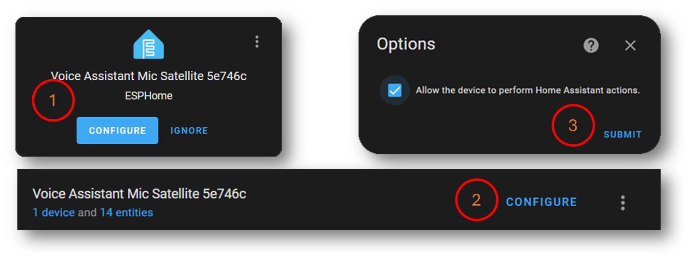

# HA Assist Mic Satellite

  

---

***
«The HA Assist Mic Satellite is a compact, ESPHome-based microphone solution designed for seamless integration with Home Assistant. »
***

---

3D Illustration            |  Config Options
:-------------------------:|:-------------------------:
 | 

Muted            |  Intent in Action
:-------------------------:|:-------------------------:
 | 

---

Simplified Process

## Features

A ~~tiny~~ Atom version of the [ESP32-S3-BOX](https://esphome.io/projects/index.html)

- Local **wake word detection** (😲 holy cow, this works fast and so well)
- Redirect TTS to a configurable media **media player entity** e.g. SONOS, to play the response
- HA **Assist Pipeline integration**
- Turn **on** and **off** listening mode (**wake word detection**)
- **Show current state** (listening, idle, request, response) on the display. It is fairly readable, though it requires good eyesight 👀.

## Hardware

**TL;DR** : *M5Stack AtomS3, PCB, INMP441 Breakout Board, Header Sockets*

### BOM

- **INMP441** MEMS Microphone - I2S ~2$
- [M5Stack AtomS3](https://docs.m5stack.com/en/core/AtomS3) ~15$
- [PCBWay Affiliate](https://www.pcbway.com/project/shareproject/HA_Assist_Mic_Satellite_f5cc4682.html")
- Case
- INMP441 Breakout Board (usually comes with PinSockets) ~2$
  - 2x 1x03 PinSocket 2.54mm (J3, J4)
- 1x  1x05 PinHeader 2.54mm (J1)
- 1x  1x04 PinHeader 2.54mm (J2)
- M2x??mm Screws (optional)

### Tools

- Soldering Equipment (or a friend with one)
- 3D Printer / Filament (or a friend with one)

### PCB

- [Schematic](<pcb/Mic HAT for M5Stack Atom/Mic HAT for M5Stack Atom.kicad_sch>)
- [PCBWay Affiliate](https://www.pcbway.com/project/shareproject/HA_Assist_Mic_Satellite_f5cc4682.html)

AtomS3 Pin|INMP441 Pin
:----------:|:-----------:
3V3| VDD
GND | GND + L/R
G5 (GPIO5) | WS
G6 (GPIO6) | SCK
G7 (GPIO7) | SD

## Assembly

Back View            |  Front View
:-------------------------:|:-------------------------:
 | 

## Software

- **ESPHome / Home Assistant**
- **Music Assistant** (optional)
- A **media player entity** (e.g. media_player.office)

### ESPHome

[m5stack-atoms3.yaml](esphome/m5stack-atoms3.yaml)

This has been frankensteined together from various sources. I will try to give [credit](#credits) where [credit](#credits) is due.

### Home Assistant

The device should get auto discovered.

We need to tick **Allow the device to perform Home Assistant actions**. Since the firmware will call the `media_player.play_media` service, we need to allow this.

While you here, click on **device** and change paste your media player entity id where the announcement should be played.

#### Sounds

There are two sound files required. One for when the device is listening, this is the silent wav file, the second is for the alarm ringtone. Find some examples here: [text](esphome/media).
The default config expects the files to be in the [/config/media](https://www.home-assistant.io/integrations/media_source/) folder. So these need to be copied there. Can be done with the vscode addon or via samba share.

## Try it out / Tricks

- **Wake Word**: "Okay Nabu"
- The display itself is also a button, so you can **double press to mute** the device, it stops listening for the wake word.
- To change the **announcement volumes**. Goto the Music Assistant Addon -> Settings -> Players -> Your Speaker -> Configure -> Announcements configuration

## Future ideas (help needed)

- [ ] **Ready made project** / **Made for ESPHome** if that is requested
- [ ] Redesign Animation (for small screens)
- [ ] 🚧 **Timers** (this is still work in progress)
- [ ] 3D printable **case** and **mounting solution** for the AtomS3 and the microphone
- [ ] Royalty free **sound files** the alarm

## Credits

- [ESPHome Voice Assistant Github Repo](https://github.com/esphome/firmware/tree/main/voice-assistant/)
- [SmarthomeCircle](https://smarthomecircle.com/How-I-created-my-voice-assistant-with-on-device-wake-word-using-home-assistant)
- [Community](https://community.home-assistant.io/t/esphome-voice-assistant-speech-output-to-home-assistant-media-player/588337/18)

## Contributing

Please do
